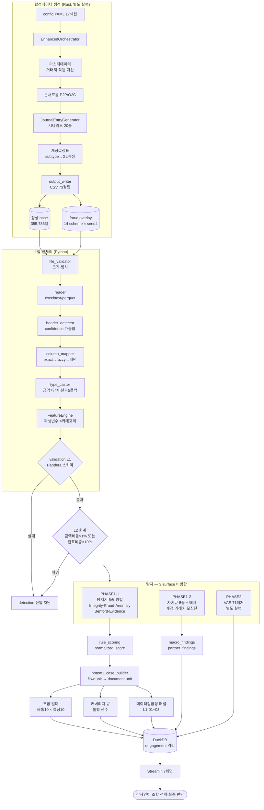

# 2. 전체 파이프라인

## 2.1 전 구간 흐름

세 표면이 화살표를 합치지 않는 것이 이 그림의 핵심이다. 룰 결과와 분석신호와 VAE 점수는 각자 DuckDB에 적재되고, 화면에서도 따로 표시된다.

## 2.2 단계 표

| 단계      | 입력               | 처리                                                  | 출력                       | 상세                               |
| --------- | ------------------ | ----------------------------------------------------- | -------------------------- | ---------------------------------- |
| 생성      | 설정 YAML 17섹션   | 시나리오 추첨 → 계정결정 → 금액·일시 표본 → 균형 강제 | 원장 CSV 73컬럼 + 사이드카 | [3장](3_DATASYNTH-ENGINE.md)       |
| 품질 검증 | 생성 산출물        | 게이트 57종 + ACC 계정검사 9종                        | PASS/FAIL 판정 JSON        | [4장](4_DATASYNTH-QUALITY.md)      |
| 수집      | Excel/CSV/Parquet  | 헤더 탐지 → 컬럼 매핑 → 타입 캐스팅                   | 표준 DataFrame             | [5장](5_INGEST-FEATURE.md)         |
| 파생      | 표준 DataFrame     | 금액·시간·패턴·텍스트 4카테고리                       | 파생변수 부착 DF           | [5장](5_INGEST-FEATURE.md)         |
| 검증      | 파생 DF            | L1 구조(게이트) → L2 회계(부분 게이트)                | 진입 가부                  | [5장](5_INGEST-FEATURE.md)         |
| 탐지      | 검증 통과 DF       | 탐지기 5종 병렬 실행                                  | DetectionResult × 5        | [6장](6_PHASE1-1_RULES.md)         |
| 정규화    | DetectionResult    | 신호강도 × 심각도 × 증거강도 × 역할 × 가중치          | normalized_score           | [6장](6_PHASE1-1_RULES.md)         |
| 표면 구성 | 정규화 결과        | flow unit 구축 → document unit → 조합 매칭            | 3분면 표면                 | [7장](7_PHASE1-1_COMBO-BUILDER.md) |
| 분석신호  | 검증 통과 DF       | 계정·거래처·작성자 단위 집계 검정                     | macro/partner findings     | [8장](8_PHASE1-2_ANALYTICAL.md)    |
| 비지도    | 전처리 행렬 71피처 | VAE 학습(정상만) → 재구성오차 백분위                  | 플래그·점수                | [9장](9_PHASE2_VAE.md)             |
| 적재      | 위 전부            | 회사·연도별 DuckDB                                    | audit.duckdb               | [10장](10_PLATFORM.md)             |

`AuditPipeline._execute()`의 실제 실행 순서는 수집 → 검증(진행률 0.30) → 피처(0.45) → 스냅샷 → 탐지(0.65) → 점수집계(0.80) → SHAP → 성능리포트 → PHASE1 케이스 → PHASE2 오버레이 → DB 적재(0.90)다(`src/pipeline.py:812-930`). 스냅샷 단계에서 파생변수까지 적용된 DataFrame을 따로 복사해 두는 이유는, 감사인이 화면에서 임계를 바꿔 재탐지할 때 수집부터 다시 하지 않기 위해서다.

탐지기 5종은 스레드풀로 병렬 실행하되 **결과를 완료 순서가 아니라 입력 순서로 재정렬한다**(`src/pipeline.py:64-147`). 실행할 때마다 룰 순서가 뒤바뀌면 같은 데이터에서 같은 화면이 나오지 않기 때문이다.

## 2.3 실증 예시 — 전표 한 장이 전 구간을 통과하는 과정

정상 base의 첫 전표를 끝까지 따라간다. 값은 전부 `data/journal/primary/datasynth_semantic_v1_normal_s10_c001_20260717/journal_entries.csv`의 실제 레코드다.

**생성 단계.** 시나리오 추첨에서 `P2P_VENDOR_INVOICE`가 뽑힌다. 이 시나리오는 20종 중 가중치 300으로 가장 크다(`process_gl_mapping.rs:927-940`) — 실제 기업 원장에서 매입송장이 가장 흔하다는 사실의 반영이다. 계정결정표가 차변 subtype `OPEX_OFFICE_SUPPLIES`를 계정 `6500`으로, 세액 라인을 매입부가세로 해소한다. 금액 표본기가 공급가액 **45,987,521원**을 뽑고, 세율 10%가 적용돼 세액 **4,598,752.1원**, 송장 총액 **50,586,273원**이 된다. 일시 표본기가 2023-10-04 11:22:56(평일 오전)을 배정하고, 작성자로 senior_accountant 페르소나의 `CWHITE048`이 선택된다. 전기 방식은 `recurring`(반복 처리)이라 개별 승인 기록이 남지 않아 `approved_by`가 공란이 된다. 균형 검증을 통과하고 문서 ID `ef8bb035-647a-4283-8756-393d7ca7bb08`으로 확정된다. 부정 라벨 `is_fraud`·`is_anomaly`는 **false**다 — 이 base는 부정을 한 건도 심지 않았다.

**수집 단계.** CSV 73컬럼이 표준 스키마로 매핑된다. 이 데이터는 이미 표준 컬럼명을 쓰므로 exact 매칭 단계에서 대부분 해소되고, fuzzy 매칭은 개입하지 않는다.

**파생 단계.** 금액 축에서 계정 `6500` 그룹 내 Z-score가 계산된다(그룹 표본이 30건 이상이면 그룹 기준, 아니면 상위 계정군, 그것도 부족하면 전체로 3단 폴백). 시간 축에서 11시 22분은 정상 근무시간(08:30–18:30)으로 분류되고 주말·공휴일·심야 어디에도 걸리지 않는다. 전기일과 증빙일이 같은 날(2023-10-04)이라 두 날짜의 괴리는 0일이다.

**검증 단계.** 필수 10컬럼이 모두 존재하고 차변·대변이 음수가 아니므로 L1 스키마를 통과한다. 전표 단위 차대 차액이 허용오차 0.01 이내라 L2도 통과한다.

**탐지 단계.** 부정이 한 건도 없는 정상 base의 전표인데도 **세 룰이 발화한다**(`reports/s1_normal_s10/rule_hits.csv` 실측).

| 룰              | 왜 발화하나                            | 성격                                                         |
| --------------- | -------------------------------------- | ------------------------------------------------------------ |
| L1-07 승인 생략 | `approved_by`가 공란                   | 정당 — 반복 처리 전표는 개별 승인 기록을 남기지 않는다       |
| L3-04 기말 집중 | 전기일 10월 4일이 월초 5일 창에 들어감 | 정당 — 기간 경계 맥락 태그이며 단독으로 등급을 올리지 않는다 |
| L4-03 절대 고액 | 4,598만원이 임계를 넘음                | **결함의 실물** — 아래                                       |

침묵한 룰들도 근거가 있다. 시간은 정상 근무시간이라 주말·심야 룰이 조용하고, 증빙일 괴리가 0일이라 소급기표 룰이, 가계정이 아니라 미정리 룰이, 관계사 거래가 아니라 관계사 룰이 각각 조용하다.

**L4-03의 발화가 이 예시의 핵심이다.** 4,598만원은 중견 제조업 매입송장으로 이상한 금액이 아니다. 그런데도 절대 고액 룰이 걸린 이유는 이 룰의 임계 산출이 깨져 있기 때문이다 — 마감분개 식별 키가 현행 데이터와 맞지 않아 순이익이 잘못 계산되고, 그 결과 임계가 연 2,018만~3,007만원까지 내려갔다. 전표 금액 90분위가 1,944만원이므로 사실상 상위 10%가 전부 걸린다. [6장](6_PHASE1-1_RULES.md)에서 이 룰을 유일한 대역 판정 **실패**로 기록한 근거가 바로 이 동작이고, 여기 그 실물이 있다.

**정규화 단계.** L1-07은 2차 정황 룰이라 단독으로 케이스 등급을 올리지 못하고, L3-04는 기간 맥락 태그라 조합에서만 의미를 갖는다. 행 종합 점수는 계층별 최댓값의 가중합이므로 L1(0.40)·L3(0.20)·L4(0.15) 세 계층에 걸친 이 전표는 한 계층만 걸린 전표보다 높은 점수를 받는다.

**표면화 단계.** 조합 빌더 관점에서 이 전표는 **몸통(이상고액·기말결산)과 특징(승인생략)을 모두 갖고 있어** 기본 모드의 조합 조건을 만족한다. 즉 정상 전표가 검토 목록에 오른다. 이것은 도구의 실패가 아니라 1차 스크리닝의 정상 동작이다 — 목록에 오른 232건이든 5만 건이든 그중 무엇이 실제 문제인지는 감사인이 증빙으로 판단한다. 다만 임계가 깨진 룰(L4-03) 때문에 목록이 필요 이상으로 넓어지는 것은 별개 문제이고, 그래서 그 룰을 통과가 아니라 실패로 기록해 둔 것이다.

이 한 건이 보여주는 것은 **정상 데이터에서도 룰은 발화하며, 그 발화율이 검증의 첫 관문**이라는 사실이다. L1-07의 22.73%(80,877건)는 사전 선언 대역 [15%, 30%] 안이라 통과했고, L4-03의 3.61%는 대역 상한 0.6%를 넘어 실패했다. 같은 전표에 걸린 두 룰의 운명이 갈린 것은 **측정 전에 선언한 대역**이 있었기 때문이다.

※ 위 측정 파일에는 증빙 관련 확장 룰(EV01·EV03)의 발화도 함께 기록돼 있다. 이들은 설정 게이트가 기본 off인 확장 트랙으로, 측정 스크립트가 이를 켜고 돌린 결과다. 기본 파이프라인의 발화는 위 세 룰이다.
