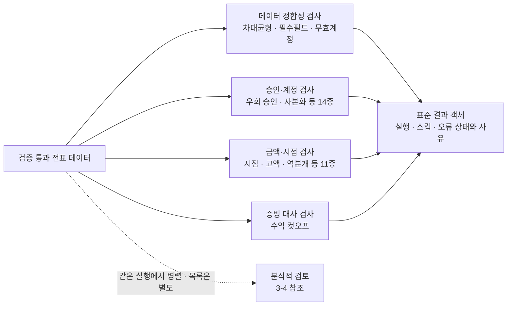
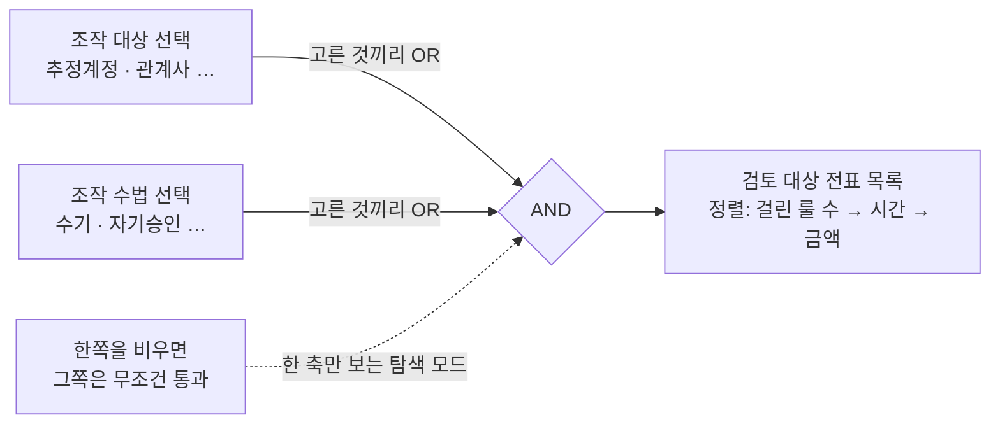
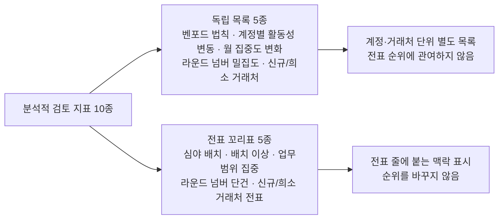

# 로컬 기반 전표 데이터 전수 분석 시스템

---

## 개요

### 1. 프로젝트 소개

로컬 환경에서 전표를 전수 분석하여 감사인이 검토할 항목을 1차 스크리닝하는 도구

- 분석 범위 및 역할
  - 전수 스크리닝 : 표본 추출 없이 전표의 전체 데이터를 분석하여 검토 대상 1차 선별
  - 판단 보조 도구 : 감사인이 분석 결과를 직접 조합해 검토 목록 구성 가능, 시스템이 부정 여부를 확정하지 않음
- 핵심 설계
  - 룰 기반 검증 : 감리지적사례와 회계감사기준을 바탕으로 설계된 룰 29종을 단일 전표에 적용해 위반 여부 분석
  - 분석적 검토 : 단일 전표로 확인이 어려운 통계적 이상치를 전체 집계 분석으로 식별
  - 머신러닝 - 비지도 학습 (VAE) : 정상 전표의 분포를 학습하여 룰로 정의할 수 없는 잠재적 이상 패턴 추출

### 2. 문제 인식 및 해결 방향

문제 인식 : 표본 추출 방식에 따른 데이터 누락 및 주관성 개입 위험<br>
해결 방향 : AI 기반 전수 분석 제안

#### 기존 표본 분석과 AI 기반 전수 분석 비교

| 구분                    | 기존 표본 분석                                  | AI 기반 전수 분석                                              |
| ----------------------- | ----------------------------------------------- | -------------------------------------------------------------- |
| 검증 범위               | 표본 추출                                       | 전표 전수 데이터                                               |
| 분석 기준               | 주관적 판단에 의존 → 감사인 간 분석 편차 가능성 | 3가지 분석 모델로 일관된 기준 적용                             |
| 금액 중요성             | 고액 위주 분석 → 소액 누락 가능성               | 금액 규모 무관                                                 |
| 데이터 전처리           | 수동 정렬 및 가공                               | 수기 입력, 승인 생략, 심야, 기말 등 속성 자동 전처리 및 시각화 |
| 사전 정의되지 않은 패턴 | 사전에 정의된 조건 내에서만 식별 가능           | 머신 러닝을 통해 정의되지 않은 패턴 추출                       |

### 3. 프로젝트 기대 효과

#### 데이터 분석 및 시각화

- 파생 변수 자동 생성 : 수기 입력 여부, 기표 시간, 기말 근접성 등 추가 속성을 전표 단위로 자동 부여
- 분석 결과 시각화 : 작성자 및 계정 단위 분석, 데이터 정합성 오류 등을 스트림릿 기반 대시보드로 시각화 하여 제공
- 검토 비용 절감 : 우선적 확인이 필요한 전표 목록을 제시하여 감사인의 검토 대상 선별 시간 단축

#### 핵심 분석 모델 기반 입체적 분석

| 분석 모델                    | 검증 대상                                            | 산출물                             |
| ---------------------------- | ---------------------------------------------------- | ---------------------------------- |
| 룰 기반 검증 - 29종          | 사전에 정의된 특정 조건에 해당?                      | 룰 조합에 따른 검토 대상 전표 목록 |
| 분석적 검토 - 5종            | 계정 및 거래처 데이터 분포에서 통계적 이상치가 존재? | 통계적 분석 및 이상치 결과 시각화  |
| 머신러닝 - 비지도 학습 (VAE) | 사전에 정의되지 않은 패턴인가?                       | 신종/복합 패턴 식별                |

### 4. 핵심 설계

#### 4-1. 합성 데이터 생성 — 상세 [3-1 생성 로직](#3-1-기술-설명---합성-데이터-생성)

| 구분        | 내용                                                                                   |
| ----------- | -------------------------------------------------------------------------------------- |
| 도입 배경   | 실제 기업 전표 확보가 불가 → 검증용 데이터 직접 생성                                   |
| 생성 기반   | EY 스위스 Assurance R&D 의 오픈소스 생성기를 K-IFRS 제조업 기준으로 수정               |
| 정상 데이터 | 제조업 거래 시나리오로 3개년 생성, 차대 균형·금액 분포·거래 정합성 등 66개 지표로 검증 |
| 이상 데이터 | 금융감독원 감리 지적사례 기반 이상 데이터 14종을 정상 데이터에 주입                    |
| 주입 밀도   | 전표 113,135건 중 330건 = **0.29%**, 실제 부정 발생의 희소성 반영                      |

---

#### 4-2. 룰 기반 검증 — 상세 [3-2 룰 판정](#3-2-기술-설명---룰-기반-검증)

```
 ━━━ 출처 1. 금융감독원 감리 지적사례 230건 (2009~2025) ━━━

    사례 분석
        │  적발 계정,거래을 구조화
        ▼
    대상 9종
    추정계정 147 · 관계사 80 · 수익 인식 시점 23 …

 ━━━ 출처 2. 감사기준서에 제시된 부정 분개의 특징 ━━━

  감사 기준서 검토
        │  통제 위반 패턴을 구조화
        ▼
    수법 10종
    수기 입력 · 자기 승인 · 심야 전기 · 드문 계정 조합 …

    검토 조합 = (조작 대상 1개 이상) AND (조작 수법 1개 이상)

```
**주제별 룰 구성**

| 주제              | 룰                                                    |
| ----------------- | ----------------------------------------------------- |
| 데이터 정합성 (4) | 차대균형·필수필드·무효계정·기간불일치                 |
| 승인·권한 (5)     | 한도초과·자기승인·직무분리·승인생략·유령승인자        |
| 금액·분할 (5)     | 한도직하 분할·분할거래·중복전표·매출 이상치·절대 고액 |
| 시점 (6)          | 기말집중·주말·심야·증빙 괴리·심야 배치·배치 이상      |
| 계정 성격 (5)     | 비용 자본화·추정계정·가계정 미정리·관계사·희귀 차대쌍 |
| 거래 성격 (4)     | 역분개·수기 전환·수익 컷오프·업무범위 집중            |

**룰 운영 방식 및 특이사항**
- 판정 기준 : 사전 정의 조건 충족 여부에 따른 이진 분류(True/False)
- 데이터 정합성 예외 처리 (4종) : 단순 데이터 오류 성격, 조합 검증 대상 제외 및 별도 대시보드 분리
- 회사별 기준값 유연화 : 전결 한도, 결산 일정, 근무 시간 등은 설정 파일을 통해 대상 기업에 맞춰 조정 가능

---

#### 4-3. 분석적 검토 — 상세 [3-4 모집단 단위 신호](#3-4-기술-설명---분석적-검토)

| 분석 지표             | 분석 단위          | 검토 내용                                                           |
| --------------------- | ------------------ | ------------------------------------------------------------------- |
| 벤포드 법칙           | 계정·월별          | 금액 첫 자릿수 분포 - 자연 발생 분포 이탈 식별                      |
| 라운드 넘버 밀집도    | 계정·월별·작성자별 | 특정 자릿수에서 절사된 금액이 밀집된 그룹 식별                      |
| 신규·희소 거래처 발생 | 거래처별           | 당기 신규 진입, 거래 빈도 극소 거래처, 휴면 후 재활성화 거래처 식별 |
| 계정별 활동성 변동    | 계정·전기대비      | 전기 대비 금액,건수,건당 금액의 변동성이 큰 계정 식별               |
| 월 집중도 변화        | 계정·전기대비      | 전기 대비 월별 거래 집중 시기가 변경된 계정 식별                    |

---

#### 4-4. 머신러닝 - 비지도 학습 (VAE) — 상세 [3-5 VAE](#3-5-기술-설명---머신러닝---비지도-학습-vae)

**비지도 학습 채택 사유**
- 정답 데이터 부재 : 전표별 부정 여부에 대한 정답 라벨 부재
- 사전에 정의되지 않은 패턴 대응 : 지도학습은 라벨에 존재하는 기존 수법만 학습, 비지도 학습은 신종,변형 패턴 식별 가능
- 데이터 요건 충족 : 부정 사례는 희소, 정상 전표는 대량 존재 → 정상 분포 학습 후 이탈 정도 측정 용이

**VAE 채택 사유**
- 판정 원리 : 데이터를 압축 후 복구 하며 복구 오차를 점수로 사용
- 근거 제시 가능 : 복구 오차가 항목별로 산출 → 항목별 기여도 분해 가능, 별도 설명 도구 불필요
- 혼합형 데이터 처리 : 금액(수치), 계정과목(범주) 등 형태가 혼재된 전표를 복구 오차 라는 동일한 척도로 비교 가능
- 단순 암기 방지 : 정상 데이터를 개별적으로 암기하지 못하도록 확률적 제약 적용 → 정상 전표의 공통 구조만 학습

**검증 결과 및 해석 범위**

| 구분                   | 값                                             |
| ---------------------- | ---------------------------------------------- |
| 평균 AUROC             | 데이터 4세트 평균 0.8845 , 세트 간 편차 0.0154 |
| 룰 기반 미식별 건 회수 | 124건 중 27건                                  |
| 적발 대상              | 가공매출 계열에 한정                           |

**가공매출 적발 신뢰 근거**
- 핵심 판정 근거 : 인도일-증빙일 간격이 주요 이상 신호로 작동
- 생성 흔적 학습 배제 : 합성 데이터 생성 패턴에는 거의 반응하지 않음
- 재현성 확보 : 4세트 반복에서 일관된 근거로 적발

**해석 범위**
- 적용 범위 제한 : 결과는 합성 데이터 기준 → 실데이터 성능으로 확대 해석 어려움
- 주장 대상 한정 : 전체 부정 시나리오 식별이 아닌 가공매출 수법에 대한 성능만 검증됨

### 5. 주요 성능 평가

이상 데이터 14종을 정상 전표에 주입 — 전표 113,135건 중 **330건(0.29%)**<br>
시드 변경 후 4세트 반복 측정

| 측정 항목                  | 결과                                                 | 해석                                                 |
| -------------------------- | ---------------------------------------------------- | ---------------------------------------------------- |
| 룰 기반 이상 데이터 회수율 | 89.7\~90.9% (296\~300 / 330)                         | 룰 분석에서 전체 이상 데이터 330건 중 296~300건 회수 |
| VAE 추가 회수              | 룰 기반 검증이 놓친 124건 중 27건 회수, AUROC 0.8845 | 추가 회수는 가공매출로 한정                          |
| 감사인 검토 대상 전표 수   | 약 11만 건 중 234\~2,040건 (0.2\~1.8%)               | 검토 대상 전표가 유의미하게 감소                     |

### 6. 실제 사용 스크린샷

> **입력** 전표 37,895건·총 거래금액 1.36조·활성 계정 39개·기표자 149명·거래처 1,270곳

<p align="center">
  
</p>
<p align="center"><sub>분석 실행 전 품질진단 화면</sub></p>

<details>
<summary><b>룰 기반 검증 화면 3종 (펼치기)</b></summary>

<p align="center"></p>
<p align="center"><sub>검토 대상 모집단 — 작성자별·계정과목별 확인 가능</sub></p>

<p align="center"></p>
<p align="center"><sub>룰별 검토대상 건수</sub></p>

<p align="center"></p>
<p align="center"><sub>데이터 정합성 패널</sub></p>

</details>

<details>
<summary><b>검토 조합 화면 2종 (펼치기)</b></summary>

<p align="center"></p>
<p align="center"><sub>감리 사례 조합 5종</sub></p>

<p align="center"></p>
<p align="center"><sub>감사인이 임의로 교차 선택 가능</sub></p>

</details>

<details>
<summary><b>분석적 검토 화면 4종 (펼치기)</b></summary>

<p align="center"></p>
<p align="center"><sub>벤포드 첫째 자릿수</sub></p>

<p align="center"></p>
<p align="center"><sub>라운드넘버 밀집</sub></p>

<p align="center"></p>
<p align="center"><sub>거래처 단위 신호</sub></p>

<p align="center"></p>
<p align="center"><sub>계정 활동 변동</sub></p>

</details>

<details>
<summary><b>비지도 VAE 화면 (펼치기)</b></summary>

<p align="center"></p>
<p align="center"><sub>문서 단위 판별력</sub></p>

</details>

---

## 목차

1. [분석 범위 및 데이터 구성 내역](#1-분석-범위-및-데이터-구성-내역)
2. [실증 예시](#2-실증-예시)
3. 기술 설명
   1. [합성 데이터 생성](#3-1-기술-설명---합성-데이터-생성)
   2. [룰 기반 검증](#3-2-기술-설명---룰-기반-검증)
   3. [검토 조합 구성](#3-3-기술-설명---검토-조합-구성)
   4. [분석적 검토](#3-4-기술-설명---분석적-검토)
   5. [머신러닝 - 비지도 학습 (VAE)](#3-5-기술-설명---머신러닝---비지도-학습-vae)
4. [검증](#4-검증)
5. [핵심 의사결정](#5-핵심-의사결정)
6. [한계점](#6-한계점)
7. [기술 스택](#7-기술-스택)

---

## 1. 분석 범위 및 데이터 구성 내역

### 분석 범위

- 분석 대상 : 단일 법인 전표 데이터 3개년
- 외부 자료 제외 : 거래처 마스터, 은행 거래 내역, 타사 장부 등 외부 자료 미사용
- 분석 범위 한계 : 재고 실사, 은행 조회 등 외부 자료로 확인 가능한 방식은 분석 대상에서 제외
- 데이터 구성
  - 개별 분개 - 최소 기록 단위인 개별 차·대변 분개
  - 개별 전표 - 동일 전표번호로 결합된 분개 집합 
- 모델 별 검증 단위
  - 전표 단위 - 룰 기반 검증, 비지도 학습
  - 계정, 거래처, 작성자 기준으로 전표를 그룹화 - 분석적 검토
- 최종 산출물 : 감사인이 우선 검토할 전표 목록, 최종 부정 여부는 감사인의 판단

### 데이터 구성 내역

| 구분      | 자료                 | 범위                                      |      수량 | 상술                                                                       |
| --------- | -------------------- | ----------------------------------------- | --------: | -------------------------------------------------------------------------- |
| 근거      | 금감원 감리 지적사례 | 2009~2025 공개 원문                       |     230건 | [3-2](#3-2-기술-설명---룰-기반-검증)                                       |
| 근거      | 회계감사기준서       | 부정 분개 특징(240호), 분석적 검토(520호) |         - | [3-3](#3-3-기술-설명---검토-조합-구성)·[3-4](#3-4-기술-설명---분석적-검토) |
| 데이터    | 정상 데이터          | K-IFRS 제조업 3개년(73개 컬럼)            | 355,786행 | [3-1](#3-1-기술-설명---합성-데이터-생성)                                   |
| 데이터    | 전표                 | 개별 분개를 전표 단위로 묶은 수           | 113,135건 | [3-1](#3-1-기술-설명---합성-데이터-생성)                                   |
| 데이터    | 거래 시나리오        | 20종 (구매, 판매, 급여지급 등) 시나리오   |      20종 | [3-1](#3-1-기술-설명---합성-데이터-생성)                                   |
| 데이터    | 이상 데이터          | 14종 (FS01~FS14) 시나리오, 전표 330건     |      14종 | [3-1](#3-1-기술-설명---합성-데이터-생성)                                   |
| 분석 모델 | 룰                   | 데이터 정합성 4 + 이상 신호 25            |      29종 | [3-2](#3-2-기술-설명---룰-기반-검증)                                       |
| 분석 모델 | 룰 조합 매트릭스     | 대상 9 × 수법 10 (사전설정 5종 포함)      |         - | [3-3](#3-3-기술-설명---검토-조합-구성)                                     |
| 분석 모델 | 분석적 검토 지표     | 벤포드 분석 등 5종                        |       5종 | [3-4](#3-4-기술-설명---분석적-검토)                                        |

---

## 2. 실증 예시

```
 ━━━ 전표 66e090a1 · 고객 대금 수금 시나리오 · 2,176,500원 · 2022-11-27(일) 09:54 ━━━

 [생성]  시나리오 할당 ───▶ 계정 할당(차변, 대변) ──────▶ 금액·일시 ──────────▶ 균형 검증
         매출채권 회수      1000 현금                     2,176,500            차변 = 대변
                                1100 매출채권            일요일 09:54          

         ◆ 작성자 CADAMS053 이 수기입력 후 자가 승인

 [파생 변수 생성]  기표 시간 ─ 일요일 09:54 → 주말 전기
                  기말 근접 ─ 11월 말 기준 ±5일
                  입력 방식 ─ 수기 입력

 [우선 검증]  필수 컬럼 10개 존재 · 차/대변 정합 · 대차 차액 0.01 이내
               └─▶ 무결성 검증 통과, 룰 검증 단계 진입

 [룰]    정상 데이터임에도 룰 5종에서 탐지 됨 
         ┣ L1-05 자기 승인   작성자 = 승인자
         ┣ L1-06 직무분리    작성·승인 기능 겸직
         ┣ L3-02 수기 전환   수기 입력 전표
         ┣ L3-05 주말 전기   일요일 전기
         ┗ L3-04 기말 집중   월말 ±5일 

 [목록]  대상(기말결산) × 수법(자기승인·수기입력) 충족
         ─▶ 검토 대상 전표 목록에 등재
```

- 정상 동작 : 정상 전표임에도 검토 목록 등재 - 1차 스크리닝 정상 결과
- 최종 판단 : 해당 전표의 실제 문제 여부는 감사인이 증빙으로 확인

---

## 3-1. 기술 설명 - 합성 데이터 생성

> **실제 구현**
> - 생성 설정 : [`datasynth.yaml`](config/datasynth.yaml)
> - 라벨 수집 : [`datasynth_labels.py`](src/ingest/datasynth_labels.py), [`datasynth_metadata.py`](src/ingest/datasynth_metadata.py)
> - 품질 게이트 : [`datasynth_quality_gate/`](tests/datasynth_quality_gate)
> - 생성기 본체 : Rust 코드로 저장소 외부 위치

| 항목         | 내용                                                        |
| ------------ | ----------------------------------------------------------- |
| 기반 모델    | EY 스위스 Assurance R&D 가 Apache 2.0 으로 배포한 DataSynth |
| 커스터마이징 | K-IFRS 제조업 기준으로 스키마 및 시나리오 개편              |
| 특이사항     | 원본 GitHub 저장소는 비공개 전환되어 참조 URL 부재          |

### 환경 설정과 사전 검증

- 환경 설정 : 기업 규모, 거래 비중, 직원 수를 YAML 17개 파일로 관리

- 사전 검증
| 검증 축         | 검증 대상                                   |
| --------------- | ---------------------------------------------- |
| 비율 범위 (0~1) | 100% 초과 및 음수 입력                         |
| 비중 총합 (1.0) | 합계 미달로 인한 나머지 거래 유형의 소실       |
| 임계치 오름차순 | 금액 대역(소액 < 중액 < 고액) 산출 로직의 붕괴 |

### 생성 로직 8단계

| #   | 단계             | 내용                                                                            |
| --- | ---------------- | ------------------------------------------------------------------------------- |
| 1   | 계정과목표       | 가용 계정과목 풀 사전 생성, 룰이 명시 참조하는 계정(가지급금 1190 등) 고정 할당 |
| 2   | 마스터데이터     | 거래처, 고객, 자재, 자산, 직원(권한 한도 포함) 생성                             |
| 3   | 문서흐름         | 발주 → 입고 → 송장 → 대금지급 연결, 교차 대사와 실무적 불일치 반영              |
| 4   | 업무 이벤트      | 정상 진행 75%, 예외 20%, 오류 5%                                                |
| 5   | 전표 생성        | 아래 단위 전표 생성 메커니즘 순서로 순차 생성                                   |
| 6   | 이상 데이터 주입 | 이상·오류 삽입, 정상 데이터만 생성 시 비활성                                    |
| 7   | 잔액 추적        | 자산 = 부채 + 자본 + (수익 − 비용) 실시간 확인                                  |
| 8   | 출력             | 73개 컬럼 CSV + 부속 명세서                                                     |

- 산출 규모 : 정상 데이터 3개년 기준 355,786행, 전표 단위로 묶어 113,135건

### 단위 전표 생성 메커니즘

- 확정 순서 : 전표 1건마다 아래 8개 축을 순서대로 확정
- 설정 근거 : 각 축의 값이 룰 기반 검증의 판정 재료가 되므로 축마다 실무 분포를 개별 설정

| 축             | 확정 방식                                                  | 실제 설정값                                                               |
| -------------- | ---------------------------------------------------------- | ------------------------------------------------------------------------- |
| 1. 거래 유형   | 업무 흐름 7종의 시나리오 20개 중 비중에 따라 추첨          | 구매 2, 판매 2, 급여 2, 결산 6, 자산 3, 자금 3, 관계사 2                  |
| 2. 계정 매핑   | 거래 유형, 차대 방향, 계정 성격을 키로 계정결정표에서 조회 | 무작위 배정 없음, 관계사 거래 비중 10%                                    |
| 3. 라인 수     | 전표 1건의 분개 줄 수를 분포에서 추첨                      | 2줄 66.7%, 4줄 16.6%, 3줄 5.8%, 10줄 이상 1.1%                            |
| 4. 금액 산출   | 로그정규분포 추첨 후 하한·상한 절단                        | 중앙값 약 120만원(μ=14.0, σ=2.5), 하한 100원, 상한 1,000억원, 소수점 없음 |
| 5. 라운드 넘버 | 일정 확률로 금액을 만원·천원 단위 절사                     | 만원 단위 12%, 천원 단위 8%                                               |
| 6. 일시 지정   | 월·일 배수를 곱해 집중 구간 형성                           | 월말 5일 전 2배, 분기말 10일 전 3배, 연말 15일 전 4배                     |
| 7. 시간대      | 하루를 9구간으로 분할해 구간별 배수 적용                   | 오전 9\~11시 1.8배, 22시\~06시 0.03\~0.05배, 주말은 평일의 20%            |
| 8. 권한 승인   | 전결 한도 초과 시 상위 권한자 배정, 작성자 본인 배제       | 예외 전결 2%, 승인 집중도는 직급별 인원(주니어 800, 시니어 400)에서 결정  |

- **생성 직후 3중 검사**
  - 계정 허용 목록 : 해당 거래 유형에서 사용 불가한 계정 유입 여부
  - 계정결정표 재대조 : 차대 방향과 계정 성격의 결정표 일치 여부
  - 대차 균형 : 차변 합계 = 대변 합계, 정합성 룰 시험용 극소수 불일치만 의도적 잔존
  - 실패 처리 : 미통과 전표는 폐기 후 재생성, 25회 연속 실패 시 생성 중단

- **생성 원칙**
  - 회계적 정상성 : 차대 균형, 양수 금액, 기간 범위 내, 계정 체계 준수
  - 실무 예외 유지 : 승인 생략, 자기승인, 결산기 야근을 0으로 소독하지 않음
  - 노이즈 라벨 무관 : 결측 2%, 오타 0.15%를 정상 데이터와 이상 데이터에 동일 비율 적용
  - 연도별 통제 환경 차등 : 2022년 보수적 → 2023년 확장 → 2024년 워크플로우 변경, 이상 비율 1.8% → 5.5%

<details>
<summary><b>정합성 검증 축 6종과 실제 적발 사례 (펼치기)</b></summary>

```
    ◆ 검증 지표   총 66개 (일반 57종 + 계정 9종) · 5단계 판정

    ┣ 복식부기    전표 대차 일치 및 재무상태표 등식 검증
    ┣ 금액 분포   매출원가율 정상 범위 및 부(-)의 잔액 비율 2% 이하
    ┣ 세무/부가세 부가세액이 공급가액의 9~11% 범주 내 안착 여부
    ┣ 승인 이력   시스템 전기는 배치 번호 부여, 수기 전기는 공란 규칙 준수
    ┣ 법인 경계   단일 법인 범위가 부속 명세서 간에도 일관 유지되는지 대사
    ┗ 인위적 흔적 동일 금액 100건 이상 집중 또는 동일 시각 50건 초과 시 적발
                  (실제 적발 : 특정 계정 162건 집중, 은행 거래처 3건 집중)
```

</details>

### 거래 시나리오 20종

| 흐름          | 시나리오                                          |
| ------------- | ------------------------------------------------- |
| 구매 P2P (2)  | 매입송장·대금지급                                 |
| 판매 O2C (2)  | 매출송장·고객입금                                 |
| 급여 H2R (2)  | 급여 발생·급여 지급                               |
| 결산 R2R (6)  | 발생분개·마감분개·대손상각·퇴직급여·잡이익·역분개 |
| 자산 A2R (3)  | 취득·감가상각·개발비 자본화                       |
| 자금 TRE (3)  | 차입·이자지급·임원 가지급                         |
| 관계사 IC (2) | 관계사 매출·관계사 정산                           |

### 이상 데이터 주입 시나리오 14종

| id   | 수법        | 흐름 | id   | 수법            | 흐름   |
| ---- | ----------- | ---- | ---- | --------------- | ------ |
| FS01 | 가공매출    | 매출 | FS08 | 부적절 자본화   | 결산   |
| FS02 | 진행률 조작 | 결산 | FS09 | 컷오프 조작     | 매출   |
| FS03 | 현금 횡령   | 매입 | FS10 | 대손 회피       | 매출   |
| FS04 | 횡령 은폐   | 매입 | FS11 | 특수관계자 남용 | 관계사 |
| FS05 | 순환거래    | 매출 | FS12 | 충당금 누락     | 결산   |
| FS06 | 부채 누락   | 매입 | FS13 | 손상 회피       | 관계사 |
| FS07 | 재고 과대   | 매입 | FS14 | 유령직원 급여   | 급여   |

**주입 절차 4단계**

```
  [1] 도너 선택   해당 수법이 사용하는 거래 유형에서 정상 전표 1건 통째 복제
        │           ┗ 빈 전표에 새로 조립하는 방식 미사용
        ▼
  [2] 조작 칸      해당 수법이 정하는 칸만 덮어쓰기 (금액·계정·일자·승인자 등)
      덮어쓰기     ┗ 나머지 70여 칸은 정상 전표 값 유지
        ▼
  [3] 시퀀스 연결  단건 조작이 아닌 연계 전표 흐름 전체 생성
        │           ┗ 가공매출 : 매출 계상 → 가공 회수 → 매출채권 담보 차입 → 차기 역분개
        ▼
  [4] 흔적 제거    계정은 정상에서 고빈도로 쓰이는 실존 22개로 한정
                   적요는 정상 전표의 범용 문구로 치환, 시나리오 명칭 노출 금지
```

- 주입 규모 : 14수법으로 전표 330건 주입, 전체 113,135건의 0.29%
- 복제 방식 채택 이유 : 별도 조립 시 정상에 없는 값 조합이 잔존, 모델이 부정이 아닌 생성 흔적을 학습
- 복제 방식의 효과 : 조작하지 않은 칸이 정상과 통계적으로 미구분, 실측 대조는 [4-1](#4-1-정상-데이터-베이스라인-검증)
- 적발 가능 조건 : 전표 구조(계정 조합, 승인, 시점, 금액)만으로 적발 가능, 적요 텍스트 검색으로는 적발 불가

---

## 3-2. 기술 설명 - 룰 기반 검증

> **실제 구현**
> - 공통 계약 : [`base.py`](src/detection/base.py), 모든 룰이 상속하는 추상 클래스와 표준 결과 객체
> - 검사기 4종 : [`integrity_layer.py`](src/detection/integrity_layer.py), [`fraud_layer.py`](src/detection/fraud_layer.py), [`anomaly_layer.py`](src/detection/anomaly_layer.py), [`evidence_detector.py`](src/detection/evidence_detector.py)
> - 룰 임계·파라미터 : [`audit_rules.yaml`](config/audit_rules.yaml), [`sod_toxic_combinations.yaml`](config/sod_toxic_combinations.yaml)
> - 룰 메타데이터 : [`rule_detail_metadata.py`](src/detection/rule_detail_metadata.py), 활성 룰 29종 코드 고정
> - 병렬 실행 : [`pipeline.py`](src/pipeline.py)



- 실패 격리 : 예외 발생 시에도 결과 객체 반환, 룰 1종의 실패가 나머지 실행에 미영향
- 상태 분리 : '컬럼 부재로 실행 불가'와 '실행 후 0건'을 별도 상태로 구분해 화면 표시

### 룰 설계 원칙

- 이진 판정 : 위반/비위반만 확정, 임의의 위험 점수나 확률 미산출
- 결정론적 실행 : 동일 입력에 동일 결과, LLM 배제
- 임계치 외부 설정 : 전결 한도, 결산 일정, 근무 시간 등 기업별 편차 파라미터는 외부 YAML 관리
- 실행 상태 명확화 : '컬럼 부재로 실행 불가'와 '실행 후 0건'을 구분 로깅

### 룰 도출 방법

- 1단계 근거 확보 : 금융감독원 공개 감리 지적 사례 **230건(2009~2025)** 전수 태깅 → **사례 731행** 확보, 적발 대상 계정·거래 유형 추출
- 2단계 패턴 구조화 : 회계감사기준 240(부정 분개 특징) 준용 → 전표 입력 통제 위반(수기 입력, 승인 우회, 비정상 시간대, 비경상 계정) 패턴 정리
- 3단계 룰 확정 : 두 출처가 겹치는 지점만 룰로 확정, 조작 대상은 감리 사례에서·조작 수법은 기준서에서 별도 축으로 사용 → [3-3](#3-3-기술-설명---검토-조합-구성)

### 대표 룰 6종 판정 방식

- 판정 형태 : 모든 룰을 계산 가능한 조건으로 표현
- 임계 조정 : 회사별 설정 파일로 변경 가능

| 룰                   | 판정 대상           | 판정 조건                                    | 기본값              |
| -------------------- | ------------------- | -------------------------------------------- | ------------------- |
| L2-01 한도 직하 분할 | 승인 한도 직하 금액 | 금액이 작성자 전결 한도의 특정 % 구간에 위치 | 한도의 90~100% 구간 |
| L2-02 분할 거래      | 한 건의 분할 기표   | 동일 거래처·동일 금액의 반복 간격            | 3일 이내            |
| L2-03 중복 전표      | 동일 지급의 반복    | 거래처·금액·계정 일치 전표의 재등장 간격     | 90일 이내           |
| L3-04 기말 집중      | 결산 직전 기표      | 전기일과 월말의 간격                         | 월말 ±5일           |
| L3-06 심야 전기      | 통제 취약 시간대    | 전기 시각의 소속 구간                        | 22시~06시           |
| L4-04 희귀 차대쌍    | 미사용 계정 조합    | 차변·대변 계정 짝의 데이터 내 출현 빈도      | 분기당 1회 미만     |

- 임계 외부화 근거 : 전결 한도 6단계, 결산 일정, 근무 시간이 회사마다 상이 → 동일 데이터도 회사 설정에 따라 다른 결과 산출
- 금액 기준 데이터 산출 : L4-03 절대 고액은 고정 금액이 아닌 **세전이익 5%의 75%**를 수행중요성으로 계산

<details>
<summary><b>활성 룰 29종 전수 판정 규칙 (펼치기)</b></summary>

```
 ━━━ 데이터 정합성 — 데이터 결함 ━━━

    L1-01  차대변 균형     차변 합 ≠ 대변 합
    L1-02  필수필드 누락   전표번호·일자·계정·금액 등 필수 칸이 공란
    L1-03  무효 계정       계정과목표에 없는 계정이 데이터에 등장
    L1-08  기간 불일치     전기일의 월과 회계기간이 어긋남 (조절 가능)

 ━━━ 승인·권한 ━━━

    L1-04  승인한도 초과   승인자의 전결 한도보다 전표 금액이 큼
    L1-05  자기 승인       작성자와 승인자가 같은 사람 (예외 : 시스템 자동·반복)
    L1-06  직무분리 위반   양립 불가 조합 겸직 시 발화 (근거 : 감사기준서)
    L1-07  승인 생략       승인자 칸이 공란
    L1-07-02 유령 승인자   직원 마스터에 없는 승인자 ID

 ━━━ 금액·분할 ━━━

    L2-01  한도 직하 분할  전결 한도의 90% 구간에 금액이 몰림
    L2-02  분할 거래       같은 거래처·금액을 3일 안에 쪼개 기표
    L2-03  중복 전표       90일 안에 같은 지급이 반복
    L4-01  매출 이상치     매출 계정(4xxx)에서 같은 계정군 대비 3σ 밖 금액
    L4-03  절대 고액       수행중요성 초과 (세전이익 5%의 75%)

 ━━━ 시점 — 사용자가 설정 가능 ━━━

    L3-04  기말 집중       월말 앞뒤 5일 전기
    L3-05  주말 전기       토·일 전기
    L3-06  심야 전기       22시 ~ 06시 전기
    L3-07  전기-증빙 괴리  증빙일보다 30일 넘게 지나 전기
    L4-05  심야 배치       기표자 단위로 심야 전기가 이례적으로 몰림
    L4-06  배치 이상       배치 기말 비중 50% 초과 · 같은 날 50건 이상 · 3σ 밖

 ━━━ 계정 성격 ━━━

    L2-04  비용 자본화     비용 성격 계정(5~8xxx)이 자산 계정(12·15xxx)으로
    L3-10  추정계정        대손상각비 등 회수가능성 추정을 그 전표에서 다시 매김
    L3-09  가계정 미정리   가지급금·가수금·미결산 계정이 30일 넘게 잔존
    L3-03  관계사          관계사 계정쌍(1150↔2050 · 4500↔2700) 사용
    L4-04  희귀 차대쌍     그 데이터에서 분기당 1회 미만으로만 나오는 계정 조합

 ━━━ 거래 성격 ━━━

    L2-05  역분개          금액 동일·방향 반대 전표 쌍 (예외 : 입고미착·관계사 정산)
    L3-02  수기 전환       입력 방식이 수기 또는 결산조정
    L3-11  수익 컷오프     기간 경계에서 수익 인식 시점이 어긋남
    L3-12  업무범위 집중   한 사람이 다루는 업무·회사 수가 직급 기준 초과
```

</details>

<p align="center">
  
</p>
<p align="center"><sub>룰 기반 전체 요약, 작성자별·계정별 신호 집중 구간 확인</sub></p>

<p align="center">
  
</p>
<p align="center"><sub>룰별 검토대상 건수, 미실행 룰과 실행 후 0건 룰을 화면에서 구분</sub></p>

<p align="center">
  
</p>
<p align="center"><sub>데이터 정합성 화면, 부정 징후가 아닌 데이터 수정 신호로만 사용해 검토 조합에서 분리</sub></p>

---

## 3-3. 기술 설명 - 검토 조합 구성

> 도입 배경 : 룰 29종의 발화를 그대로 나열 시 목록 수만 건 발생<br>
> 해결 방식 : 감사인이 조작 대상과 조작 수법을 교차 선택해 교집합만 추출

> **실제 구현**
> - 조합 본체 : [`phase1_combo_builder.py`](src/export/phase1_combo_builder.py), 어휘 적재·결합 판정·정렬
> - 어휘·프리셋 정의 : [`combo_builder.yaml`](config/combo_builder.yaml)
> - 화면 : [`phase1_combo_builder_panel.py`](dashboard/components/phase1_combo_builder_panel.py)
> - 판정 스크립트 : [`s4_adjudicate_combo_builder.py`](tools/scripts/s4_adjudicate_combo_builder.py), 증거 실재 검사와 결합 논리 전수 대조

### 조작 대상 9종 × 조작 수법 10종

- 조작 대상 출처 : 금융감독원 감리 지적 사례, 어떤 계정·거래가 조작되는가
- 조작 수법 출처 : 감사기준서 240, 조작된 전표가 어떤 형태인가

| 룰    | 조작 대상   | 감리 확정 | 룰       | 조작 수법     | 출처 성격  |
| ----- | ----------- | --------: | -------- | ------------- | ---------- |
| L3-10 | 추정계정    |       147 | L3-02    | 수기          | 명문       |
| L3-03 | 관계사      |        80 | L1-04    | 승인한도초과  | 명문       |
| L3-11 | 컷오프      |        23 | L1-05    | 자기승인      | 명문       |
| L2-04 | 비용자산화  |        22 | L1-07    | 승인생략      | 명문       |
| L3-04 | 기말결산    |        20 | L1-07-02 | 유령승인자    | 명문       |
| L4-01 | 매출과대    |        20 | L1-06    | 직무분리 겸직 | 명문(부록) |
| L4-03 | 이상고액    |        12 | L3-07    | 소급기표      | 명문       |
| L2-05 | 역분개      |         3 | L4-04    | 희소계정쌍    | 명문       |
| L3-09 | 가수금 체류 |         2 | L3-05    | 휴일 입력     | 실무 관행  |
| —     | —           |         — | L3-06    | 심야 입력     | 실무 관행  |

- 감리 확정 : 해당 계정·거래가 실제 지적된 사례 건수, 조합 카드에 표기해 선정 근거 제시
- 정합성 룰 제외 : 데이터 정합성 4종은 단순 데이터 오류로 조작 여부와 무관 → 별도 화면 분리

### 결합 방식



- 축 내부 결합 : 같은 축에서 복수 선택 시 하나만 해당돼도 통과 (OR)
- 축 간 결합 : 두 축 모두 해당돼야 통과 (AND)
- 위험 등급 미사용 : 정렬 기준은 걸린 룰 수 → 시간 신호 → 금액 → 증거 수
- 금액 후순위 배치 : 동점 처리에만 사용, 고액 정상 거래가 신호 보유 소액 전표를 밀어내지 않도록 조정
- 설정 오류 즉시 중단 : 축 내부 중복, 두 축의 겹침, 어휘 밖 룰 참조는 예외 처리해 화면 오답 차단

### 프리셋 5종

- 성격 : 자주 쓰는 조합의 사전 묶음, 고정값이 아닌 감사인이 개별 조건을 변경 가능한 체크 상태
- 도출 방법 : 감리 사례 태깅 731행 스크립트 전수 집계
- 묶음 근거 : 한 사례에 여러 조작 대상이 함께 확정된 조합의 빈도 (관계사+추정계정 10건, 기말결산+추정계정 5건)

| 프리셋           | 조작 대상                   | 근거                                  |
| ---------------- | --------------------------- | ------------------------------------- |
| 추정·관계사 조작 | 추정계정·관계사             | 감리 확정 최다 2종 (147건, 80건)      |
| 수익인식         | 매출과대·컷오프             | 기준서 240 문단 26, 수익인식 부정위험 |
| 역분개·은폐      | 역분개·가수금 체류·이상고액 | 감리 확정, 기말 되돌림·경과계정 은폐  |
| 비용자산화       | 비용자산화                  | 감리 확정 22건                        |
| 결산 손상·충당금 | 기말결산·추정계정           | 감리 확정, 손상·대손충당금 미인식 5건 |
- 조작 수법 전체 개방 : 감리 원문에 전표 통제 세부 서술이 적어 확정 사례가 8건에 불과

<p align="center">
  
</p>
<p align="center"><sub>금감원 사례 조합 5종, 카드별 감리 확정 건수 표기</sub></p>

<p align="center">
  
</p>
<p align="center"><sub>직접 조합, 조작 대상·조작 수법 표에서 감사인이 교차 선택</sub></p>

---

## 3-4. 기술 설명 - 분석적 검토

> 대상 : 단일 전표로 확인이 어렵고 계정·거래처·작성자 집계에서 드러나는 통계적 이상치<br>
> 근거 : 감사기준서 520

> **실제 구현**
> - 벤포드 법칙 : [`benford_detector.py`](src/detection/benford_detector.py)
> - 라운드 넘버 밀집도 : [`round_density_rules.py`](src/detection/round_density_rules.py)
> - 신규·희소 거래처 : [`partner_signals.py`](src/detection/partner_signals.py)
> - 계정별 활동성 변동 : [`trendbreak_detector.py`](src/detection/trendbreak_detector.py), [`trendbreak_rules.py`](src/detection/trendbreak_rules.py)
> - 월 집중도 변화 : [`timeseries_concentration_rules.py`](src/detection/timeseries_concentration_rules.py)

### 결과 활용 방식 2종



- 독립 목록 선정 기준 : 해당 계정·거래처 전체의 이상을 단독으로 주장 가능한 지표
- 전표 꼬리표 선정 기준 : 정상 업무에도 빈발해 단독 목록 구성 시 노이즈가 되는 지표
- 꼬리표의 의미 : 해당 전표가 이상 표시된 계정에 속한다는 맥락 정보, 전표 자체의 문제 표시 아님
- 꼬리표 미생성 축 : 월·작성자 등 전표 단위로 환원 불가한 축

### 지표 5종 판정 방식

| 지표               | 집계 단위          | 판정 방식                                                                      |
| ------------------ | ------------------ | ------------------------------------------------------------------------------ |
| 벤포드 법칙        | 계정·월            | 첫 자릿수 분포와 이론값의 평균절대편차, 0.012 이하 적합·0.015 초과 강한 부적합 |
| 라운드 넘버 밀집도 | 계정·전기월·작성자 | 그룹의 라운드 넘버 비율이 전체 데이터 비율보다 높은지 이항검정                 |
| 신규·희소 거래처   | 거래처             | 전기 미등장, 거래 건수 하위 10%, 직전 연도 결번 후 재등장                      |
| 계정별 활동성 변동 | 계정·전기대비      | 임계 없음, 감사인이 선택한 축(금액·건수·건당 금액)의 변동 절대값 순            |
| 월 집중도 변화     | 계정·전기대비      | 임계 없음, 결산월 비중 증가분(부호 유지) 내림차순                              |

<details>
<summary><b>라운드 넘버 판정의 자릿수 처리 방식 (펼치기)</b></summary>

- 절대 단위 방식 폐기 : 금액이 1,526원~2,057억원으로 8자릿수에 분포, 단일 절대 단위로 측정 불가
- 폐기 근거 실측 : 100만원 단위 기준 적용 시 거래의 64.9%가 판정 대상에서 제외, 전체 데이터의 0.04%만 적발
- 대체 방식 : 금액 규모 대비 끝자리 0의 개수로 판정

```
 ━━━ 전표 1건 라운드 넘버 판정 ━━━

  금액 → 통화별 소수점 반올림 (원화는 소수점 없음)
    │
    ├─ [1] 소수부 잔존 여부                  잔존 시 → 라운드 넘버 아님
    │
    ├─ [2] 유효숫자 = 끝자리 0 제거 후 자릿수  2자리 이하만 통과
    │        5,000,000 → 유효숫자 1 (통과)
    │          250,000 → 유효숫자 2 (통과)
    │          416,628 → 유효숫자 6 (탈락)
    │
    └─ [3] 총 자릿수 3자리 이상               10원·50원 등 사소한 소액 배제
```

**그룹 단위 밀집 판정** : 전표별 판정 결과를 계정·전기월·작성자로 집계 후 검정

| 단계         | 방식                                                         |
| ------------ | ------------------------------------------------------------ |
| 기준선       | 해당 데이터 전체의 라운드 넘버 비율, 상수 미사용             |
| 표본 하한    | 100건 미만 그룹 검정 제외, 우연 집중된 소규모 그룹 배제      |
| 실무 유의성  | 기준선 대비 5%p 이상 초과만 후보, p값보다 우선 검사          |
| 통계 검정    | 이항검정 단측, 유의수준 0.01, 0.0001 미만은 강한 신호로 구분 |
| 축 결합 금지 | 계정·월·작성자를 복합키로 미결합, 결합 시 그룹당 표본 급감   |

- 효과 크기 우선 적용 근거 : 표본이 크면 1%p 차이도 통계적으로 유의해져 목록의 변별력 소실

</details>

- **기준선의 데이터 산출**
  - 라운드 넘버 기준선 : 정상 비율이 산업·회사마다 상이해 상수 대신 해당 데이터 전체 비율 사용
  - 결산월 기준 : 12월 고정 없이 해당 데이터에서 관측된 최대 회계기간으로 결정, 3월·6월 결산 법인 대응

- **임계 미설정 지표 2종**
  - 대상 : 계정별 활동성 변동, 월 집중도 변화
  - 근거 : 이상 판정 기준선의 근거 제시 불가
  - 처리 : 전기 비교 가능한 계정 전체 노출, 절단 지점은 감사인이 결정
  - 정렬 : 화면 표기 숫자가 그대로 정렬 기준

- **명칭 표기 원칙**
  - 신규 거래처 대신 데이터 첫 등장 : 거래처 마스터 등록일이 아닌 해당 데이터 최초 등장일 기준
  - 미판정 구분 : 비교 대상 과거 연도 부재 시 0건이 아닌 판정 불가로 표시

<p align="center">
  
</p>
<p align="center"><sub>벤포드 첫째 자릿수, 데이터 전체 적합 판정 후 계정별 이탈도 상위 별도 제시</sub></p>

<p align="center">
  
</p>
<p align="center"><sub>라운드 넘버 밀집도, 점선은 해당 데이터에서 산출한 기준선</sub></p>

<p align="center">
  
</p>
<p align="center"><sub>거래처 단위 신호 3종, 가공거래처 확정이 아닌 데이터 범위 내 근사 신호로 표기</sub></p>

<p align="center">
  
</p>
<p align="center"><sub>계정별 활동성 변동, 임계가 없어 비교 가능한 전 계정 노출</sub></p>

---

## 3-5. 기술 설명 - 머신러닝 - 비지도 학습 (VAE)

> 역할 : 정상 전표 분포를 학습해 이탈 전표를 추가 검토 후보로 제시하는 보조 모델<br>
> 담당 영역 : 룰로 사전 정의가 불가능한 패턴

> **실제 구현**
> - 입력 선정 : [`phase2_plan.py`](src/preprocessing/phase2_plan.py), 허용 목록 51칸 컬럼별 판정
> - 파생 생성 : [`phase2_features.py`](src/preprocessing/phase2_features.py), 날짜·마스터 조인·금액 구조 3종
> - 행렬 구성 : [`phase2_matrix.py`](src/preprocessing/phase2_matrix.py), 변환기 [`transformers.py`](src/preprocessing/transformers.py)
> - 모델 : [`vae_model.py`](src/preprocessing/vae_model.py), 인코더·디코더와 손실 2항
> - 학습·분할 : [`phase2_training_service.py`](src/services/phase2_training_service.py)
> - 점수화 : [`vae_detector.py`](src/detection/vae_detector.py), 복구 오차와 항목별 기여 분해
> - 측정 스크립트 : [`s5_measure_vae_performance.py`](tools/scripts/s5_measure_vae_performance.py), [`diag_vae_input_audit.py`](tools/scripts/diag_vae_input_audit.py)

- 지도학습 미채택 근거 : 합성 데이터의 이상 라벨은 규칙으로 주입된 값, 모델이 학습하는 대상이 부정이 아닌 주입 규칙

```
 ━━━ 학습 및 추론 파이프라인 ━━━

  전표 데이터
    │
    ▼
  [1] 입력 선정     허용 목록 기재 항목만 모델 투입
    │                 ┣ 원본 39칸 + 전용 파생 12칸 = 51칸
    │                 ┗ 파생 3종 한정 : 날짜 간격, 마스터 조인, 금액 구조
    ▼
  [2] 분할          학습 80%, 확인용 20%, 전표 단위 분할
    │                 ┣ 동일 전표의 행이 양쪽 분할에 걸치면 정답 누수
    │                 ┗ 이상 시나리오 2종은 학습 제외, 확인용에만 배정
    ▼
  [3] 전처리        학습 분할에서만 기준값 산출 후 저장
    │                 ┗ 확인용 통계 사전 참조 시 성능 과대 산출
    ▼
  [4] 학습          정상 전표만 투입, 정답 라벨 미참조, 시드 고정
    │                 ┗ 손실 = 복구 오차 + 잠재 분포 규제 (비중 1:1)
    ▼
  [5] 점수화        복구 오차를 학습 분포 기준 백분위로 환산
    │                 ┗ 상위 1% 초과 시 검토 후보 표시
    ▼
  [6] 평가          1차 정상 과탐 억제, 2차 판별력(AUROC), 3차 룰과의 상호보완
```

### 입력 선정 방식

- 선정 원칙 : 모델 투입 항목을 허용 목록으로 선언, 차단 목록 미해당 항목의 자동 유입 차단

| 구분      | 내용                                                                    |
| --------- | ----------------------------------------------------------------------- |
| 입력 항목 | 원본 39칸 + 전용 파생 12칸 = **51칸**                                   |
| 파생 종류 | 날짜 간격, 마스터 조인, 금액 구조 3종 한정                              |
| 제외 항목 | 룰 판정 결과 **0칸**, 회귀 테스트로 강제                                |
| 제외 근거 | 룰이 이미 적발한 항목 재학습 시 룰 미적발 항목 제시라는 역할 상실       |
| 경로 분리 | 룰용 파생 칸의 모델 자동 유입 차단, 룰 측 칸 추가 시에도 모델 입력 불변 |

### 컬럼별 전처리

- 처리 결정 기준 : 해당 칸의 성격으로 결정, 고유값 개수 등 숫자 기준은 역할 미정 칸의 폴백
- 측정된 균형 : 처리 그룹별 표준편차 최대 **1.033**, 단일 그룹 최대 비중 40% 미만

<details>
<summary><b>성격별 처리 규칙과 결정 근거 (펼치기)</b></summary>

| 성격             | 처리                              | 해당 칸                                             |
| ---------------- | --------------------------------- | --------------------------------------------------- |
| 분류·코드        | 원-핫 (희소값·결측은 별도 값)     | 계정과목·전표유형·업무프로세스·세무구분·회계연도·월 |
| 이름·식별        | 빈도 (전체에서 차지하는 비율)     | 승인자·작성자·거래처·부서·적요                      |
| 금액             | 부호 유지 로그 → 크기만 나눔      | 차변·대변·원화·송장·공급가·세액·승인자 한도         |
| 그 밖의 수치     | 치우침을 보고 강건/표준 자동 선택 | 날짜 간격 3종·끝자리 0 개수                         |
| 불리언           | 0/1                               | 증빙·관계사·가계정·공휴일·승인자 명단 등재          |
| 결측이 정보인 칸 | 위 처리 + 결측 표식 1칸           | 세액·승인 간격·인도 간격·승인자 한도                |

- 이름 칸의 고유값 개수 기준 배제
  - 문제 : 승인자 45명 회사와 55명 회사가 서로 다른 전처리 적용
  - 결정 : 승인자·거래처는 대상이 아닌 희소성이 신호이므로 도메인 기준으로 고정
- 회계연도·회계기간의 수치 표준화 배제
  - 문제 : 수치로 처리 시 12월과 1월을 최대 거리로 학습
  - 결정 : 결산(12월)과 기초(1월)는 감사상 인접 구간이므로 분류 처리
- 결측값의 정보 취급
  - 문제 : 승인 간격을 0으로 대체 시 승인 없음과 당일 승인이 동일 값
  - 결정 : 결측 표식 1칸 추가
- 고결측 칸의 일괄 제외 배제
  - 문제 : 가계정 정리 여부는 가계정 외 전표에서 성립 불가한 항목으로 전체 95% 결측
  - 결정 : 자동 제외에서 예외 처리, 정리 가계정 2,809건·**미정리 가계정 135건**·가계정 아님 57,056건 구분

</details>

### 학습 구성과 1차 검증

| 항목               | 값                                         |
| ------------------ | ------------------------------------------ |
| 학습 표본          | 정상 50,000행, 라벨 미사용                 |
| 입력 피처          | 71개                                       |
| 은닉 / 잠재 차원   | 64 / 32                                    |
| 에폭·배치·학습률   | 50·256·0.001                               |
| 손실 2항 비중      | 1 : 1, 가중 조정 없음                      |
| 실측 손실          | 복구 오차 0.2300, 잠재 규제 0.3718         |
| 미학습 정상 발화율 | **1.056%**, 데이터 생성 시 설정 이상 1.00% |

- 1차 검증 결과 : 사전 선언 대역 [0.3배, 3배] 내 진입으로 통과, 정상 데이터의 정상 판정 확인
- 조건 차이 주의 : 위 표는 학습 5만 행 조건, 아래 판별력·추가 회수는 학습 20만 행에 입력 재설계 조건 → [6. 한계점](#6-한계점)

### 판별력과 추가 회수

| 데이터셋       | 전표 단위 AUROC | 상위 1% 내 회수율 |
| -------------- | --------------: | ----------------: |
| r9             |          0.8775 |            0.3697 |
| r9_seed1       |          0.8831 |            0.3667 |
| r9_seed2       |          0.8844 |            0.3212 |
| r9_seed3       |          0.8929 |            0.3697 |
| **4세트 평균** |      **0.8845** |        **0.3568** |

- 재현성 : 시드 고정으로 동일 데이터 재측정 시 동일 값 산출
- **추가 회수 분모 축소 적용**
  - 전체 룰 기준 부적합 : 룰 미적발 이상 데이터가 0~2건에 불과해 지표 미성립
  - 제외 대상 : 판별력 없는 룰로만 걸린 전표는 회수로 미인정, 해당 룰 선택 시 정상 전표가 동일 비율로 동반
  - 최종 분모 : **판별력 있는 룰이 놓친 이상 데이터**, 4세트 합계 **124건 중 27건(21.8%)**

### 추가 회수 수법별 분포

| 수법               | 룰이 놓친 건수 | 회수 | 회수율 |
| ------------------ | -------------: | ---: | -----: |
| FS01 가공매출      |             21 |    9 |  42.9% |
| FS05 순환거래      |             57 |   18 |  31.6% |
| FS14 유령급여      |             27 |    0 |     0% |
| FS08 부적절 자본화 |             11 |    0 |     0% |
| FS12 충당금 누락   |              7 |    0 |     0% |
| FS13 손상 회피     |              1 |    0 |     0% |

- 회수 대상 : 27건 전부 가공매출 계열, FS01과 FS05는 가공 매출 생성이라는 동일 계열
- 미회수 대상 : 나머지 4개 수법 46건은 4세트 전부 0건
- 구조적 성질 : 회수 수법 구성이 4세트 모두 동일, 표본 크기에 따른 변동 아님
- 성능 진술 범위 : **룰이 놓친 가공매출의 34% 회수, 유령급여 등 다른 계열은 미회수**
- 비용 병기 : **9건 획득에 1,134건 검토 소요**

### 항목별 기여도 분해

| 항목                  | 축        | 등장  | 기여 배율 평균 |
| --------------------- | --------- | ----- | -------------: |
| 인도일 − 증빙일 간격  | 시점      | 4세트 |       **39.0** |
| 대변 금액             | 금액      | 3세트 |           28.1 |
| 차변 금액             | 금액      | 3세트 |           14.6 |
| 전표유형 = KR         | 전표 속성 | 3세트 |           11.1 |
| 업무프로세스 = 구매   | 전표 속성 | 3세트 |            8.5 |
| 인도일 간격 결측 표식 | 시점      | 4세트 |            7.9 |

- 별도 설명 도구 불필요 : 점수가 항목별 복구 오차의 합이므로 분해값이 정확값으로 존재, SHAP 등 근사 기법 미사용
- 적발 근거의 회계적 타당성 : 가공 매출은 인도 부재 또는 증빙일 불일치를 수반, 기여도 1위 항목이 해당 간격
- 생성 흔적 학습 배제 확인 : 전기시각·요일·월중일자 기여도 평탄, 이상 전표가 정상 전표 복제본이라 학습 대상 흔적 부재
- 사람·승인 축 기여 0.1% : 담당자 배정에 인공적 편향 없음

<p align="center">
  
</p>
<p align="center"><sub>화면의 AUC는 해당 배치에서 점수가 부여된 전표만 대상으로 한 구 회차 값</sub></p>

---

## 4. 검증

### 4-1. 정상 데이터 베이스라인 검증

> 목적 : 이상 데이터 주입 전 정상 데이터 자체의 검증<br>
> 핵심 장치 : 측정 전 허용 대역 선언

**통과 28 / 실패 0** (발화율 상위 항목 발췌, 분모 355,786행)

| 룰              | 실측 발화율 | 선언 대역      | 판정        |
| --------------- | ----------: | -------------- | ----------- |
| L1-07 승인 생략 |      22.73% | [15%, 30%]     | 통과        |
| L3-04 기말 집중 |      14.14% | [10%, 20%]     | 통과        |
| L3-02 수기 전환 |       8.16% | [5%, 12%]      | 통과        |
| L3-06 심야 전기 |       3.25% | [1.2%, 8%]     | 통과        |
| L1-06 직무분리  |       3.05% | [0.5%, 8%]     | 통과        |
| L4-05 심야 배치 |       2.80% | [1%, 8%]       | 통과        |
| L3-05 주말 전기 |       2.49% | [1%, 9%]       | 통과        |
| L3-10 추정계정  |       0.42% | [0.07%, 0.7%]  | 통과 (해소) |
| L4-03 절대 고액 |       0.19% | [0.065%, 0.6%] | 통과 (해소) |

- **실패 기록 후 해소된 룰 2종**
  - L4-03 절대 고액 : 마감분개 식별 키 불일치로 순이익 오산출, 임계 붕괴로 3.61% 발화 → 마감분개를 벤치마크 집계에서 제외해 0.19%
  - L3-10 추정계정 : 이상 데이터 공백 보완 목적으로 상각 계정 3종 추가 시 정상 데이터 4,392건 동반 발화로 1.43% → 상각 전표에 추정 판단 부재로 목록 원복해 0.42%
  - 처리 원칙 : 수정 가능한 실패도 대역표에 실패로 기록 후 수정

- **허용 대역의 출처와 한계**
  - 설정 방식 : 실제 기업 전표 통계 확보 불가로 자체 실측과 LLM 휴리스틱 기반 설정, 외부 채점 아님
  - 사후 조작 차단 : 측정 전 대역 고정, 이탈 시 생성기 결함·룰 과탐·대역 오류 중 하나로 분류 강제, 대역 오류 판정에는 도메인 근거 필수
  - 통과의 의미 : 룰의 회계적 정당성 보증이 아닌 룰과 생성기 간 내적 정합성 확인

### 4-2. 룰 단위 발화 검증

> 목적 : 룰 29종의 표적 적중 여부 개별 시험

| 항목      | 내용                                                    |
| --------- | ------------------------------------------------------- |
| 배경 전표 | 정상 데이터의 2024회계연도 구간 119,205행               |
| 주입      | 룰별 최소 위반 사례 2~5건, 총 74행 / 전표 36건          |
| 분모      | 룰 목록을 스크립트로 추출해 파일 고정, 수기 목록 미사용 |
| 판정 기준 | 표적 적중, 다른 전표에서의 발화는 실패로 계산           |
| 결과      | **29 / 29 발화, 룰 결함 0건**                           |

**검토 조합 정확성 검증**

- 검증 방식 : 동일 판정을 별도 스크립트로 재구현 후 조합 결과와 대조
- 검증 범위 : 화면 제시 근거의 실재 여부, 조합 논리의 정의 준수 여부

| 판정 축   | 내용                                                            | 결과                     |
| --------- | --------------------------------------------------------------- | ------------------------ |
| 증거 실재 | 화면 제시 증거의 원본 데이터 실재 여부                          | **위반 0 / 37,341 unit** |
| 결합 논리 | 조작 대상×조작 수법 + 단독 선택 전 조합(9×10+19 = 109셀), 2모드 | **전셀 일치**            |
| 단독 선택 | 룰 1종 단독 선택 시 해당 룰 표적 전표와 일치 여부               | **전룰 일치**            |
| 목록 도달 | 룰 발화 전표의 실제 목록 등재 여부                              | 유실 **741 → 2건**       |

### 4-3. 이상 데이터 주입 후 회수 측정

> 측정 방식 : 정상 데이터에 이상 데이터 덧씌움, 14수법 × 전표 330건, 시드 변경 4세트

#### 룰 기반 검증

- 전체 룰 기준 : 이상 데이터 330건 중 **328\~330건(99.4\~100%)** 검토 대상 목록 등재
- 판별력 있는 룰 기준 : **296\~300건(89.7\~90.9%)**

| 룰                                  | 이상 데이터 | 정상 데이터 |     배수 |
| ----------------------------------- | ----------: | ----------: | -------: |
| L4-04 희소계정쌍                    |       17.0% |       0.02% |  **810** |
| L2-05 역분개                        |       30.9% |       0.29% |      108 |
| L1-05 자기승인                      |       19.7% |       0.33% |       59 |
| L2-04 비용자산화                    |        7.6% |       0.19% |       40 |
| L3-09 가수금 체류                   |        9.4% |       0.43% |       22 |
| L3-02 수기                          |       59.1% |       25.7% |      2.3 |
| L3-04 기말결산                      |       70.9% |       44.5% |      1.6 |
| L1-07 승인생략                      |       46.1% |       71.6% | **0.64** |
| L1-04·L2-01·L2-02·L3-07·L4-01·L4-03 |          0% |   0.01~0.6% |    **0** |

- 배수의 정의 : 이상 데이터 발화율 ÷ 정상 데이터 발화율, 해당 룰의 판별력
- 최상위 희소계정쌍 810배 : 이상 시나리오 절반이 정상 데이터에 없는 계정 조합 사용(가지급금 경유 횡령, 가수금 부채 은닉, 유령급여)
- 기말결산 1.6배 : 이상 데이터에서 더 자주 발화하나 정상 데이터에도 44.5% 발화, 해당 룰 단독 등재 전표는 5만 건 목록에 포함 → 회수율 2단 보고 근거
- 승인생략 0.64배 역전 : 이상 데이터 생성 시 자기승인·수기 조건 충족을 위해 승인자 보유 정상 전표가 도너로 선택된 결과

- **미회수 이상 데이터**
  - 전체 룰 기준 : 4세트에서 **0~2건**
  - 판별력 있는 룰 기준 : **30~34건**이 실질 공백, 대부분 기말결산 룰 단독 발화 전표
  - 수법 단위 전체 누락 : **4세트 모두 0건**

**조합별 검토 대상 건수**

| 프리셋           |    적중 | 검토 대상 |      밀도 |
| ---------------- | ------: | --------: | --------: |
| 비용자산화       |      25 |       234 | **10.7%** |
| 역분개·은폐      | 108~111 |    ~1,558 |  6.9~7.1% |
| 수익인식         |   12~14 |      ~266 |  4.5~5.2% |
| 추정·관계사 조작 |   46~47 |    ~2,040 |      2.3% |
| 결산 손상·충당금 | 229~241 |   ~50,200 |      0.5% |

- 트레이드오프 : 좁은 조합은 밀도 상승, 넓은 조합은 건수 증가
- 실측 대비 : 비용자산화 234건 중 25건 적중, 결산 5만 건 중 230여 건 적중
- 설계 의도 : 선택을 도구가 대신하지 않고 감사인에게 건수로 제시

#### 분석적 검토

| 집계 축 | 검정 대상 그룹 | 이상 데이터 포함 그룹 | 기저율                 |
| ------- | -------------: | --------------------: | ---------------------- |
| 계정    |        36 / 39 |                    22 | **61.1%** (4세트 동일) |
| 작성자  |       67 / 192 |                 41~48 | **61~72%**             |
| 월      |        36 / 36 |                    34 | **94.4%** (4세트 동일) |

- 측정 결과 : 이 데이터로는 성능 측정 불성립
- 원인 1 집계 단위 : 전표를 계정·작성자·월로 묶은 뒤 판정하므로 검정 대상이 전표가 아닌 그룹
- 원인 2 기저율 : 계정 39개에 이상 데이터 330건이 14개 수법으로 분산, 어떤 지표든 그룹 지목 시 최소 61%가 이상 데이터 포함 그룹에 해당
- 결론 : 지표 판별력과 분모 성질의 분리 불가로 대조 수치 산출 불능 → [6. 한계점](#6-한계점)

#### 머신러닝 - 비지도 학습 (VAE)

- 측정 순서 : 착수 시점에 폐기 조건 사전 선언 후 측정, 결과 확인 후 기준 설정 시 임의 정당화 가능

| 사전 선언 폐기 조건                  | 실측                         | 판정   |
| ------------------------------------ | ---------------------------- | ------ |
| 판별력이 무작위 수준인가             | AUROC 0.8845 (무작위 = 0.5)  | 아니오 |
| 룰이 올린 것 위에 더 올리지 못하는가 | 룰이 놓친 124건 중 27건 회수 | 아니오 |

- 판정 : 폐기 조건 2종 모두 불성립으로 모델 유지
- 주장 범위 : 일반적 유효성 주장 아님, 유효 범위는 가공매출 계열 한정
- 비용 : 9건 획득에 1,134건 검토, 교환 성립 여부는 감사인 판단

---

## 5. 핵심 의사결정

### 1. 프로젝트 범위 조정

| 제외 대상                      | 사유                                 |
| ------------------------------ | ------------------------------------ |
| 관계 분석 계열·순환거래 검사기 | 단일 법인 전표로는 불가              |
| 6모델 앙상블·계층적 순위결합   | 합성 라벨 지도학습은 순환 학습       |
| LLM 서술 생성·Text-to-SQL      | 외부 API에 전표 전송 금지(보안 문제) |

- 제외 시점 : 초기 기획에 포함됐으나 구현 과정에서 제외
- 관계 분석 제외 근거 : 대조 대상 데이터 부재
- 앙상블 제외 근거 : 합성 라벨 학습 시 주입 규칙을 되찾는 순환 구조 형성

### 2. 위험 등급 자동 산출 폐지

| 구분 | 변경 전                                 | 변경 후                          |
| ---- | --------------------------------------- | -------------------------------- |
| 산출 | 조합마다 HIGH/MEDIUM/LOW/맥락 자동 부여 | 등급 없음, 일치 건수와 발화 룰만 |
| 근거 | 조합별 임의 점수 산정                   | 감리 확정 건수, 기준서 문언 표기 |
| 판단 | 도구가 선언                             | 감사인이 조합 선택               |

- 폐지 근거 : 감리 사례 731행 엄격 재태깅 결과 구 HIGH 조합의 지지가 기말×추정 12\~22건 외 전부 0\~3건으로 붕괴
- 보정 대신 폐지 선택 : 등급 미선언 시 방어할 휴리스틱 0
- 기준 부합 : 감사기준서 240도 분개 테스트 항목 선정을 감사인 판단 사항으로 규정

### 3. VAE 유지 결정

- 최초 측정값 : AUROC 0.5187, 무작위 수준
- 처리 방식 : 모델 한계로 기록하지 않고 4회에 걸쳐 원인 재탐색

| 회차 | 시점       | 당시 결론                       | 다음 회차의 반증                              |
| ---- | ---------- | ------------------------------- | --------------------------------------------- |
| 1    | 2026-07-18 | 모델의 식별 실패                | 데이터에 지름길 존재, 측정 자체가 무효        |
| 2    | 2026-07-25 | 측정 데이터 무효                | 낮은 수치의 원인은 방어 성과가 아닌 학습 부족 |
| 3    | 2026-07-27 | 합성 데이터로는 원리적으로 불가 | 전제 오류, 생성 구조 변경 시 결과 변동        |
| 4    | 2026-07-29 | **모델 유지**                   | 원인은 모델이 아닌 **입력 선정**              |

- 실제 원인 : 모델 입력 71칸 중 6칸이 룰 판정 결과 그 자체, 룰용 파생 칸이 결정 없이 자동 유입
- 반대 방향 오류 : 전표 데이터 핵심인 차대변 금액이 2개월 전 근거로 차단 상태 유지
- 조치 : 입력 결정 방식을 차단 목록 기반에서 허용 목록 기반으로 전환(98칸 → 51칸), 학습 시드 고정 → **0.8845** 재현
- 모델 코드 변경 없음 : 원인 후보를 모델·전처리·라벨·튜닝으로 한정해 파이프라인 입구 누락
- 개선 수치의 주장 범위 제한 : 회수가 가공매출 계열에 집중되어 성능 진술을 수법 단위로 축소 기재
- 미인용 수치 : 0.5187, 0.660, 1.0000, 입력·데이터 조건 상이 및 시드 미고정으로 현행 값과 비교 불가

---

## 6. 한계점

### 검증 한계 — 실제 전표 데이터 부재

| #   | 한계                  | 내용                                                                          |
| --- | --------------------- | ----------------------------------------------------------------------------- |
| 1   | 합성 데이터 전용 검증 | 실제 기업 전표 확보 불가로 생성 데이터 측정, 실데이터 성능으로 확대 해석 불가 |
| 2   | 정답 자체 주입 구조   | 이상 데이터를 직접 주입 후 식별하는 구조, 유리하게 심을 경우 자문자답 성립    |
| 3   | 판정 기준 내부 산출   | 정상 발화율 허용 대역을 자체 실측·휴리스틱으로 설정, 외부 채점 부재           |

- 2번 방어 장치 : 정상 전표 복제 기반 생성, 적요·계정 등 지름길 요소 제거, 미조작 칸의 정상 대비 구분 여부 전수 검사 → [3-1](#3-1-기술-설명---합성-데이터-생성)
- 2번 잔존 한계 : 주입한 대상을 식별하는 구조 자체는 해소 불가
- 3번 통과의 의미 : 룰의 회계적 정당성 보증이 아닌 룰과 생성기 간 내적 정합성 확인

### 원리적 한계 — 데이터 재생성으로 해소 불가

| #   | 한계                       | 내용                                                                             |
| --- | -------------------------- | -------------------------------------------------------------------------------- |
| 4   | 단일 법인 전표 단일 소스   | 은행 계좌망·타사 장부·거래처 마스터 부재, 순환거래·가공거래처·유령급여 확인 불가 |
| 5   | 위장된 조작의 룰 범위 이탈 | 승인·증빙·차대변이 모두 구비된 조작은 전표 단위 위반 미해당                      |
| 6   | VAE 유효 범위 협소         | 추가 회수가 가공매출 계열 한정, 나머지 4개 수법 0건, 9건당 1,134건 검토          |
| 7   | 분석적 검토 성능 미검증    | 집계 그룹 기저율 61~94%로 대조 불성립                                            |

- 4번 규모 실측 : 금감원 고위험 사례 36건 중 **25건(69%)** 이 실물 재고·부외 자금·증빙 위조·타사 전표 대사에 기인해 데이터 내 신호 부재
- 4번 이번 측정 대응 : 룰 미적발 124건 중 **순환거래 57건, 유령급여 27건**이 해당
- 6번 활용 : VAE를 보조 모델로 한정하는 근거
- 7번 해소 조건 : 이상 데이터를 소수 계정에 집중시킨 별도 데이터셋 필요

### 합성 데이터·프로파일 한계 — 재생성·재설정으로 해소 가능

| #   | 한계                     | 내용                                                            |
| --- | ------------------------ | --------------------------------------------------------------- |
| 8   | 손익 구조 비정합         | 감가·매입·급여를 매출과 무관하게 독립 생성, 영업적자 구조       |
| 9   | 단일 업종 프로파일 전용  | 승인 한도 6단계·발화 수치가 한국 중견 제조업 1개사 기준         |
| 10  | 현 합성 데이터 전용 배선 | 읽기 단계가 해당 데이터 컬럼에 고정, 타사 전표는 코드 수정 필요 |
| 11  | 이상 데이터 주입 반작용  | 자기승인·수기 조건 충족 과정에서 승인생략 룰 판별력 0.64로 역전 |

- 8번 영향 범위 : 룰이 손익 총액을 미참조해 검증 결과와 무관, 재무제표 현실성만 미달

### 미조치 항목

| 항목                         | 상태      | 내용                                                               |
| ---------------------------- | --------- | ------------------------------------------------------------------ |
| VAE 정상 과탐 억제 재측정    | 미측정    | 학습 5만 행 조건 값만 보유, 20만 행 조건은 공란 유지               |
| 입력 차단 목록의 조합 판정   | 우회 처리 | 허용 목록으로 차단, 컬럼 조합 판정 장치 부재                       |
| 지름길 검사의 결측률 축 분모 | 미조치    | 메타 컬럼 8개 한정으로 동종 결함 재발 가능                         |
| 라운드 넘버 전표 단위 룰     | 미구현    | 기준서 명문 특징이나 전표 단위 룰 부재로 갭 기록                   |
| L1-08 기간 불일치            | 어휘 제외 | ERP가 전기일로 회계기간 결정해 비교가 동어반복, 실측 전건 불일치 0 |

---

## 7. 기술 스택

| 레이어          | 기술                                            | 비고                                                         |
| --------------- | ----------------------------------------------- | ------------------------------------------------------------ |
| 합성데이터 생성 | Rust (워크스페이스 15 크레이트)                 | EY 스위스 Assurance R&D 공개 오픈소스 개편(원 저장소 비공개) |
| 언어·패키지     | Python 3.11+ / uv + pyproject dependency-groups | core·ml·dashboard·dev 그룹 분리                              |
| 수집·전처리     | pandas 2.x·openpyxl·rapidfuzz                   | 헤더 자동 인식·유사도 매핑(이 데이터는 미개입)               |
| 데이터 검증     | Pandera                                         | 스키마 기반 구조 게이트                                      |
| 통계            | scipy.stats·numpy                               | 벤포드·이항검정                                              |
| 비지도 학습     | PyTorch (VAE)·scikit-learn                      | 보조 모델·시드 고정으로 재현                                 |
| 저장            | DuckDB                                          | 분석 질의용·회사·감사연도별 파일 격리                        |
| 설정            | pydantic-settings + YAML                        | 글로벌 → 회사 → 연도 3계층 병합                              |
| 화면            | Streamlit + Plotly + AgGrid                     | 6화면 배선                                                   |

---

> 수치 출처 : 본 README의 모든 수치는 [FINAL-REPORT](FINAL-REPORT/0_README.md) 17장 실측과 대조, 장별 상세와 정정 이력은 해당 문서 참조
