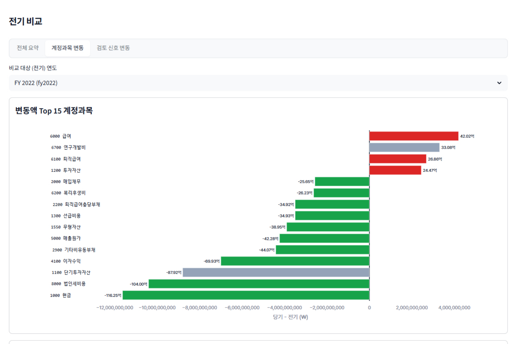

# 로컬 기반 전표 이상탐지 

## 개요

전수 전표 테스트로 **감사인이 먼저 볼 항목**을 고르는 1차 스크리닝 도구<BR>
LLM 개입 없이 로컬로 실행 가능

1. 전표 생성    : 회계적으로 성립하는 합성 원장 생성<br>(EY 스위스 Assurance R&D 가 공개한 오픈소스 DataSynth 기반 → K-IFRS 중견 제조업으로 개조. 원 저장소는 이후 비공개 전환)
2. 룰 탐지      : 결정론 룰을 설정하여 단위 규칙 위반 탐지
3. 조합 및 추출 : 탐지된 위반 항목을 조합하여 필터링 및 조회 가능
4. 보조 탐지    : 분석적 검토와 비지도 학습 VAE 모델 활용

```
   원장 CSV
       │
       ▼
 ┌─ 읽기 · 파생 · 검증 　　───────────────────────────────────────┐   ◀ 합성데이터 원장 스키마에 종속되어있음
    원장 읽기 ──────────▶ 파생변수 생성  ─────────▶ 구조검증             타사 데이터 적용 시
    합성데이터 기준       주말, 심야, 기말         필수 컬럼 존재 여부      컬럼 매핑 수정해야하는 한계 
    컬럼 읽기            수기, 관계사 등           없을 시 멈춤            
 └────────────────────────────┬──────────────────────────────────┘
                              ▼
 ┌─ 탐지   ───────────────────────────────────────────────────────────┐

    명시적 룰 29종         모집단 집계 신호          비지도 학습 모델(VAE)
    조건 위반 시         개별 단건으로는 정상      정상 전표의 특징을 학습
    해당 전표 발화       시간·계정·거래처로 묶어   재구성 오차가 큰 전표를
                            분포 검토                이상 후보로 분류
       │                        │                         │
       ▼                        ▼                         ▼
    데이터 정합성 점검     벤포드 등의 분석지표      ML 기반 검토 후보 목록
    사용자 조합 추출 가능  시각화하여 확인 가능         (성능 검증 실패)

 └────────────────────────────┬───────────────────────────────────────┘
                              ▼
                    회사·연도별 DuckDB
                              ▼
           여러 시각자료(streamlit)를 통해 다양한 분석 가능
```

**실제 화면**

> **입력 원장 —** 전표 37,895건 · 총 거래금액 1.36조 · 활성 계정 39개 · 기표자 149명 · 거래처 1,270곳

분석 실행 전 품질진단 화면. 이후 분석 실행 가능

<p align="center">
  
</p>

---

## 1. 초기 기획 및 기술적 한계

기획 목표 : AI 기반 **전수 검사 체계** 구축
- 목적: 표본 검사 방식에서 벗어나, AI를 활용한 전표 전수 검사 도입
- 기능: 대량의 전표 중 감사인이 우선 검토할 타겟 큐 자동 생성
- 방법론: 금융감독원 지적 사례 기반의 결정론적 룰과 비지도 학습(VAE) 모델 병행

기술적 병목 및 한계
- 합성 데이터의 구조적 결함
  - 부정 전표와 정상 전표의 생성 경로가 다름 → 정답지에 흔적이 남음
- 검증의 한계 (**실제 원장 부재**)
  - 부정 단서를 인위적으로 심으면 자문자답이 되어 검증이 무의미
  - 합성 데이터만으로는 모델의 실제 탐지 능력을 증명할 수 없음
- 탐지 범위의 한계
  - 실제 회계 부정은 거래처 마스터나 은행 내역 등 외부 관계망과의 대조를 통해 발견
  - 본 도구는 분석 범위를 **단일 법인 원장으로만 한정**함
  - 부정을 잡아낼 진짜 핵심 단서들이 데이터셋에서 누락됨

---

## 2. 실증 예시 — 단일 전표 파이프라인 처리 과정

정상 원장의 첫 번째 전표 데이터가 파이프라인을 통과하는 전체 과정을 추적<BR>
표기된 값은 모두 실제 생성된 레코드임

```
 ━━━ 전표 66e090a1 · 고객 대금 수금 · 2,176,500원 · 2022-11-27(일) 09:54 ━━━

 [생성]  시나리오 할당 ───▶ 계정 결정 ──────▶ 금액·일시 ──────────▶ 균형 검증
        매출채권 회수       1000 현금         2,176,500            차변 = 대변
                          1100 매출채권     일요일 09:54          정상 전표(라벨X)

         ◆ 수기 입력 · 작성자 CADAMS053 이 본인 전표를 그대로 승인

 [읽기]  표준 스키마와 컬럼명 일치하여 별도 매핑 없이 로드
         ◆ 합성데이터 스키마 = 표준 스키마

 [파생]  금액 ─ 동일 계정(1000) 내 금액 분포 편차 및 이상도 계산
         시간 ─ 일요일 09:54 · 주말 해당 · 심야 아님 · 증빙일자 괴리 0일
         패턴 ─ ROUND NUMBER 금액 아님 · 수기 입력

 [검증]  필수 컬럼 10개 존재 · 차/대변 음수(Negative) 없음 · 대차 차액 0.01 이내
         └─▶ 무결성 검증 통과, 탐지 단계 진입

 [탐지]  정상 원장임에도 불구하고 3개의 탐지 룰 위반 발생
         ┣ L1-05 자기 승인   작성자 = 승인자     
         ┣ L3-05 주말 전기   일요일 전기         
         ┗ L3-04 기말 집중   월말 ±5일 창        

 [목록]  대상(기말결산) × 수법(자기승인·수기입력) 충족 ─▶ 검토 큐 적재
```
정상 전표가 검토 목록에 오르는 것 자체는 1차 스크리닝의 정상 동작<br>
목록에 오른 것 중 무엇이 실제 문제인지는 감사인이 증빙으로 판단

---

## 3-1. 기술 설명 — 합성 데이터 생성

- 기반 모델   : EY 스위스 Assurance R&D 가 Apache 2.0 으로 배포한 오픈소스 DataSynth
- 커스터마이징 : K-IFRS 제조업 기준으로 스키마 및 시나리오 개편
- 특이사항    : 원본 GitHub 저장소는 현재 비공개 상태로 전환되어 참조 URL 부재

```
 ━━━ [1] 환경 설정 : 기업 규모·거래 비중·직원 수 등을 YAML 17개 파일로 관리 ━━━

      ◆ 사전 유효성 검증 : 설정 로드 시 우선 점검
                          (회사·거래·승인·문서흐름·분포·시계열·관계사·품질 게이트 등)
                      ┣ 비율 범위 (0~1)    초과(100% 이상) 및 음수 입력 차단
                      ┣ 비중 총합 (=1.0)   합계 1 미달로 인한 나머지 거래 유형의 소실 방지
                      ┗ 임계치 오름차순    금액 대역(소액 < 중액 < 고액) 산출 로직 붕괴 방지

 ━━━ [2] 생성 로직 : 8단계 순차 파이프라인 ━━━

    1  계정과목표    대상 법인의 가용 계정과목 풀 사전 생성
                     ┗ 탐지 룰이 특정 계정(예: 가지급금 1190)을 명시적으로 참조하므로, 무작위 자동 생성에 앞서 고정 할당
    2  마스터데이터  전표에 등장할 대상 구축 — 거래처·고객·자재·자산·직원(권한 한도 포함)
    3  문서흐름      실물 거래 프로세스 모사 : 예) 매입거래 : 발주(PO) ─▶ 입고(GR) ─▶ 송장(IR) ─▶ 대금지급
                     ┗ 문서 간 교차 대사 수행 및 실무적 불일치 시나리오 반영
    4  업무 이벤트   정상 진행 75% · 예외 20% · 오류 5% 확률 부여
    5  전표 생성     아래 [3]의 순서로 단위 전표 순차 생성
    6  이상치 주입   인위적 부정/오류 데이터 삽입 (정상 원장 생성 모드에서는 비활성화)
    7  잔액 추적     생성 단계에서 자산 = 부채 + 자본 + (수익−비용) 을 실시간 확인
    8  출력          73개 컬럼 CSV + 부속 명세서(거래처·문서흐름·세금·기간마감 등)

 ━━━ [3] 단위 전표 생성 메커니즘 ━━━

    ◆ 거래 유형   업무 흐름 7종에 걸친 20개 시나리오를 추출
                  ┗ 구매 2 · 판매 2 · 급여 2 · 결산 6 · 자산 3 · 자금 3 · 관계사 2
    ◆ 계정 매핑   거래 유형·차대 방향·계정 성격을 키로 계정결정표에서 계정 매칭
    ◆ 금액 산출   로그정규 분포 · 중앙값 약 120만원 · 하한 100원 · 상한 1,000억
                  ┗ EY DATA 생성기 원본은 달러 전제(중앙값 1,097달러)라 원화 규모로 다시 잡은 값
    ◆ 일시 지정   월말 · 분기말 · 연말 집중생성
    ◆ 적요 생성   업무 프로세스·계정 성격별 한국어 문구 템플릿에서 조합
    ◆ 권한 승인   한도 초과 시 권한자 승인 배정 및 생성자 본인 배제 (단, 2% 예외 전결 허용)
    ◆ 의미 검증   3중 체계 — 허용 목록 · 결정표로 계정 고정 · 사후 규칙 검사
                  ┣ 시나리오마다 허용 계정·거래처·문서유형·적요 계열 등 사정 정의
                  ┣ 사전 통제를 통과한 논리적 모순 조합 적발 (인건비 적요 + 구매 거래 등)
                  ┗ 걸리면 폐기 후 재생성 · 25회 실패 시 생성 자체를 중단
    ◆ 대차 균형   차변 합계 = 대변 합계 완전 일치

 ━━━ [4] 정합성 검증 : 생성된 합성 원장의 실무 현실성 평가 ━━━

    ◆ 생성 원칙   회계적으로 정상    차대 균형 · 양수 금액 · 기간 범위 내 · 계정 체계 준수
                  실무 예외 유지     승인 생략 · 자기승인 2% · 결산기 야근 존재 등
                  노이즈는 라벨 무관 결측 2% · 오타 0.15% — 정상·부정에 같은 비율로 적용
                  계정은 무작위 아님 거래 성격에서 계정으로 가는 결정표를 생성기에 내장

    ◆ 검증 지표   총 66개 (일반 57종 + 계정 9종) · 5단계 판정 (통과 / 실패 / 보류 / 관찰 / 참고)
    ┣ 복식부기    개별 전표 대차 일치 여부 및 재무상태표 등식(자산 = 부채 + 자본 + 당기순이익) 검증
    ┣ 금액 분포   매출원가율등 정상 범위 및 부(-)의 잔액 비율 2% 이하 확인
    ┣ 세무/부가세 부가세액이 공급가액의 9~11% 범주 내 안착 여부
    ┣ 승인 이력   시스템 자동 전기는 배치 번호 부여, 수기 전기는 공란 처리 규칙 준수 여부
    ┣ 법인 경계   단일 법인 스코프(Scope)가 부속 명세서 간에도 일관되게 유지되는지 대사
    ┗ 인위적 흔적 동일 금액이 특정 거래에 100건 이상 집중되거나, 동일 시각이 50건 초과 시 적발
                  (실제 적발 사례 : 특정 계정 162건 집중, 은행 거래처 3건 집중 발생)
```

### 거래 시나리오 20종

| 흐름          | 시나리오                                                    |
| ------------- | ----------------------------------------------------------- |
| 구매 P2P (2)  | 매입송장 · 대금지급                                         |
| 판매 O2C (2)  | 매출송장 · 고객입금                                         |
| 급여 H2R (2)  | 급여 발생 · 급여 지급                                       |
| 결산 R2R (6)  | 발생분개 · 마감분개 · 대손상각 · 퇴직급여 · 잡이익 · 역분개 |
| 자산 A2R (3)  | 취득 · 감가상각 · 개발비 자본화                             |
| 자금 TRE (3)  | 차입 · 이자지급 · 임원 가지급                               |
| 관계사 IC (2) | 관계사 매출 · 관계사 정산                                   |

### 이상치 주입 시나리오 — 금융감독원 감리 지적 사례 기반

정상 원장 베이스라인을 유지한 상태에서 14종의 부정 시나리오를 오버레이 방식으로 별도 주입<BR>
각 시나리오는 단건이 아닌 3~4단계의 연속된 분개 흐름으로 구성

| id   | 수법        | 흐름 | id   | 수법            | 흐름   |
| ---- | ----------- | ---- | ---- | --------------- | ------ |
| FS01 | 가공매출    | 매출 | FS08 | 부적절 자본화   | 결산   |
| FS02 | 진행률 조작 | 결산 | FS09 | 컷오프 조작     | 매출   |
| FS03 | 현금 횡령   | 매입 | FS10 | 대손 회피       | 매출   |
| FS04 | 횡령 은폐   | 매입 | FS11 | 특수관계자 남용 | 관계사 |
| FS05 | 순환거래    | 매출 | FS12 | 충당금 누락     | 결산   |
| FS06 | 부채 누락   | 매입 | FS13 | 손상 회피       | 관계사 |
| FS07 | 재고 과대   | 매입 | FS14 | 유령직원 급여   | 급여   |

1. 다중 전표 기반의 시퀀스 주입 (핵심 설계)
  - 단일 전표의 수치 조작이 아닌, 연계된 흐름 전체를 모사
  - (예: [가공매출 시나리오] 매출 계상 ─▶ 가공 회수 ─▶ 매출채권 담보 차입 ─▶ 차기 역분개의 4단계 사이클로 주입)

2. 정상 데이터 오염 방지
  - 계정 체계 오염 방지: '신규 미식별 계정 = 부정'이라는 단순 패턴 학습을 막기 위해 정상 전표에서 고빈도로 사용되는 22개 실존 계정으로 설정
  - 적요(텍스트) 마스킹: 시나리오 명칭 등 식별자가 텍스트에 노출되어 모델의 정답지로 작용하지 않도록, 정상 전표의 범용 헤더 텍스트로 치환 적용.

---

## 3-2. 기술 설명 - 룰 위반 검증

```
 검증 통과 원장
        │
        ├─▶ 정합성 검사기     ── 차대균형 · 필수필드 · 무효계정 ────┐
        ├─▶ 부정 탐지 계층    ── 우회 승인·자본화 등 14개 룰 ───────┤ 
        ├─▶ 이상 탐지 계층    ── 시점·고액·역분개 등 11개 룰 ───────┤ 
        └─▶ 증빙 대사 검사기  ── 기간 귀속 ────────────────────────┘
                        │
                        ▼
    개별 탐지 모듈은 예외 발생 시에도 표준 결과 객체 반환
        ◆ 실행 상태(실행 / 스킵 / 오류) 및 스킵 사유를 계약 필드에 명시
          ┗ '필수 컬럼 결측으로 인한 실행 불가'와 '실행 결과 위반 건수 0건'의 상태 분리

 ※ 벤포드 법칙 및 계정 단위 집계 신호는 동일 파이프라인 내에서 병렬 실행되나,
    별도의 분석적 검토 영역으로 분류 (3-4 참조)
```

**룰 설계 원칙**

- 이진 판정 : **위반/비위반 여부**만 확정적으로 판정, 임의의 위험 점수나 확률을 산출하지 않음.
- 결정론적 실행 : 동일 입력에 대해 항상 동일한 결과를 반환, LLM 배제
- 임계치 외부 설정 : 전결 한도, 결산 일정, 근무 시간 등 기업별 편차가 있는 파라미터는 소스코드에서 분리하여 **외부 설정 파일**로 관리
- 실행 상태 명확화 : '필수 컬럼 결측으로 인한 실행 불가' 상태와 '정상 실행 후 위반 건수 0건' 상태를 구분하여 로깅

**룰의 근거**

- **조작 대상**은 금융감독원 공개 감리 지적 사례(2009년~ 231건)에서 반복되는 계정·거래 유형에서 잡았다
- **조작 방법**은 회계감사기준 240이 든 부정 분개의 특징(수기 입력 · 승인 우회 · 비정상 시간대 · 비경상 계정)에서 잡았다
- 두 출처의 역할이 갈리는 이유가 있다 — 감리 원문은 "무엇이 조작됐나"는 쓰지만 **"전표를 어떻게 입력했나"는 거의 쓰지 않는다**
- **탐지 범위를 GL 원장 안으로 한정했다** — 고위험 사례 36건 중 25건(69%)은 실물 재고·부외자금·증빙 위조·타사 원장이라 원장만 봐서는 신호가 없다

**룰이 맞게 도는지는 사후에 두 방향으로 쟀다** — 정상 원장에서 발화율이 미리 선언한 대역 안에 있는가(§4), 표적 위반을 심었을 때 전수 발화하는가.

감리 사례를 룰과 1:1 대조한 **731행 지도**는 룰을 만든 재료가 아니라, 만들어 둔 등급 체계의 실증 근거를 확인하려고 나중에 만든 것이다. 그 대조에서 근거가 무너져 등급을 폐지했다(3-3).

이진 판정 탐지기 4종을 병렬로 돌리고 결과는 완료 순서가 아니라 **입력 순서로 재정렬**한다. 실행할 때마다 룰 순서가 바뀌면 같은 데이터에서 같은 화면이 나오지 않는다.

### 룰이 몇 개인가 — 세는 기준이 넷

| 기준                   |  개수  | 무엇을 세나                                                  |
| ---------------------- | :----: | ------------------------------------------------------------ |
| 탐지 함수 레지스트리   | **35** | 실제 탐지 함수. 접근감사 4종·증빙 2종 포함                   |
| 점수 정규화 레지스트리 | **37** | 하위 변형과 별칭 포함, 접근감사·증빙 미포함                  |
| **활성 표면**          | **29** | 35 − 설정 게이트 기본 off 5 − 미구현 스켈레톤 1              |
| 발화율 판정 분모       | **28** | 대역표 33행 − 모집단 신호 이관 1 − 계측 미분리 1 − 유령 ID 3 |

이 구분을 흐리면 "31개 룰 전부 검증 완료" 같은 문장이 만들어진다. 실제로는 29개를 검증했고 6개는 애초에 대상이 아니었으며 3개는 탐지기가 존재하지 않는 유령 ID였다.

### 주제별 분류

| 주제           | 룰                                      | 어떻게 판정하나                                             | 조정 가능한 값                                        |
| -------------- | --------------------------------------- | ----------------------------------------------------------- | ----------------------------------------------------- |
| 데이터 정합성  | L1-01·02·03·08                          | 차변합 ≠ 대변합 · 필수 칸 공란 · 계정과목표에 없는 계정     | 대차 허용 오차 0.01                                   |
| 승인·권한      | L1-04·05·06·07·07-02                    | 작성자 = 승인자 · 승인자 공란 · 승인 한도 < 금액 · 겸직     | 자동·반복 전기는 자기승인 면제 · 중요성 초과는 즉시   |
| 금액·분할      | L2-01·02·03 · L4-01·03                  | 한도 바로 아래 구간 집중 · 같은 거래처에 쪼갠 지급 · 재지급 | 한도 근접 90% · 분할 3일 · 중복 90일 · 적요 유사도 80 |
| 시점           | L3-04·05·06·07 · L4-05·06               | 결산 창 집중 · 주말 · 심야 · 증빙일보다 늦은 전기           | 기말 ±5일 · 심야 22~06시 · 정상 근무 08:30~18:30      |
| 계정·거래 성격 | L2-04·05 · L3-02·03·09·10·11·12 · L4-04 | 비용을 자산으로 · 역분개 쌍 · 수기 입력 · 가계정 미정리     | 수기 소스 코드 · 가계정 키워드 · 추정 계정 목록       |

**데이터 정합성만 위험 목록에서 분리한다.** 차대 불일치나 필수필드 누락은 부정 징후가 아니라 데이터가 깨진 것이므로, 별도 패널로 빼서 "먼저 데이터를 고치라"는 신호로만 쓴다.

<p align="center">
  
</p>
<p align="center"><sub>정합성 오류는 룰 위반이 아니라 <b>데이터 결함</b>으로 분리한다. 차이 큰 순으로 세우고 검토 포인트를 함께 적는다.</sub></p>

<details>
<summary><b>활성 룰 29종 전수 (펼치기)</b></summary>

| 룰       | 이름          | 룰    | 이름             | 룰    | 이름              |
| -------- | ------------- | ----- | ---------------- | ----- | ----------------- |
| L1-01    | 차대변 균형   | L2-01 | 한도 직하 분할   | L3-09 | 가계정 장기미정리 |
| L1-02    | 필수필드 누락 | L2-02 | 분할 거래        | L3-10 | 추정계정          |
| L1-03    | 무효 계정     | L2-03 | 중복 전표        | L3-11 | 수익 컷오프       |
| L1-04    | 승인한도 초과 | L2-04 | 비용 자본화      | L3-12 | 업무범위 집중     |
| L1-05    | 자기 승인     | L2-05 | 역분개 거울쌍    | L4-01 | 매출 이상치       |
| L1-06    | 직무분리 위반 | L3-02 | 수기 전환        | L4-02 | 벤포드 이탈       |
| L1-07    | 승인 생략     | L3-03 | 관계사 꼬리표    | L4-03 | 절대 고액         |
| L1-07-02 | 유령 승인자   | L3-04 | 기말 집중        | L4-04 | 희귀 차대 계정쌍  |
| L1-08    | 기간 불일치   | L3-05 | 주말 전기        | L4-05 | 심야 배치         |
|          |               | L3-06 | 심야 전기        | L4-06 | 배치 이상         |
|          |               | L3-07 | 전기-증빙일 괴리 |       |                   |

</details>

<p align="center">
  
</p>
<p align="center"><sub>개요는 위험 크기가 아니라 "무엇을 얼마나 검사하는가"만 보여준다. 등급 도넛과 즉시검토 리본은 등급 폐지와 함께 걷어냈다.</sub></p>

---

## 3-3. 기술 설명 — 룰 위반 조합 검토

룰 조합에 HIGH/MEDIUM 등급을 자동 부여하던 설계를 **폐기**했다. 등급의 실증 근거를 확인하려고 금융감독원 감리 지적 사례를 엄격 기준으로 재태깅(731행)했더니 지지가 무너졌다.

| 구 HIGH 조합    | 감리 사례 확정 건수 |
| --------------- | ------------------: |
| 기말 × 추정계정 |               12~22 |
| 나머지 전부     |                 0~3 |

원인은 자료의 장르였다. 감리 문서는 "무엇이 조작됐나"는 쓰지만 **"전표를 어떻게 입력했나"는 쓰지 않는다.**

따라서 수법 신호가 낀 조합은 원문으로 영구히 실증할 수 없고, 합성데이터로 메우면 우리가 넣은 파라미터의 메아리가 된다. 등급 산출 모듈은 662줄에서 193줄로 줄었다.

### 어휘 — 조작 대상 10 × 조작 수법 10

**대상** 자격은 두 조건을 모두 만족해야 한다 — 감리 사례 확정 1건 이상 · 감사기준서 240의 조작대상 조항 매핑.

| 룰    | 대상        | 감리 확정 | 룰       | 수법          | 출처 성격  |
| ----- | ----------- | --------: | -------- | ------------- | ---------- |
| L3-10 | 추정계정    |       147 | L3-02    | 수기          | 명문       |
| L3-03 | 관계사      |        80 | L1-04    | 승인한도초과  | 명문       |
| L3-11 | 컷오프      |        23 | L1-05    | 자기승인      | 명문       |
| L2-04 | 비용자산화  |        22 | L1-07    | 승인생략      | 명문       |
| L3-04 | 기말결산    |        20 | L1-07-02 | 유령승인자    | 명문       |
| L4-01 | 매출과대    |        20 | L1-06    | 직무분리 겸직 | 명문(부록) |
| L4-03 | 이상고액    |        12 | L3-07    | 소급기표      | 명문       |
| L2-05 | 역분개      |         3 | L4-04    | 희소계정쌍    | 명문       |
| L3-09 | 가수금 체류 |         2 | L3-05    | 휴일 입력     | 실무 관행  |
| L1-08 | 기간귀속    |         1 | L3-06    | 심야 입력     | 실무 관행  |

기준서가 명문으로 든 "라운드넘버" 수법은 해당 룰이 전표 단위로 미구현이라 **탐지 갭으로 기록**했다. 있는 척하지 않는다.

### 결합 의미론

```
 ◆ 기본 모드   (대상 중 1개 이상)  AND  (수법 중 1개 이상)
               ┣ 그룹 안은 OR · 그룹 사이는 AND
               ┗ 한 그룹을 비우면 그쪽은 무조건 통과 (탐색 모드)

 ◆ 엄격 모드   선택한 룰이 전부 한 전표에 발화
               ┗ 엔진·판정 스크립트는 지원, 현재 화면은 기본 모드만 노출

 ◆ 정렬        분류 점수 → 시간 심각도 → 금액 → 증거 수
               ┗ 금액은 마지막 동점 처리에만 — 고액 정상 거래가
                 신호 있는 소액 전표를 밀어내지 않게

```

### 프리셋 — 등급이 아니라 시작점

카드마다 그 조합이 **어떤 룰 논리식인지** 그대로 적는다. 추상 라벨을 없애 결합 의미론이 화면에서 읽히게 한 것이고, 감리 확정 건수는 어휘 정본에 남기되 화면에는 노출하지 않는다.

| 프리셋                  | 대상                         | 소명                                       |
| ----------------------- | ---------------------------- | ------------------------------------------ |
| 추정·관계사 조작        | 추정계정 · 관계사            | 감리 최다 적발 2종이 함께 확정된 사례 10건 |
| 수익인식                | 매출과대 · 컷오프 · 기간귀속 | 기준서 240 — 수익인식은 부정위험 추정      |
| 역분개·은폐             | 역분개 · 가수금 · 이상고액   | 기말 분식 후 되돌림 · 경과계정 은폐        |
| 비용자산화              | 비용자산화                   | 감리 22건 실증 수법                        |
| 결산 손상·충당금 미인식 | 기말결산 · 추정계정          | 두 대상이 함께 확정된 사례 5건             |

<p align="center">
  
</p>
<p align="center"><sub>카드에 <code>(L2-04 비용자산화) and (L3-02 수기 or L1-04 승인한도초과 or …)</code>가 그대로 적힌다. 행을 클릭하면 그 전표의 실제 분개 라인이 아래에 펼쳐진다.</sub></p>

표면은 세 갈래다 — **조합 빌더**(주 검토) · **커버리지 큐**(어휘 밖 룰까지 전수) · **정합성 패널**(데이터 결함).

---

## 3-4. 기술 설명 - 분석적 검토

전표 한 장만 봐서는 안 보이고 계정·거래처·작성자를 모아야 드러나는 신호다. 근거는 감사기준서 520이다.

```
 ◆ 자기 큐 (별도 목록)                     ◆ 꼬리표 (전표 줄의 맥락)
   벤포드 · 라운드넘버 밀집 · 첫등장/희소    심야집중 · 배치 · 업무범위
   계정 활동 변동 · 결산월 집중 변동         + 라운드넘버 단건 · 첫등장 전표
        │                                       │
   "이 계정·거래처가 통째로 이상하다"       "정상 업무에 흔해 단독 큐는 노이즈"
   독립 표면 · 전표 등급에 미참여            전표에 표시만 · 등급 안 바꿈

 ◆ 점수 비병합 3중 강제
   ├─ 점수 레지스트리에서 역할계수를 0으로
   ├─ 케이스 빌더가 이 룰들을 집합으로 배제
   └─ 탐지기가 행 점수를 0으로 대입
      ┗ 함정 : 레지스트리에서 지우면 폴백이 주 신호로 잡아 점수가 오히려 붙는다
              → 제거가 아니라 계수 0으로 중화해야 한다
```

같은 현상이라도 모집단 쏠림은 신호이고 개별 건은 흔한 일이라, 라운드넘버는 **밀집도는 자기 큐 · 단건은 꼬리표**로 갈라 둔다.

### 자기 큐 5종

| 신호               | 단위               | 판정 방식                                                                  |
| ------------------ | ------------------ | -------------------------------------------------------------------------- |
| 벤포드 이탈        | 계정·월            | 평균절대편차 0.012 이하 적합 · 0.015 초과 강한 부적합 · 표본 500 미만 제외 |
| 라운드넘버 밀집    | 계정·전기월·작성자 | 이항검정(유의수준 0.01) + 기준선 초과분 하한 5%p · 표본 100 미만 제외      |
| 첫등장/희소 거래처 | 거래처             | 전기 미등장 · 거래 건수 하위 10분위 · 직전 연도 결번 후 재등장             |
| 계정 활동 변동     | 계정·전기대비      | **컷 없음** — 비교 가능한 전 계정을 금액·건수·건당 금액 축별로 정렬        |
| 결산월 집중 변동   | 계정·전기대비      | **컷 없음** — 결산월 비중 증가분 내림차순(부호 유지)                       |

라운드넘버 밀집의 기준선은 상수가 아니라 **그 원장 전체의 둥근 금액 비율**이다. 정상 비율은 산업과 회사마다 다르므로 데이터에서 뽑고, 표본이 크면 사소한 차이도 유의해지므로 p값 앞에 효과크기 하한을 건다.

<p align="center">
  
</p>
<p align="center"><sub>막대 길이가 그 그룹의 둥근 금액 비율이고 점선을 넘어간 폭이 초과분이다. 정렬이 곧 검토 우선순위가 된다.</sub></p>

### 임계를 버린 이유

계정 활동 변동과 결산월 집중 변동에는 목록을 자르는 컷이 있었는데 **어느 숫자도 근거를 댈 수 없었다.** 실측에서 결산월 신호가 계정 하나만 남겨 화면이 고장 난 것처럼 보이자 컷을 전부 폐기하고, 비교 가능한 계정을 전부 세운 뒤 어디서 끊을지는 감사인이 정하게 했다.

정렬 기준은 **표에 보이는 숫자가 그대로 정렬 키**가 되도록 골랐다. 감사에서 읽고 싶은 문장은 "이 계정, 연간 금액 중 결산월분이 전기 9% → 당기 38%" 하나이므로 그 한 축만 남겼다.

결산월은 12월로 박지 않고 그 원장에서 관측된 최대 회계기간으로 정한다.

<p align="center">
  
</p>
<p align="center"><sub>두 신호는 전기 원장을 붙여야 산출되므로 전기 비교 화면에 붙였다. 금액 변동 Top 15 바로 아래에 계정 단위 활동 변동표가 이어진다.</sub></p>

**폐기한 신호도 있다.** "당기 안에서 특정 시점에 몰리는 것"을 자기 큐로 만들었다가 실측에서 전제가 무너졌다 — 발화 864건 중 분기말이 70.0%, 분기말끼리 비교해도 12월이 최다였다.

감가상각·충당금·법인세가 연말에만 얹히므로 연말 결산은 원래 무겁다. 감사인이 이미 아는 사실을 계정마다 다시 찾아내는 신호라 배선을 걷어냈다.

---

## 3-5. 기술 설명 - VAE 비지도 학습

정상 데이터만으로 정상 분포를 학습한 뒤, 복원이 잘 안 되는 행을 추가 검토 후보로 올리는 표면이다. 합성데이터에서 지도학습은 순환 논증이라(부정 라벨은 우리가 심은 것) 라벨을 쓰지 않는 쪽을 골랐다.

### 학습 구성과 1차 관문

| 항목             | 값                        | 항목                     | 값         |
| ---------------- | ------------------------- | ------------------------ | ---------- |
| 학습·보정 표본   | 각 50,000행 (라벨 미사용) | 임계                     | 상위 1%    |
| 피처 수          | 71                        | 학습 소요                | 460.9초    |
| 은닉 / 잠재 차원 | 64 / 32                   | 학습 구간 플래그율       | 0.998%     |
| 학습 회차 / 배치 | 50 / 256                  | **미학습 정상 플래그율** | **1.056%** |
| 학습률           | 0.001                     | 오염 설정                | 1.00%      |

사전 선언 대역(설정값의 0.3~3배) 안이라 **통과**다. 모델이 정상을 정상으로 보고 있다는 뜻이다.

### 라벨 누수 차단 3중 방어

| 겹  | 장치           | 내용                                                               |
| --- | -------------- | ------------------------------------------------------------------ |
| 1   | 컬럼 차단 목록 | 누적 52컬럼 — 단일 컬럼 판별력이 높았던 것 전부 · 해제 없음        |
| 2   | 이름 패턴 차단 | label · fraud · score · model 등 12토큰을 정규식으로               |
| 3   | 물리 제거      | 8컬럼을 데이터에서 아예 제거 — 실수로 참조하면 즉시 실패           |
| —   | 금액 전량 차단 | \"합성 금액이 너무 깨끗해 지름길 학습을 유발\" — 전 금액 컬럼 차단 |


### 2차 관문 — 부정 데이터에서 무작위 수준

| 지표 (시드 4벌 합산)                            | 값                        |
| ----------------------------------------------- | ------------------------- |
| 문서 판별력(AUROC) 평균                         | **0.5187** (무작위 ≈ 0.5) |
| 상위 1% 회수율 평균                             | **0.0038**                |
| 룰이 표면화하지 못한 부정 중 VAE 상위 1%가 회수 | 4벌 합계 **2건**          |

**완화 없이 그대로 적는다.** 그리고 합성 경로로는 이 검증 자체가 성립하지 않는다는 것이 이번 라운드의 결론이다.

```
 흔적을 심는다        ──▶ 자기가 심은 것을 자기가 찾음 (자문자답)   ↓ 성능 증거 아님
 흔적을 안 심는다     ──▶ 정보가 없어 못 잡음                      ↓ 성능 증거 아님
 안 심으려 했는데
 게이트 밖에서 남았다 ──▶ 측정 자체가 무효 (§8에서 확인)           ↓ 성능 증거 아님
```

구세대 데이터에서 얻었던 판별력 0.93은 **흔적을 심은 자문자답 수치**였음을 명시적으로 무효화했다. 좋은 숫자를 폐기하는 결정이었다.

<p align="center">
  
</p>
<p align="center"><sub>잘 나오지 않는 지표도 화면에 그대로 띄운다. 이 표면이 무엇을 하는지 판단하려면 <b>얼마나 못 맞히는지</b>가 보여야 한다. 곡선 옆에 "평가 전용"과 라벨 출처를 함께 적었다.</sub></p>

---

## 4. 검증

모든 판정은 스크립트 종료 코드가 완료 선언이다. 문장으로 "전수 완료"를 쓰지 않는다.

| 검증 항목        | 방법                             | 결과                                         |
| ---------------- | -------------------------------- | -------------------------------------------- |
| 룰 발화율 대역   | 대역 사전 선언 후 정상 원장 실측 | **통과 27 / 28**                             |
| 룰 단위시험      | 룰별 표적 위반 주입 후 적중 판정 | **29 / 29** exit 0                           |
| 빌더 날조 검사   | 제시 증거가 오라클에 실재하는가  | **위반 0 / 36,774 단위**                     |
| 빌더 결합 의미론 | 120셀 × 2모드 독립 재구현 대조   | **120/120** · **120/120**                    |
| 부정 표면화      | 부정 데이터 4벌 문서 커버리지    | **197~204 / 330** (59.7~61.8%) ⚠ 대비는 상한 |
| VAE 부정 탐지    | 4벌 문서 판별력                  | **0.5187** — 성능 검증 불성립(데이터 무효)   |
| 현실성 게이트    | 57종 자동 검사                   | 통과 37 / 실패 7 / 보류 9 / 정보 4           |
| 단위 테스트      | pytest 수집                      | **4,178개** (파일 282개)                     |

### 정상에서 조용한가 — 발화율 대역

핵심 장치는 **측정 전 대역 선언**이다. 실측한 뒤 그 숫자에 맞춰 기준을 정하면 아무것도 증명하지 못하므로, 룰별 허용 대역을 문서에 먼저 박고 측정했다.

대역 밖은 자동 불합격이 아니라 조사 대상이고, 조사 결과를 ①생성기 결함 ②룰 과탐 ③대역 오선언으로 3분류한다.

| 룰                  | 실측 발화율 | 선언 대역      | 판정        |
| ------------------- | ----------: | -------------- | ----------- |
| L1-07 승인 생략     |      22.73% | [15%, 30%]     | 통과        |
| L3-04 기말 집중     |      14.14% | [10%, 20%]     | 통과        |
| L3-02 수기 전환     |       8.16% | [5%, 12%]      | 통과        |
| L1-06 직무분리      |       3.05% | [0.5%, 8%]     | 통과        |
| L3-11 컷오프        |      0.072% | [0.01%, 0.2%]  | 통과 (부활) |
| **L4-03 절대 고액** |   **3.61%** | [0.065%, 0.6%] | **실패**    |

**죽은 룰 3종을 되살린 라운드**가 있었다. 이전 세대에서 12개 룰이 0건이었고, 0건은 "정상이 깨끗하다"일 수도 "룰이 죽었다"일 수도 있어 전수 재점검했다. 결과는 수정 3 / 정당 6 / 탐지기 부재 3이었다.

| 룰              | 0건이었던 이유                            | 수정                                    |
| --------------- | ----------------------------------------- | --------------------------------------- |
| L3-11 컷오프    | 통제이전일이 입고 문서 전용 → 구조적 침묵 | 출하·입고 기준 원설계 복원              |
| L3-07 증빙 괴리 | 생성 분포가 ±29일로 잘려 30일 초과 불가   | 매입·수기 계열에 31~90일 지연 꼬리 주입 |
| L3-09 가계정    | 정리 신호 컬럼이 원장에 없음              | 정리 여부 컬럼 신설(가계정 행 전용)     |

처음에는 "정상이니까 0이 맞다"고 대역을 재선언하려 했으나, "정상에 컷오프가 0건인 게 이상하다"는 지적으로 재개봉해 생성기 갭으로 재분류했다. **데이터를 테스트에 맞추지 않고 생성기를 고쳤다.**

### 쏴야 할 때 쏘는가 — 단위시험

정상에서 조용한 것만으로는 부족하다 — 룰이 고장 나 있어도 조용하다. 룰별로 교과서적 위반 전표를 심고 **자기 표적에서 발화하는지** 판정했다.

1차 판정은 26/29였고, 미발화 3건을 추적한 결과 **전부 시험 장치의 결함**이었다.

| 룰              | 1차 미발화 원인                                               | 교정                              |
| --------------- | ------------------------------------------------------------- | --------------------------------- |
| L1-03 무효 계정 | "미등재 계정"으로 심은 코드가 실제 계정과목표에 등재돼 있었음 | 런타임에 계정과목표를 읽어 선택   |
| L2-03 중복 전표 | 중복 키가 전기 시각까지 비교하고 거래처 빈 행은 제외됨        | 동일 시각·동일 거래처로 교정      |
| L3-12 업무범위  | 점수를 싣지 않는 룰이라 점수 채널이 항상 0                    | 판정기가 두 채널 모두 읽도록 보강 |

세 번째가 특히 교훈적이다. **점수 0이 침묵을 의미하지 않는다.** 측정 도구가 제품 구조를 모르면 멀쩡한 룰을 고장으로 판정한다.

### 데이터셋 부적격 — 이 수치의 데이터를 직접 심문했다

화면에 판별력 곡선을 붙이면서 그 값이 낮은 원인을 팠고, 원인이 모델이 아니라 **측정 대상 데이터**에 있었다.

| 측정                         | 결과                                               |
| ---------------------------- | -------------------------------------------------- |
| 부정·정상 결측률 차 5%p 초과 | 69컬럼 중 **16개**                                 |
| 가계정 플래그 결측 여부 단독 | 부정 100% 결측 · 정상 0% 결측 → **판별력 1.000**   |
| 승인자 보유                  | 부정 **100%** · 정상 28.4%                         |
| 승인 생략 룰의 부정 표면화   | **0.000** (부정이 전부 승인자를 가져 발화 불가)    |
| 룰 하나라도 발화             | 부정 95.2% vs 정상 **98.9%** → 이 축에 판별력 없음 |

즉 부정 전표가 생성 경로 차이로 특정 컬럼이 통째로 비거나 차 있었다. 명문화한 생성 규칙의 정면 위반이고, **이 데이터에서 나온 어떤 탐지 성능 수치도 인용할 수 없다.**

지름길 게이트가 왜 통과시켰는지도 확인했다. 결측률 축의 검사 대상이 메타 컬럼 8개뿐이었고, 단일 피처 축은 "채워져 있으면 부정"을 판정 형태로 갖지 않았다. **거짓 통과가 아니라 선언한 범위를 지켰고 그 범위가 좁았다.**

역설이 하나 남는다. 지름길이 실재했다면 점수가 부풀어야 했는데 부풀지 않았다 — 가장 강한 지름길은 차단 목록이 입력 전에 잘라냈고, 통과한 지름길은 비지도 구조가 성능으로 환산하지 못했다(점수와의 상관 −0.049).

다만 이것은 **방어 장치에 대한 주장이고 모델 성능에 대한 주장이 아니다.** VAE의 부정 탐지 성능은 여전히 증명되지 않았고, 이 데이터로는 증명도 반증도 할 수 없다.

### 전수 커버리지

정리 보고서(`FINAL-REPORT/`)는 표본이 아니라 전수를 근거로 쓴다. 정독할 파일 목록을 사람이 만들면 그 시점에 누락이 생기므로 분모를 스크립트가 고정하고, 커버리지 표와 인벤토리의 차집합이 0인지 검증기가 확인한다 — 현재 **11,436 / 11,436**.

---

## 5. 핵심 의사결정

### ① 목표를 과하게 잡았다 → 세 표면으로 축소

처음에는 관계 분석·순환거래 대사·6모델 앙상블·계층적 순위결합까지 넣으려 했다. 감사 계약이 법인 단위라는 사실 앞에서 다법인을 전제한 검사기들은 실제 사용 맥락에서 돌 수 없었고, 순위결합은 실측에서 오히려 손실(합집합 363건 대비 결합 321건)이었다.

| 버린 것                          | 사유                                        |
| -------------------------------- | ------------------------------------------- |
| 관계 분석 계열 · 순환거래 검사기 | 단일 법인 원장으로는 원리상 불가            |
| 6모델 앙상블 · 계층적 순위결합   | 합성데이터 지도학습은 순환 학습 · 실측 손실 |
| LLM 서술 생성 · Text-to-SQL      | 외부 API에 원장·증거 전송 금지              |


### ② 등급을 매기려 했으나 기준이 설명되지 않았다 → 어휘 제공으로

등급의 근거는 세 축이었다 — 감사기준 인용, 감리 실증 건수, 조합별 전문가 특례. 실질 결정력은 세 번째였고, 재태깅으로 두 번째 축이 무너졌다.

| 구분 | 전                                      | 후                                |
| ---- | --------------------------------------- | --------------------------------- |
| 산출 | 조합마다 HIGH/MEDIUM/LOW/맥락 자동 부여 | 등급 없음 · 일치 건수와 발화 룰만 |
| 근거 | 조합별 특례("보강신호 1개면 승격")      | 감리 확정 건수 · 기준서 문언 표기 |
| 코드 | 등급 산출 662줄 · 조합 바닥값 12종      | 193줄 · 바닥값 전부 삭제          |
| 판단 | 도구가 선언                             | 감사인이 조합을 고름              |

**방어할 수 없는 주장은 하지 않는 것이 가장 방어적인 설계다.**

### ③ VAE를 끝내 못 살렸다 → 실패 기록 후 판정 정정

아무리 해도 되지 않았고 판별력 0.5187로 실패를 기록했다. 이후 진단에서 그 수치의 데이터가 성능 측정에 부적격이라는 것이 드러났다.

판정 이름을 **"검증 실패" → "성능 검증 불성립(측정 데이터 무효)"**로 고쳤다. 수치는 그대로 두고 라벨과 원인 설명만 교체했다.

그리고 **생성기를 고치지 않기로 결정했다.**

| 근거                        | 내용                                                                    |
| --------------------------- | ----------------------------------------------------------------------- |
| 고쳐서 지킬 것이 없다       | 본문 검증 수치는 다른 데이터셋 기반이라 이 결함의 영향권 밖             |
| 이 데이터셋엔 판별력이 없다 | 룰이 정상 전표 98.9%에 발화 — 어떤 방법도 대비를 만들 수 없다           |
| 고쳐서 얻는 것이 인용 불가  | 산출물은 합성 라벨의 자기참조 때문에 애초에 성능 주장에 쓸 수 없는 수치 |

대신 데이터셋에 **성능 측정 부적격** 딱지를 붙였다. 목적은 하나다 — 나중에 누가(작성자 자신을 포함해) 이 판별력 수치를 성능으로 인용하지 않게 하는 것.

생성기 결측 패턴과 게이트 범위는 **고칠 계획이 없다는 사실까지** 미조치로 기록했다.

---

## 6. 트러블슈팅

디버깅 기록 8,351줄을 전수 정독해 사고 96건을 추출했다. 피해와 교훈 기준으로 대표만 남긴다.

| 사고                        | 증상·피해                               | 근본 원인                                                     | 재발 방지                            |
| --------------------------- | --------------------------------------- | ------------------------------------------------------------- | ------------------------------------ |
| 설정 손작성으로 12섹션 유실 | 금액이 1,223배 축소                     | 섹션 누락이 에러가 아니라 조용한 기본값 적용                  | 정본을 읽어 최소 변경 · 섹션 수 확인 |
| 합성데이터 fitting 한계     | 누출 컬럼 판별력 0.998                  | 부정을 규칙으로 심으면 그 규칙이 컬럼에 남는다                | 구조적 한계로 인정 · 차단 목록 도입  |
| 직무분리 룰 99.96% 과탐     | 110만 건 중 110만 건이 위반             | 한국 기업 조직 구조에 맞지 않는 조합 정의                     | "설정과 데이터의 계약" 개념 도입     |
| 저장은 하고 로드는 안 함    | 재시작하면 화면이 비어 10분 재실행 요구 | 저장 함수와 로더는 있는데 앱이 로더를 부르지 않았다           | 저장·로드 배선을 같은 변경에 함께    |
| 화면이 실행 상태를 추정     | 전기 데이터가 있는데 "스킵됨"으로 표시  | 계정 단위 신호는 전표 건수가 늘 0인데 "0이면 스킵"으로 라벨링 | 상태는 실행 기록으로만 판정          |

### 반복된 실패 패턴

| 패턴           | 실체                                                                   |
| -------------- | ---------------------------------------------------------------------- |
| 조용한 기본값  | 누락이 에러가 아니라 기본값으로 채워지는 구조가 최대 피해 두 건을 만듦 |
| 스테일 산출물  | 빌드가 무동작이거나 캐시가 남아 "고쳤는데 안 고쳐진 것으로" 보임       |
| 측정 도구 결함 | 게이트 4종은 항등식이었고, 시험 장치가 멀쩡한 룰 3개를 고장으로 판정   |
| 반쪽 배선      | 각 조각은 정상인데 조각을 잇는 선이 없음 — 단위 테스트로는 안 잡힌다   |
| 좁은 분모      | 도구는 동작하는데 보는 범위가 좁아 결함이 그 밖으로 빠짐               |

마지막 패턴이 가장 늦게 나왔다. 게이트가 통과한 것은 "깨끗하다"가 아니라 **"우리가 본 축에서 깨끗하다"**이고, 그래서 게이트를 볼 때 결과보다 먼저 분모를 본다.

### 검토 목록을 만드는 두 방향의 실패

| 실패           | 어떻게 생기나                           | 결과                                            |
| -------------- | --------------------------------------- | ----------------------------------------------- |
| 표본 편향      | 금액 상위 100건을 뽑음                  | 고액 정상 거래가 목록을 채우고 쪼갠 은폐는 빠짐 |
| 등급 방어 부담 | 도구가 "이 전표는 HIGH 위험"이라고 선언 | 감사인이 왜 HIGH인지 조서에 써야 함             |

---

## 7. 한계점

| #   | 한계                    | 성격                                                                                               |
| --- | ----------------------- | -------------------------------------------------------------------------------------------------- |
| 1   | **행 단위 비지도 탐지** | 판별력 무작위 수준 · 이 데이터로는 증명도 반증도 불가 — 실데이터와 감사인 라벨이 전제              |
| 2   | **순환거래 원환**       | 은행 계좌망·다사 장부 대조가 전제 — 단일 법인 원장에서는 전표마다 정상 매출·매입·지급 (표면화 22%) |
| 3   | **가공거래처 확정**     | 사업자번호 위조·공유 계좌는 거래처 마스터가 있어야 보임 → 약한 근사만 제공 · 커버리지 주장 제외    |
| 4   | **유령급여**            | 정상 급여 패턴 모사라 전표 모양에 구분점 없음 (표면화 33%) · 인사 마스터 대사 영역                 |
| 5   | **부정 표면화 60%**     | 나머지 40% 다수가 전표 단독으로는 규칙 위반 아닌 위장 전표 — 설계 의도이나 충분하다는 뜻은 아님    |
| 6   | **화면 미완성**         | 6화면 배선 · 모듈 8개 도달 불가 · 검토 큐 워크플로와 내보내기는 코드만 존재                        |
| 7   | **자동 회귀 가드 없음** | 기준선 퇴역·산출물 부재로 상시 실패하던 CI 전부 제거 → 판정 스크립트 수동 실행                     |
| 8   | **손익 구조 비정합**    | 비용이 매출에 비례하지 않아 영업적자 — 룰은 손익 총액을 안 읽어 탐지 성과와 무관                   |
| 9   | **게이트 범위**         | 현실성 카탈로그 146축 중 49개만 구현 — "룰이 안 읽는 축은 영향 없다"는 전제가 ML엔 부적용(§8)      |
| 10  | **이 합성데이터 전용**  | 읽기 단계가 이 원장 컬럼에 맞춰 고정 — 다른 회사 원장은 코드를 고쳐야 들어옴(설정 변경으로 안 됨)  |

### 무엇을 증명했고 무엇을 못 했나

| 구분                 | 내용                                                                                                |
| -------------------- | --------------------------------------------------------------------------------------------------- |
| 증명한 것            | 룰 29종이 정상에서 선언된 대역 안에서 동작 · 표적 위반에 전수 발화 · 조합 집계가 독립 재구현과 일치 |
| 증명하지 못한 것     | 행 단위 비지도 모델의 부정 탐지 성능 · 실데이터 운영 성능 · 모집단 신호의 유효성                    |
| 증명할 수 없는 것    | 합성데이터 경로로 비지도 성능을 주장하는 것 · 단일 법인 원장으로 순환거래 원환을 탐지하는 것        |
| 측정이 성립 안 한 것 | 현행 부정 데이터셋에서의 VAE 성능 — 데이터가 부적격이라 어떤 수치도 증거가 아님                     |

네 구분을 유지하는 것이 도구의 신뢰도다. 특히 **네 번째를 첫 번째로 옮기지 않는 것** — 측정이 무효였다는 사실을 "그러니 성능은 괜찮았을 것"으로 바꾸지 않는 것이 규율이다.

---

## 8. 기술 스택

| 레이어          | 기술                                            | 비고                                                         |
| --------------- | ----------------------------------------------- | ------------------------------------------------------------ |
| 합성데이터 생성 | Rust (워크스페이스 15 크레이트)                 | EY 스위스 Assurance R&D 공개 오픈소스 개편(원 저장소 비공개) |
| 언어·패키지     | Python 3.11+ / uv + pyproject dependency-groups | core·ml·dashboard·dev 그룹 분리                              |
| 수집·전처리     | pandas 2.x · openpyxl · rapidfuzz               | 헤더 자동 탐지 · 유사도 매핑(이 원장은 미개입)               |
| 데이터 검증     | Pandera                                         | 스키마 기반 구조 게이트                                      |
| 통계            | scipy.stats · numpy                             | 벤포드 · 이항검정 · 젠슨-섀넌 발산                           |
| 비지도 학습     | PyTorch (VAE) · scikit-learn                    | 보조 표면                                                    |
| 지도 학습       | xgboost · scikit-learn · shap                   | **휴면** — 라벨 누수 가드 통과 전 비활성                     |
| 저장            | DuckDB                                          | 분석 질의용 · 회사·감사연도별 파일 격리                      |
| 설정            | pydantic-settings + YAML                        | 글로벌 → 회사 → 연도 3계층 병합                              |
| 화면            | Streamlit + Plotly + AgGrid                     | 6화면 배선                                                   |
| 배포            | Docker · docker-compose                         | 멀티스테이지 · 비루트 실행 · 생성기는 이미지 제외            |

상세 설계·검증 기록은 [`FINAL-REPORT/`](FINAL-REPORT/)에 17개 문서로 있다.

---
