# 로컬 기반 전표 이상탐지 시스템

---

## 개요

### 1. 프로젝트 소개

로컬 환경에서 전표를 전수 분석하여 감사인이 검토할 항목을 1차 스크리닝하는 도구

- 분석 범위 및 역할
- 전수 스크리닝 : 표본 추출 없이 전표의 전체 데이터를 분석하여 검토 대상 1차 선별
- 판단 보조 도구 : 감사인이 분석 결과를 직접 조합해 검토 목록 구성 가능, 시스템이 부정 여부를 확정하지 않음
- 핵심 설계
- 룰 기반 검증 : 감리지적사례와 회계감사기준을 바탕으로 설계된 룰 29종을 단일 전표에 적용해 위반 여부 분석
- 분석적 검토 : 단일 전표로 확인이 어려운 통계적 이상치를 전체 집계 분석으로 식별
- 머신러닝 - 비지도 학습 (VAE) : 정상 전표의 분포를 학습하여 룰로 정의할 수 없는 잠재적 이상 패턴 추출

### 2. 문제 인식 및 해결 방향

문제 인식 : 표본 추출 방식에 따른 데이터 누락 및 주관성 개입 위험<br>
해결 방향 : AI 기반 전수 분석 제안

#### 기존 표본 분석과 AI 기반 전수 분석 비교

| 구분                    | 기존 표본 분석                                  | AI 기반 전수 분석                                              |
| ----------------------- | ----------------------------------------------- | -------------------------------------------------------------- |
| 검증 범위               | 표본 추출                                       | 전표 전수 데이터                                               |
| 분석 기준               | 주관적 판단에 의존 → 감사인 간 분석 편차 가능성 | 3가지 분석 모델로 일관된 기준 적용                             |
| 금액 중요성             | 고액 위주 분석 → 소액 누락 가능성               | 금액 규모 무관                                                 |
| 데이터 전처리           | 수동 정렬 및 가공                               | 수기 입력, 승인 생략, 심야, 기말 등 속성 자동 전처리 및 시각화 |
| 사전 정의되지 않은 패턴 | 사전에 정의된 조건 내에서만 탐지 가능           | 머신 러닝을 통해 정의되지 않은 패턴 추출                       |

### 3. 프로젝트 기대 효과

#### 데이터 분석 및 시각화

- 파생 변수 자동 생성 : 수기 입력 여부, 기표 시간, 기말 근접성 등 추가 속성을 전표 단위로 자동 부여
- 분석 결과 시각화 : 작성자 및 계정 단위 분석, 데이터 정합성 오류 등을 스트림릿 기반 대시보드로 시각화 하여 제공
- 검토 비용 절감 : 우선적 확인이 필요한 전표 목록을 제시하여 감사인의 검토 대상 선별 시간 단축

#### 핵심 분석 모델 기반 입체적 분석

| 분석 모델                    | 검증 대상                                            | 산출물                             |
| ---------------------------- | ---------------------------------------------------- | ---------------------------------- |
| 룰 기반 검증 - 29종          | 사전에 정의된 특정 조건에 해당?                      | 룰 조합에 따른 검토 대상 전표 목록 |
| 분석적 검토 - 5종            | 계정 및 거래처 데이터 분포에서 통계적 이상치가 존재? | 통계적 분석 및 이상치 결과 시각화  |
| 머신러닝 - 비지도 학습 (VAE) | 사전에 정의되지 않은 패턴인가?                       | 신종/복합 패턴 식별                |


### 4. 핵심 설계

#### 4-1. 합성 데이터 생성 — 상세 [3-1 생성 로직](#3-1-기술-설명--합성-데이터-생성)

| 구분        | 내용                                                                                   |
| ----------- | -------------------------------------------------------------------------------------- |
| 도입 배경   | 실제 기업 전표 확보가 불가 → 검증용 데이터 직접 생성                                   |
| 생성 기반   | EY 스위스 Assurance R&D 의 오픈소스 생성기를 K-IFRS 제조업 기준으로 수정               |
| 정상 데이터 | 제조업 거래 시나리오로 3개년 생성, 차대 균형·금액 분포·거래 정합성 등 66개 지표로 검증 |
| 이상 데이터 | 금융감독원 감리 지적사례 기반 이상 데이터 14종을 정상 원장에 주입                      |

#### 4-2. 룰 기반 검증 — 상세 [3-2 룰 판정](#3-2-기술-설명--룰-위반-검증) · [3-3 조합 검토](#3-3-기술-설명--룰-위반-조합-검토)

```
 ━━━ 출처 1. 금융감독원 감리 지적사례 230건 (2009~2025) ━━━

    사례 분석
        │  적발 계정,거래을 구조화
        ▼
    대상 9종
    추정계정 147 · 관계사 80 · 수익 인식 시점 23 …

 ━━━ 출처 2. 감사기준서에 제시된 부정 분개의 특징 ━━━

  감사 기준서 검토
        │  통제 위반 패턴을 구조화
        ▼
    수법 10종
    수기 입력 · 자기 승인 · 심야 전기 · 드문 계정 조합 …

    검토 조합 = (조작 대상 1개 이상) AND (조작 수법 1개 이상)

```
**주제별 룰 구성**

| 주제              | 룰                                                            |
| ----------------- | ------------------------------------------------------------- |
| 데이터 정합성 (4) | 차대균형 · 필수필드 · 무효계정 · 기간불일치                   |
| 승인·권한 (5)     | 한도초과 · 자기승인 · 직무분리 · 승인생략 · 유령승인자        |
| 금액·분할 (5)     | 한도직하 분할 · 분할거래 · 중복전표 · 매출 이상치 · 절대 고액 |
| 시점 (6)          | 기말집중 · 주말 · 심야 · 증빙 괴리 · 심야 배치 · 배치 이상    |
| 계정 성격 (5)     | 비용 자본화 · 추정계정 · 가계정 미정리 · 관계사 · 희귀 차대쌍 |
| 거래 성격 (4)     | 역분개 · 수기 전환 · 수익 컷오프 · 업무범위 집중              |

**룰 운영 방식 및 특이사항**
- 판정 기준 : 사전 정의 조건 충족 여부에 따른 이진 분류(True/False)
- 데이터 정합성 예외 처리 (4종) : 단순 데이터 오류 성격, 조합 검증 대상 제외 및 별도 대시보드 분리
- 회사별 기준값 유연화 : 전결 한도, 결산 일정, 근무 시간 등은 설정 파일을 통해 대상 기업에 맞춰 조정 가능

#### 4-3. 분석적 검토 — 상세 [3-4 모집단 단위 신호](#3-4-기술-설명--분석적-검토)

| 분석 지표             | 분석 단위          | 검토 내용                                                           |
| --------------------- | ------------------ | ------------------------------------------------------------------- |
| 벤포드 법칙           | 계정·월별          | 금액 첫 자릿수 분포 - 자연 발생 분포 이탈 식별                      |
| 라운드 넘버 밀집도    | 계정·월별·작성자별 | 특정 자릿수에서 절사된 금액이 밀집된 그룹 식별                      |
| 신규·희소 거래처 발생 | 거래처별           | 당기 신규 진입, 거래 빈도 극소 거래처, 휴면 후 재활성화 거래처 식별 |
| 계정별 활동성 변동    | 계정·전기대비      | 전기 대비 금액,건수,건당 금액의 변동성이 큰 계정 식별               |
| 월 집중도 변화        | 계정·전기대비      | 전기 대비 월별 거래 집중 시기가 변경된 계정 식별                    |

#### 4-4. 머신러닝 - 비지도 학습 (VAE) — 상세 [3-5 학습·평가](#3-5-기술-설명--비지도-vae)

**비지도 학습 채택 사유**
- 정답 데이터 부재 : 전표별 부정 여부에 대한 정답 라벨 부재
- 사전에 정의되지 않은 패턴 대응 : 지도학습은 라벨에 존재하는 기존 수법만 학습, 비지도 학습은 신종,변형 패턴 탐지 가능
- 데이터 요건 충족 : 부정 사례는 희소, 정상 전표는 대량 존재 → 정상 분포 학습 후 이탈 정도 측정 용이

**VAE 채택 사유**
- 판정 원리 : 데이터를 압축 후 복구 하며 복구 오차를 점수로 사용
- 근거 제시 가능 : 복구 오차가 항목별로 산출 → 항목별 기여도 분해 가능, 별도 설명 도구 불필요
- 혼합형 데이터 처리 : 금액(수치), 계정과목(범주) 등 형태가 혼재된 전표를 복구 오차 라는 동일한 척도로 비교 가능
- 단순 암기 방지 : 정상 데이터를 개별적으로 암기하지 못하도록 확률적 제약 적용 → 정상 전표의 공통 구조만 학습

**검증 결과 및 해석 범위**

| 구분                     | 값                                             |
| ------------------------ | ---------------------------------------------- |
| 평균 AUROC               | 데이터 4세트 평균 0.8845 , 세트 간 편차 0.0154 |
| 룰 기반 미탐지 부정 적발 | 124건 중 27건                                  |
| 적발 대상                | 가공매출 계열에 한정                           |

**가공매출 적발 신뢰 근거**
- 핵심 판정 근거 : 인도일-증빙일 간격이 주요 이상 신호로 작동
- 생성 흔적 학습 배제 : 합성 데이터 생성 패턴에는 거의 반응하지 않음
- 재현성 확보 : 4세트 반복에서 일관된 근거로 적발

**해석 범위**
- 적용 범위 제한 : 결과는 합성 데이터 기준 → 실데이터 성능으로 확대 해석 어려움
- 주장 대상 한정 : 전체 부정 시나리오 탐지가 아닌 가공매출 수법에 대한 성능만 검증됨

### 5. 주요 성능 평가

정상 원장 · 표적 위반 주입 · 부정 시나리오 주입 3단계로 나눠 측정

| 관문                    | 결과                                                                  | 상세                                          |
| ----------------------- | --------------------------------------------------------------------- | --------------------------------------------- |
| 합성 원장 현실성 게이트 | 통과 37 / 실패 7 / 보류 9 / 참고 4 (57종)                             | [3-1](#3-1-기술-설명--합성-데이터-생성)       |
| 정상 발화율 대역        | **통과 28 / 실패 0** · 대역은 측정 전 선언                            | [4-1](#4-1-정상-원장-베이스라인-정합성-검증)  |
| 룰 단위시험             | **29 / 29 발화** · 룰 결함 0건                                        | [4-2](#4-2-표적-위반-시나리오-주입-발화-검증) |
| 조합 빌더 정확성        | 날조 **0 / 37,341 unit** · 의미론 **109셀 × 2모드 전셀 일치**         | [4-2](#4-2-표적-위반-시나리오-주입-발화-검증) |
| 부정 문서 표면화        | **328~330 / 330** (99.4~100%) · 판별력 있는 룰만 296~300 (89.7~90.9%) | [4-3](#4-3-부정-시나리오-주입-탐지)           |
| 분석적 검토             | **측정 불가** — 모집단 기저율 61~94%로 대조 불성립                    | [4-3](#4-3-부정-시나리오-주입-탐지)           |
| 비지도 VAE              | **폐기 조건 불성립 → 표면 유지** · AUROC 0.8845                       | [4-3](#4-3-부정-시나리오-주입-탐지)           |

- 표면화 99.4%를 탐지 성능으로 읽으면 안 됨 : 정상 원장 44.5%에도 발화하는 룰(기말 집중)이 끌어올린 몫이 포함돼 두 줄로 나눠 보고
- VAE는 세 라운드 동안 성립하지 않았음 : 0.5187 · 0.660 · 1.0000 전부 인용하지 않고, 인용값은 입력 재설계·시드 고정 후 **0.8845** 하나

### 6. 실제 사용 스크린샷

> **입력 원장 —** 전표 37,895건 · 총 거래금액 1.36조 · 활성 계정 39개 · 기표자 149명 · 거래처 1,270곳

<p align="center">
  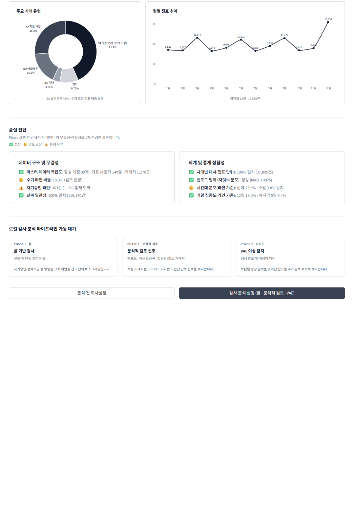
</p>
<p align="center"><sub>분석 실행 전 품질진단 화면. 세 표면으로 들어가기 전에 원장 자체가 읽을 만한 상태인지 먼저 본다.</sub></p>

---

## 목차

1. [문제 인식과 스코프](#1-문제-인식과-스코프) — 무엇을 하려 했고 어디에 선을 그었나
2. [실증 예시](#2-실증-예시--단일-전표-파이프라인-처리-과정) — 전표 한 장을 끝까지 추적
3. 기술 설명
   1. [합성 데이터 생성](#3-1-기술-설명--합성-데이터-생성) — 8단계 생성과 정합성 검증
   2. [룰 위반 검증](#3-2-기술-설명--룰-위반-검증) — 룰 29종의 도출과 판정
   3. [룰 위반 조합 검토](#3-3-기술-설명--룰-위반-조합-검토) — 몸통 9 × 특징 10
   4. [분석적 검토](#3-4-기술-설명--분석적-검토) — 모집단 단위 신호 5종
   5. [비지도 VAE](#3-5-기술-설명--비지도-vae) — 학습·평가와 네 차례 정정
4. [검증](#4-검증) — 정상 원장 · 룰 발화 · 부정 주입
5. [핵심 의사결정](#5-핵심-의사결정) — 스코프 축소 · 등급 폐지 · VAE 판정
6. [한계점](#6-한계점) — 원리적 한계와 미조치
7. [기술 스택](#7-기술-스택) — 레이어별 구성

---

## 1. 문제 인식과 스코프

- **기획 목표 — AI 기반 전수 검사 체계 구축**
  - 목적 : 표본 검사에서 벗어나 전표 전수 검사 도입
  - 기능 : 대량 전표 중 감사인이 우선 검토할 타겟 큐 자동 생성
  - 방법론 : 금융감독원 지적 사례 기반 결정론 룰과 비지도 학습(VAE) 병행

- **합성 데이터의 구조적 결함**
  - 부정과 정상의 생성 경로가 달라 정답지에 흔적이 남음
  - 2026-07-27 도너 복제 구조로 재설계하여 단독 분리자 4종을 **0종**으로 제거

- **검증의 한계 — 실제 원장 부재**
  - 부정 단서를 인위적으로 심으면 자문자답이 되어 검증이 무의미
  - 합성 데이터만으로는 모델의 실제 탐지 능력을 증명할 수 없음

- **탐지 범위의 한계**
  - 실제 회계 부정은 거래처 마스터·은행 내역 등 외부 관계망 대조로 발견
  - 분석 범위를 **단일 법인 원장으로만 한정**
  - 감리 고위험 사례 36건 중 25건(69%)이 실물 재고·부외 자금·증빙 위조·타사 원장 대사에 기인해 원장 안에 신호 없음

### 다루는 자료

| 구분      | 자료                 | 범위                                 |       수량 | 상술                                         |
| --------- | -------------------- | ------------------------------------ | ---------: | -------------------------------------------- |
| 근거      | 금감원 감리 지적사례 | 2009~2025 공개 원문                  |      230건 | [3-2](#3-2-기술-설명--룰-위반-검증)          |
| 근거      | 사례 태깅 결과       | 적발 계정·거래 유형 전수 태깅        |      731행 | [3-2](#3-2-기술-설명--룰-위반-검증)          |
| 근거      | 감사기준서           | 240 부정 분개 특징 · 520 분석적 검토 |        2종 | [3-3](#3-3-기술-설명--룰-위반-조합-검토)     |
| 원장      | 정상 합성 원장       | K-IFRS 제조업 3개년 · 73컬럼         |  355,786행 | [3-1](#3-1-기술-설명--합성-데이터-생성)      |
| 원장      | 전표 문서            | 행을 전표 단위로 묶은 수             |  113,135건 | [3-1](#3-1-기술-설명--합성-데이터-생성)      |
| 원장      | 거래 시나리오        | 구매·판매·급여·결산·자산·자금·관계사 |       20종 | [3-1](#3-1-기술-설명--합성-데이터-생성)      |
| 원장      | 이상치 주입 시나리오 | FS01~FS14 · 부정 문서 330            |       14종 | [3-1](#3-1-기술-설명--합성-데이터-생성)      |
| 탐지 자산 | 활성 룰              | 데이터 정합성 4 + 부정·이상 25       |       29종 | [3-2](#3-2-기술-설명--룰-위반-검증)          |
| 탐지 자산 | 조합 어휘·프리셋     | 조작 대상 9 × 조작 수법 10           | 프리셋 5종 | [3-3](#3-3-기술-설명--룰-위반-조합-검토)     |
| 탐지 자산 | 분석적 검토 신호     | 자기 큐 5 + 배지 5                   |       10종 | [3-4](#3-4-기술-설명--분석적-검토)           |
| 검증 자산 | 합성 원장 검증 지표  | 일반 57 + 계정 9                     |       66개 | [4-1](#4-1-정상-원장-베이스라인-정합성-검증) |

---

## 2. 실증 예시 — 단일 전표 파이프라인 처리 과정

> 정상 원장의 첫 전표가 파이프라인을 통과하는 전 과정 · 표기된 값은 모두 실제 생성된 레코드

```
 ━━━ 전표 66e090a1 · 고객 대금 수금 · 2,176,500원 · 2022-11-27(일) 09:54 ━━━

 [생성]  시나리오 할당 ───▶ 계정 결정 ──────▶ 금액·일시 ──────────▶ 균형 검증
        매출채권 회수       1000 현금         2,176,500            차변 = 대변
                          1100 매출채권     일요일 09:54          정상 전표(라벨X)

         ◆ 수기 입력 · 작성자 CADAMS053 이 본인 전표를 그대로 승인

 [읽기]  표준 스키마와 컬럼명 일치하여 별도 매핑 없이 로드
         ◆ 합성데이터 스키마 = 표준 스키마

 [파생]  금액 ─ 동일 계정(1000) 내 금액 분포 편차 및 이상도 계산
         시간 ─ 일요일 09:54 · 주말 해당 · 심야 아님 · 증빙일자 괴리 0일
         패턴 ─ ROUND NUMBER 금액 아님 · 수기 입력

 [검증]  필수 컬럼 10개 존재 · 차/대변 음수 없음 · 대차 차액 0.01 이내
         └─▶ 무결성 검증 통과, 탐지 단계 진입

 [탐지]  정상 원장임에도 5개 룰 위반 발생
         ┣ L1-05 자기 승인   작성자 = 승인자
         ┣ L1-06 직무분리    작성·승인 기능 겸직
         ┣ L3-02 수기 전환   수기 입력 전표
         ┣ L3-05 주말 전기   일요일 전기
         ┗ L3-04 기말 집중   월말 ±5일 창

 [목록]  몸통(기말결산) × 특징(자기승인·수기입력) 충족 ─▶ 검토 큐 적재
```

- 정상 전표가 검토 목록에 오르는 것 자체는 1차 스크리닝의 정상 동작
- 목록에 오른 것 중 무엇이 실제 문제인지는 감사인이 증빙으로 판단

---

## 3-1. 기술 설명 — 합성 데이터 생성

> **실제 구현**
> - 생성 설정 : [`datasynth.yaml`](config/datasynth.yaml) — 기업 규모·거래 비중·임계 17개 파일
> - 라벨 수집 : [`datasynth_labels.py`](src/ingest/datasynth_labels.py) · [`datasynth_metadata.py`](src/ingest/datasynth_metadata.py)
> - 품질 게이트 : [`datasynth_quality_gate/`](tests/datasynth_quality_gate) — 구조·도메인·교차참조·분포 4계층
> - 생성기 본체는 Rust 벤더 코드로 이 저장소 밖에 있고, 빌드된 바이너리와 위 설정만 사용

| 항목         | 내용                                                        |
| ------------ | ----------------------------------------------------------- |
| 기반 모델    | EY 스위스 Assurance R&D 가 Apache 2.0 으로 배포한 DataSynth |
| 커스터마이징 | K-IFRS 제조업 기준으로 스키마 및 시나리오 개편              |
| 특이사항     | 원본 GitHub 저장소는 비공개 전환되어 참조 URL 부재          |

### 환경 설정과 사전 검증

| 검증 축         | 차단하는 것                                    |
| --------------- | ---------------------------------------------- |
| 비율 범위 (0~1) | 100% 초과 및 음수 입력                         |
| 비중 총합 (1.0) | 합계 미달로 인한 나머지 거래 유형의 소실       |
| 임계치 오름차순 | 금액 대역(소액 < 중액 < 고액) 산출 로직의 붕괴 |

- 기업 규모·거래 비중·직원 수를 YAML 17개 파일로 관리하고 로드 시 위 3축을 우선 점검

### 생성 로직 8단계

| #   | 단계         | 내용                                                                                      |
| --- | ------------ | ----------------------------------------------------------------------------------------- |
| 1   | 계정과목표   | 가용 계정과목 풀 사전 생성 — 룰이 특정 계정(가지급금 1190 등)을 명시 참조하므로 고정 할당 |
| 2   | 마스터데이터 | 거래처 · 고객 · 자재 · 자산 · 직원(권한 한도 포함)                                        |
| 3   | 문서흐름     | 발주 ─▶ 입고 ─▶ 송장 ─▶ 대금지급 · 교차 대사와 실무적 불일치 반영                         |
| 4   | 업무 이벤트  | 정상 진행 75% · 예외 20% · 오류 5%                                                        |
| 5   | 전표 생성    | 아래 단위 전표 생성 메커니즘 순서로 순차 생성                                             |
| 6   | 이상치 주입  | 부정·오류 삽입 (정상 원장 모드에서는 비활성)                                              |
| 7   | 잔액 추적    | 자산 = 부채 + 자본 + (수익 − 비용) 실시간 확인                                            |
| 8   | 출력         | 73개 컬럼 CSV + 부속 명세서                                                               |

### 단위 전표 생성 메커니즘

| 축        | 규칙                                                                                      |
| --------- | ----------------------------------------------------------------------------------------- |
| 거래 유형 | 업무 흐름 7종에 걸친 20개 시나리오                                                        |
| 계정 매핑 | 거래 유형 · 차대 방향 · 계정 성격을 키로 계정결정표에서 매칭                              |
| 금액 산출 | 로그정규 · 중앙값 약 120만원 · 하한 100원 · 상한 1,000억 (원본 달러 전제를 원화로 재설정) |
| 일시 지정 | 월말 · 분기말 · 연말 집중생성                                                             |
| 적요 생성 | 업무 프로세스 · 계정 성격별 한국어 템플릿 조합                                            |
| 권한 승인 | 한도 초과 시 권한자 배정 및 생성자 본인 배제 (2% 예외 전결)                               |
| 의미 검증 | 3중 — 허용 목록 · 결정표로 계정 고정 · 사후 규칙 검사 (25회 실패 시 생성 중단)            |
| 대차 균형 | 차변 합계 = 대변 합계 완전 일치                                                           |

- **생성 원칙**
  - 회계적으로 정상 : 차대 균형 · 양수 금액 · 기간 범위 내 · 계정 체계 준수
  - 실무 예외 유지 : 승인 생략 · 자기승인 2% · 결산기 야근 존재
  - 노이즈는 라벨 무관 : 결측 2% · 오타 0.15%를 정상·부정에 같은 비율로 적용
  - 계정은 무작위 아님 : 거래 성격에서 계정으로 가는 결정표를 생성기에 내장

<details>
<summary><b>정합성 검증 — 축 6종과 실제 적발 사례 (펼치기)</b></summary>

```
    ◆ 검증 지표   총 66개 (일반 57종 + 계정 9종) · 5단계 판정

    ┣ 복식부기    전표 대차 일치 및 재무상태표 등식 검증
    ┣ 금액 분포   매출원가율 정상 범위 및 부(-)의 잔액 비율 2% 이하
    ┣ 세무/부가세 부가세액이 공급가액의 9~11% 범주 내 안착 여부
    ┣ 승인 이력   시스템 전기는 배치 번호 부여, 수기 전기는 공란 규칙 준수
    ┣ 법인 경계   단일 법인 스코프가 부속 명세서 간에도 일관 유지되는지 대사
    ┗ 인위적 흔적 동일 금액 100건 이상 집중 또는 동일 시각 50건 초과 시 적발
                  (실제 적발 : 특정 계정 162건 집중, 은행 거래처 3건 집중)
```

</details>

### 거래 시나리오 20종

| 흐름          | 시나리오                                                    |
| ------------- | ----------------------------------------------------------- |
| 구매 P2P (2)  | 매입송장 · 대금지급                                         |
| 판매 O2C (2)  | 매출송장 · 고객입금                                         |
| 급여 H2R (2)  | 급여 발생 · 급여 지급                                       |
| 결산 R2R (6)  | 발생분개 · 마감분개 · 대손상각 · 퇴직급여 · 잡이익 · 역분개 |
| 자산 A2R (3)  | 취득 · 감가상각 · 개발비 자본화                             |
| 자금 TRE (3)  | 차입 · 이자지급 · 임원 가지급                               |
| 관계사 IC (2) | 관계사 매출 · 관계사 정산                                   |

### 이상치 주입 시나리오 14종 — 금융감독원 감리 지적 사례 기반

| id   | 수법        | 흐름 | id   | 수법            | 흐름   |
| ---- | ----------- | ---- | ---- | --------------- | ------ |
| FS01 | 가공매출    | 매출 | FS08 | 부적절 자본화   | 결산   |
| FS02 | 진행률 조작 | 결산 | FS09 | 컷오프 조작     | 매출   |
| FS03 | 현금 횡령   | 매입 | FS10 | 대손 회피       | 매출   |
| FS04 | 횡령 은폐   | 매입 | FS11 | 특수관계자 남용 | 관계사 |
| FS05 | 순환거래    | 매출 | FS12 | 충당금 누락     | 결산   |
| FS06 | 부채 누락   | 매입 | FS13 | 손상 회피       | 관계사 |
| FS07 | 재고 과대   | 매입 | FS14 | 유령직원 급여   | 급여   |

- **다중 전표 시퀀스 주입 (핵심 설계)**
  - 단건 수치 조작이 아니라 연계된 흐름 전체를 모사
  - 가공매출 예 : 매출 계상 ─▶ 가공 회수 ─▶ 매출채권 담보 차입 ─▶ 차기 역분개

- **정상 데이터 오염 방지**
  - 계정 체계 : '신규 미식별 계정 = 부정' 학습을 막기 위해 정상 고빈도 22개 실존 계정 사용
  - 적요 마스킹 : 시나리오 명칭이 텍스트에 노출되지 않도록 정상 전표의 범용 헤더로 치환

- **도너 복제 구조 (2026-07-27 재설계)**
  - 정상 전표를 통째 복제한 뒤 부정이 정하는 칸만 덮어씀
  - 단독 분리자 4종 → **0종**
  - 계정 무관 컬럼쌍의 정상 미출현률 91.97% → **0.91%** (정상 동수 대조군 0.30%)

---

## 3-2. 기술 설명 — 룰 위반 검증

> **실제 구현**
> - 공통 계약 : [`base.py`](src/detection/base.py) — 모든 탐지기가 상속하는 추상 클래스와 표준 결과 객체
> - 검사기 4종 : [`integrity_layer.py`](src/detection/integrity_layer.py) · [`fraud_layer.py`](src/detection/fraud_layer.py) · [`anomaly_layer.py`](src/detection/anomaly_layer.py) · [`evidence_detector.py`](src/detection/evidence_detector.py)
> - 룰 임계·파라미터 : [`audit_rules.yaml`](config/audit_rules.yaml) · [`sod_toxic_combinations.yaml`](config/sod_toxic_combinations.yaml)
> - 룰 메타데이터 : [`rule_detail_metadata.py`](src/detection/rule_detail_metadata.py) — 활성 룰 29종을 코드에서 고정
> - 병렬 실행 : [`pipeline.py`](src/pipeline.py)

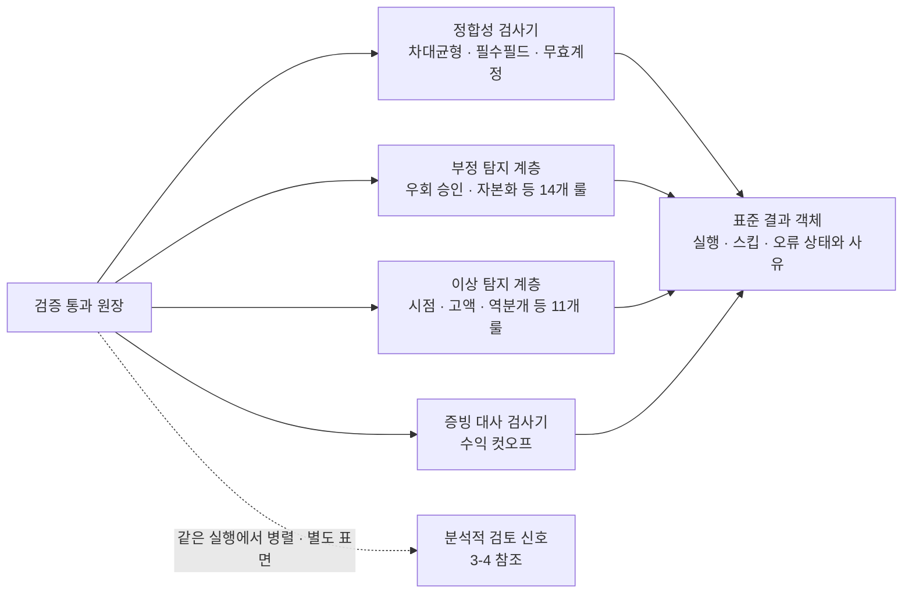

- 예외가 나도 결과 객체를 반환 : 한 탐지기의 실패가 나머지 실행을 멈추지 않음
- '컬럼 결측으로 실행 불가'와 '실행 결과 0건'을 상태로 분리해 화면에서 구분

### 룰 설계 원칙

- 이진 판정 : 위반/비위반만 확정 판정하고 임의의 위험 점수나 확률을 산출하지 않음
- 결정론적 실행 : 동일 입력에 항상 동일 결과, LLM 배제
- 임계치 외부 설정 : 전결 한도·결산 일정·근무 시간 등 기업별 편차 파라미터는 외부 YAML
- 실행 상태 명확화 : '컬럼 결측으로 실행 불가'와 '정상 실행 후 0건'을 구분 로깅

### 탐지 룰 도출 방법

1. 금융감독원 공개 감리 지적 사례 문서 **230건(2009~2025)** 전수 태깅 → **사례 731행** 확보, 적발 대상 계정·거래 유형 추출
2. 회계감사기준 240(부정 분개 특징) 준용 → 전표 입력 통제 위반(수기 입력·승인 우회·비정상 시간대·비경상 계정) 패턴 구조화
3. 탐지 스코프를 단일 법인 GL 원장으로 한정
   - 고위험 지적 사례 36건 중 25건(69%)은 실물 재고·부외 자금·증빙 위조·타사 원장 대사로 GL 외부 요인

<details>
<summary><b>활성 룰 29종 전수 — 주제별 판정 규칙 (펼치기)</b></summary>

```
 ━━━ 데이터 정합성 — 데이터 결함 ━━━

    L1-01  차대변 균형     차변 합 ≠ 대변 합
    L1-02  필수필드 누락   전표번호·일자·계정·금액 등 필수 칸이 공란
    L1-03  무효 계정       계정과목표에 없는 계정이 원장에 등장
    L1-08  기간 불일치     전기일의 월과 회계기간이 어긋남 (조절 가능)

 ━━━ 승인·권한 ━━━

    L1-04  승인한도 초과   승인자의 전결 한도보다 전표 금액이 큼
    L1-05  자기 승인       작성자와 승인자가 같은 사람 (예외 : 시스템 자동·반복)
    L1-06  직무분리 위반   양립 불가 조합 겸직 시 발화 (근거 : 감사기준서)
    L1-07  승인 생략       승인자 칸이 공란
    L1-07-02 유령 승인자   직원 마스터에 없는 승인자 ID

 ━━━ 금액·분할 ━━━

    L2-01  한도 직하 분할  전결 한도의 90% 구간에 금액이 몰림
    L2-02  분할 거래       같은 거래처·금액을 3일 안에 쪼개 기표
    L2-03  중복 전표       90일 안에 같은 지급이 반복
    L4-01  매출 이상치     매출 계정(4xxx)에서 같은 계정군 대비 3σ 밖 금액
    L4-03  절대 고액       수행중요성 초과 (세전이익 5%의 75%)

 ━━━ 시점 — 사용자가 설정 가능 ━━━

    L3-04  기말 집중       월말 앞뒤 5일 전기
    L3-05  주말 전기       토·일 전기
    L3-06  심야 전기       22시 ~ 06시 전기
    L3-07  전기-증빙 괴리  증빙일보다 30일 넘게 지나 전기
    L4-05  심야 배치       기표자 단위로 심야 전기가 이례적으로 몰림
    L4-06  배치 이상       배치 기말 비중 50% 초과 · 같은 날 50건 이상 · 3σ 밖

 ━━━ 계정 성격 ━━━

    L2-04  비용 자본화     비용 성격 계정(5~8xxx)이 자산 계정(12·15xxx)으로
    L3-10  추정계정        대손상각비 등 회수가능성 추정을 그 전표에서 다시 매김
    L3-09  가계정 미정리   가지급금·가수금·미결산 계정이 30일 넘게 잔존
    L3-03  관계사          관계사 계정쌍(1150↔2050 · 4500↔2700) 사용
    L4-04  희귀 차대쌍     그 원장에서 분기당 1회 미만으로만 나오는 계정 조합

 ━━━ 거래 성격 ━━━

    L2-05  역분개          금액 동일·방향 반대 전표 쌍 (예외 : 입고미착·관계사 정산)
    L3-02  수기 전환       입력 방식이 수기 또는 결산조정
    L3-11  수익 컷오프     기간 경계에서 수익 인식 시점이 어긋남
    L3-12  업무범위 집중   한 사람이 다루는 업무·회사 수가 직급 기준 초과
```

</details>

<p align="center">
  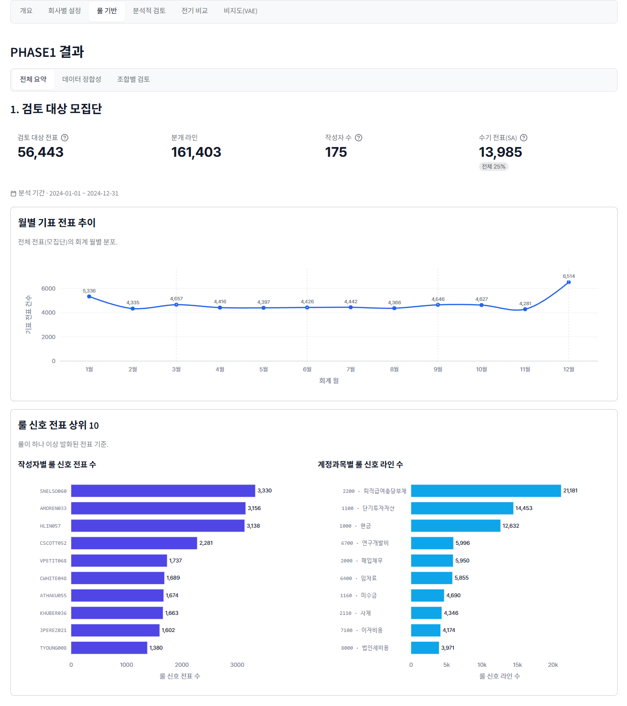
</p>
<p align="center"><sub>룰 기반 전체 요약 — 검토 대상 모집단. 작성자별·계정별로 신호가 어디에 몰리는지 먼저 본다.</sub></p>

<p align="center">
  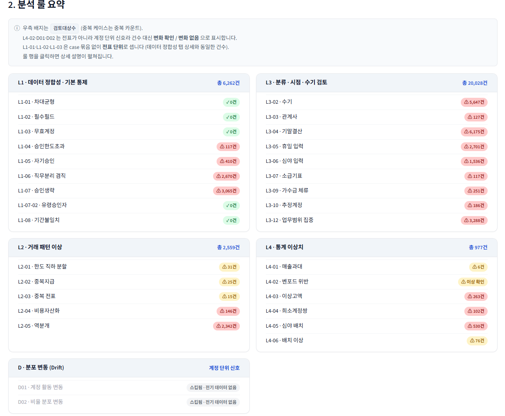
</p>
<p align="center"><sub>룰별 검토대상 건수. 실행되지 않은 룰과 실행 후 0건인 룰을 화면에서 구분한다.</sub></p>

<p align="center">
  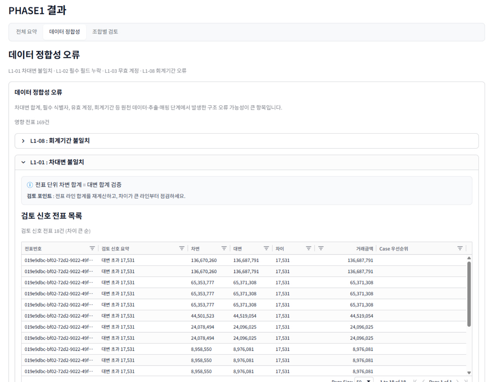
</p>
<p align="center"><sub>데이터 정합성 패널. 부정 징후가 아니라 "먼저 데이터를 고치라"는 신호로만 쓰므로 조합에서 분리했다.</sub></p>

---

## 3-3. 기술 설명 — 룰 위반 조합 검토

> **실제 구현**
> - 빌더 본체 : [`phase1_combo_builder.py`](src/export/phase1_combo_builder.py) — 어휘 적재·결합 판정·정렬
> - 어휘·프리셋 정의 : [`combo_builder.yaml`](config/combo_builder.yaml)
> - 화면 : [`phase1_combo_builder_panel.py`](dashboard/components/phase1_combo_builder_panel.py)
> - 판정 스크립트 : [`s4_adjudicate_combo_builder.py`](tools/scripts/s4_adjudicate_combo_builder.py) — 날조 검사와 결합 의미론 전수 대조

### 조작 대상(몸통) 9 × 조작 수법(특징) 10

| 룰    | 몸통(조작 대상) | 감리 확정 | 룰       | 특징(전표의 모양) | 출처 성격  |
| ----- | --------------- | --------: | -------- | ----------------- | ---------- |
| L3-10 | 추정계정        |       147 | L3-02    | 수기              | 명문       |
| L3-03 | 관계사          |        80 | L1-04    | 승인한도초과      | 명문       |
| L3-11 | 컷오프          |        23 | L1-05    | 자기승인          | 명문       |
| L2-04 | 비용자산화      |        22 | L1-07    | 승인생략          | 명문       |
| L3-04 | 기말결산        |        20 | L1-07-02 | 유령승인자        | 명문       |
| L4-01 | 매출과대        |        20 | L1-06    | 직무분리 겸직     | 명문(부록) |
| L4-03 | 이상고액        |        12 | L3-07    | 소급기표          | 명문       |
| L2-05 | 역분개          |         3 | L4-04    | 희소계정쌍        | 명문       |
| L3-09 | 가수금 체류     |         2 | L3-05    | 휴일 입력         | 실무 관행  |
| —     | —               |         — | L3-06    | 심야 입력         | 실무 관행  |

> **L1-08 기간귀속을 몸통에서 뺐다 (2026-07-27).** 감리 확정 1건으로 어휘에 있었으나, 룰이 보는 회계기간은 ERP가 전기일로 정하는 값이라 둘의 비교가 동어반복이다. 실측 358,426행 전건에서 불일치 0 — 정상도 부정도 0이다. 원장 필드 정합성 검사로는 올바르므로 데이터정합성 패널 전용으로 되돌렸다.
>
> 기준서가 명문으로 든 "라운드넘버" 특징은 해당 룰이 전표 단위로 미구현이라 **탐지 갭으로 기록**했다.

### 결합 의미론

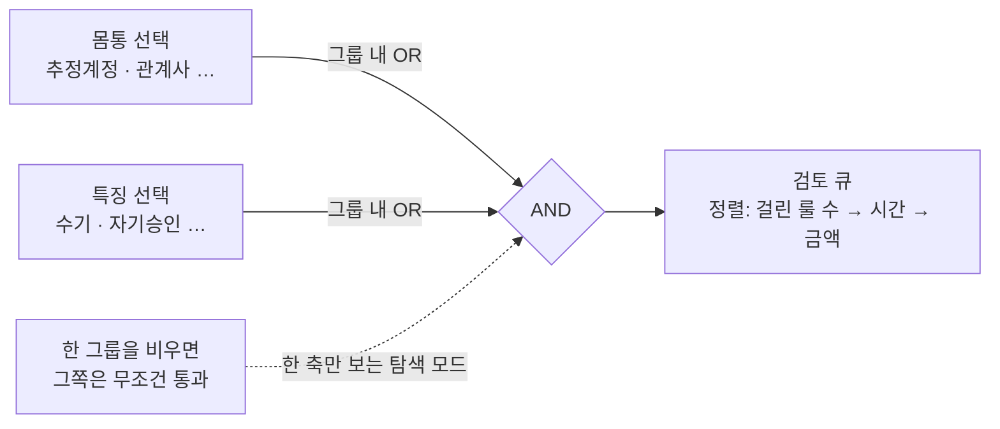

- 등급 축이 없음 : 정렬은 걸린 룰 수 → 시간 신호 → 금액 → 증거 수
- 금액은 마지막 동점 처리에만 : 고액 정상 거래가 신호 있는 소액 전표를 밀어내지 않게
- 무결성 검증 3중 : 몸통·특징 내 중복, 두 그룹의 겹침, 프리셋의 어휘 밖 참조는 즉시 예외
  - 화면 버그를 조용한 오답이 아니라 크래시로 만듦

### 프리셋 5종

| 프리셋           | 몸통                            | 근거                                     |
| ---------------- | ------------------------------- | ---------------------------------------- |
| 추정·관계사 조작 | 추정계정 · 관계사               | 감리 확정 최다 2종 (147 · 80건)          |
| 수익인식         | 매출과대 · 컷오프               | 기준서 240 문단 26 — 수익인식 부정위험   |
| 역분개·은폐      | 역분개 · 가수금 체류 · 이상고액 | 감리 확정 — 기말 되돌림 · 경과계정 은폐  |
| 비용자산화       | 비용자산화                      | 감리 확정 22건                           |
| 결산 손상·충당금 | 기말결산 · 추정계정             | 감리 확정 — 손상 · 대손충당금 미인식 5건 |

- 도출 방법 : 감리 확정룰 지도 731행을 스크립트로 전수 집계
- 몸통 묶음 근거 : 한 사례에 여러 몸통이 함께 확정된 조합의 빈도 (관계사+추정계정 10건, 기말결산+추정계정 5건)
- 특징은 전체로 열어 둠 : 감리 원문이 전표 통제 디테일을 거의 서술하지 않아 확정이 8건뿐
- 프리셋은 수정 가능한 체크 상태 : 위험 선언이 아니며 감사인이 개별 조건을 바꿈

<p align="center">
  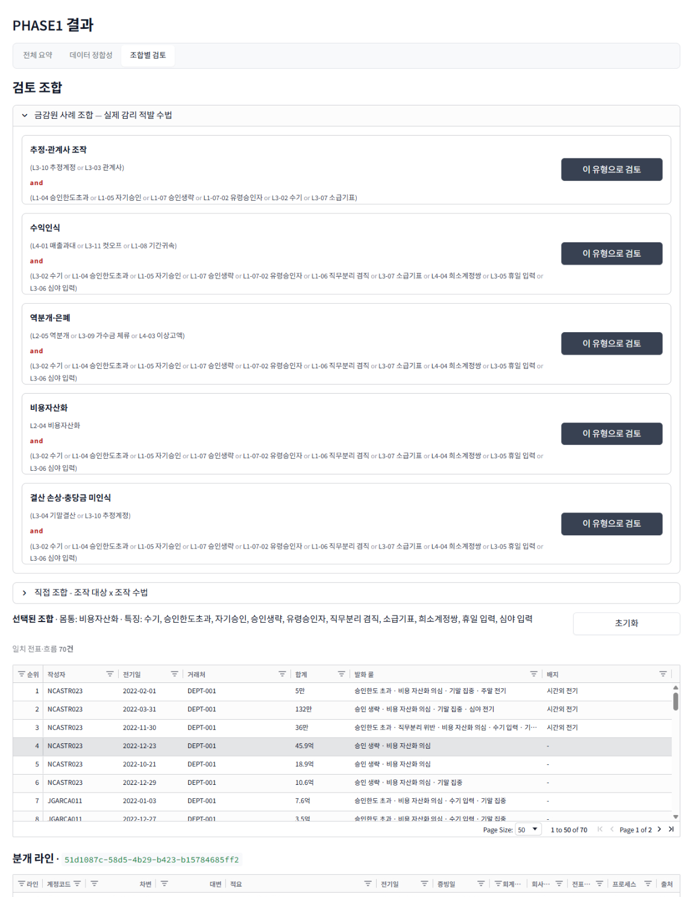
</p>
<p align="center"><sub>금감원 사례 조합 5종. 카드마다 감리 확정 건수를 표기해 "왜 이 묶음인가"를 화면에서 읽게 한다.</sub></p>

<p align="center">
  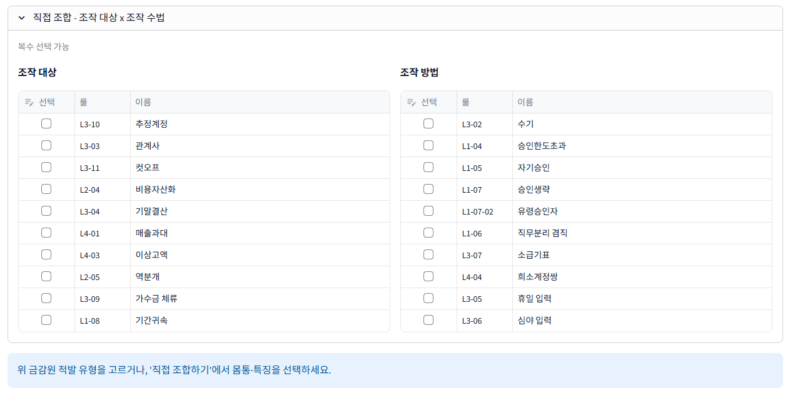
</p>
<p align="center"><sub>직접 조합. 몸통·특징 매트릭스에서 감사인이 임의로 교차 선택한다.</sub></p>

---

## 3-4. 기술 설명 — 분석적 검토

> 전표 한 장이 아닌 계정·거래처·작성자를 모아야 드러나는 신호 · 근거는 감사기준서 520

> **실제 구현**
> - 벤포드 : [`benford_detector.py`](src/detection/benford_detector.py)
> - 라운드넘버 밀집도 : [`round_density_rules.py`](src/detection/round_density_rules.py)
> - 첫등장·희소 거래처 : [`partner_signals.py`](src/detection/partner_signals.py)
> - 계정 활동 변동 : [`trendbreak_detector.py`](src/detection/trendbreak_detector.py) · [`trendbreak_rules.py`](src/detection/trendbreak_rules.py)
> - 결산월 집중 변동 : [`timeseries_concentration_rules.py`](src/detection/timeseries_concentration_rules.py)

### 두 가지 운영 방식

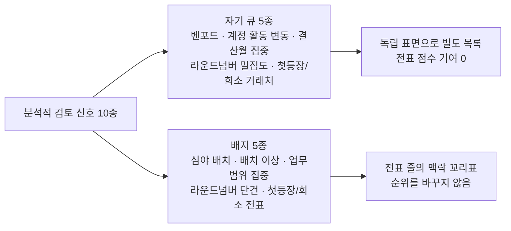

- 자기 큐로 세우는 기준 : "이 계정·거래처가 통째로 이상하다"를 단독으로 주장할 수 있는 신호
- 배지로 내리는 기준 : 정상 업무에도 흔해서 단독 큐로 세우면 노이즈가 되는 신호

- 배지의 의미 : "이 전표가 범인"이 아니라 "이 전표가 이상하다고 표시된 계정에 속한다"
  - "이 집이 도둑맞았다"가 아니라 "이 집은 도둑 많은 동네에 있다"
- 전표로 환원 불가한 축은 배지 없음 : 계정도 문서도 못 잡는 월·작성자 축

### 자기 큐 5종 판정 방식

| 신호               | 단위               | 판정 방식                                                                    |
| ------------------ | ------------------ | ---------------------------------------------------------------------------- |
| 벤포드 이탈        | 계정·월            | 평균절대편차 0.012 이하 적합 · 0.015 초과 강한 부적합 · 표본 500건 미만 제외 |
| 라운드넘버 밀집    | 계정·전기월·작성자 | 원장 전체 비율을 기준선으로 이항검정 + 효과크기 하한 0.05                    |
| 첫등장/희소 거래처 | 거래처             | 전기 미등장 · 거래 건수 하위 10분위 · 직전 연도 결번 후 재등장               |
| 계정 활동 변동     | 계정·전기대비      | **컷 없음** — 감사인이 고른 축의 변동 절대값 순                              |
| 결산월 집중 변동   | 계정·전기대비      | **컷 없음** — 결산월 비중 증가분(부호 유지) 내림차순                         |

- **기준선을 데이터에서 뽑는다**
  - 둥근 금액의 정상 비율은 산업·회사마다 달라 상수 대신 그 원장 전체 비율 사용
  - 결산월도 12월로 박지 않고 그 원장에서 관측된 최대 회계기간으로 결정 (3월·6월 결산 법인 대응)

- **임계를 폐지했다**
  - 계정 활동 변동·결산월 집중 변동의 컷은 근거를 댈 수 없어 제거
  - 전기와 비교 가능한 계정을 전부 세우고 절단 지점은 감사인이 결정
  - 표에 보이는 숫자가 그대로 정렬 키

- **이름을 정직하게 붙인다**
  - "신규 거래처"가 아니라 **"원장 첫 등장"**
  - 마스터 등록일이 아니라 우리 원장에 처음 찍힌 날을 보므로, 전자는 갖지 않은 데이터를 가진 것처럼 오인시킴

<p align="center">
  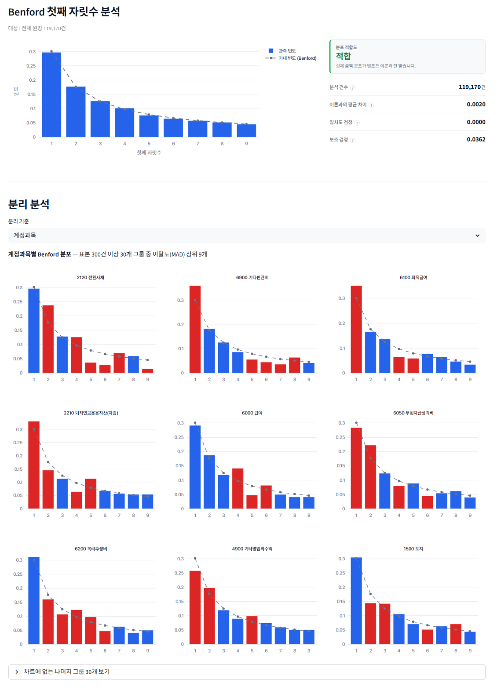
</p>
<p align="center"><sub>벤포드 첫째 자릿수. 원장 전체는 적합 판정이고, 아래에 계정별 이탈도 상위를 따로 세운다.</sub></p>

<p align="center">
  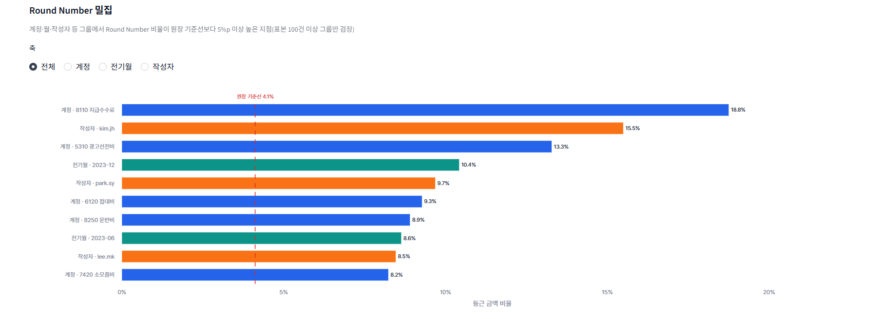
</p>
<p align="center"><sub>라운드넘버 밀집. 점선이 그 원장에서 뽑은 기준선이며 상수가 아니다.</sub></p>

<p align="center">
  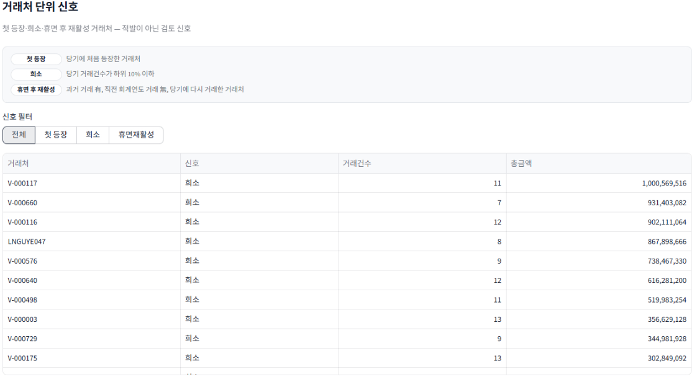
</p>
<p align="center"><sub>거래처 단위 신호. 세 신호 모두 "가공거래처 탐지"가 아니라 원장 범위 내 약한 근사로 표기한다.</sub></p>

<p align="center">
  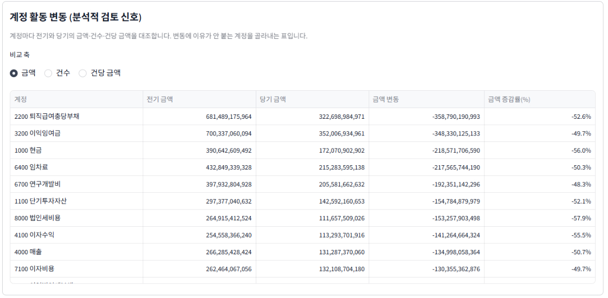
</p>
<p align="center"><sub>계정 활동 변동. 컷이 없으므로 비교 가능한 전 계정이 서고, 절단은 감사인이 한다.</sub></p>

---

## 3-5. 기술 설명 — 비지도 VAE

> 정상 전표의 특성을 학습해 이탈하는 전표를 추가 검토 후보로 올리는 보조 모듈

> **실제 구현**
> - 입력 경계 : [`phase2_plan.py`](src/preprocessing/phase2_plan.py) — 허용 목록 51칸을 컬럼별로 판정
> - 파생 생성 : [`phase2_features.py`](src/preprocessing/phase2_features.py) — 날짜·마스터 조인·금액 구조 3종
> - 행렬 구성 : [`phase2_matrix.py`](src/preprocessing/phase2_matrix.py) · 변환기 [`transformers.py`](src/preprocessing/transformers.py)
> - 모델 : [`vae_model.py`](src/preprocessing/vae_model.py) — 인코더·디코더와 손실 두 항
> - 학습·분할 : [`phase2_training_service.py`](src/services/phase2_training_service.py)
> - 점수화 : [`vae_detector.py`](src/detection/vae_detector.py) — 재구성 오차와 칸별 기여 분해
> - 측정 스크립트 : [`s5_measure_vae_performance.py`](tools/scripts/s5_measure_vae_performance.py) · [`diag_vae_input_audit.py`](tools/scripts/diag_vae_input_audit.py)

- 지도학습을 안 쓰는 이유 : 합성데이터의 부정 라벨은 규칙으로 심은 것이라 모델이 배우는 것은 부정이 아니라 주입 규칙

```
 ━━━ 학습 및 추론 파이프라인 ━━━

  원장
    │
    ▼
  [1] 입력 경계     PHASE2 전용 허용 목록이 무엇이 들어올지 정한다
    │                 ┣ 허용 원본 39칸 + 전용 파생 12칸 = 51칸
    │                 ┗ 파생은 세 종류만 — 날짜·마스터 조인·금액 구조
    ▼
  [2] 분할          학습 80% · 확인용 20% · 전표 단위로 가른다
    │                 ┣ 같은 전표의 행이 양쪽에 나뉘면 정보 누수
    │                 ┗ 조작 시나리오 2종은 학습 배제, 확인용에만 할당
    ▼
  [3] 전처리        학습 분할에서만 기준값을 계산해 저장한다
    │                 ┗ 컬럼이 무엇이냐로 처리를 정하고 숫자 임계는 폴백
    ▼
  [4] 학습          정상 전표만 투입 · 정답지 미참조 · 시드 고정
    │                 ┗ 손실 = 복원 오차 + 잠재 분포 규제 (비중 1:1)
    ▼
  [5] 점수화        복원 오차를 학습 분포 기준 백분위로 환산
    │                 ┗ 상위 1% 초과 시 검토 후보로 표시
    ▼
  [6] 평가          1차 미학습 정상에서 과탐 억제 · 2차 AUROC · 3차 상보성
```

### 입력을 다시 정의했다 (2026-07-29)

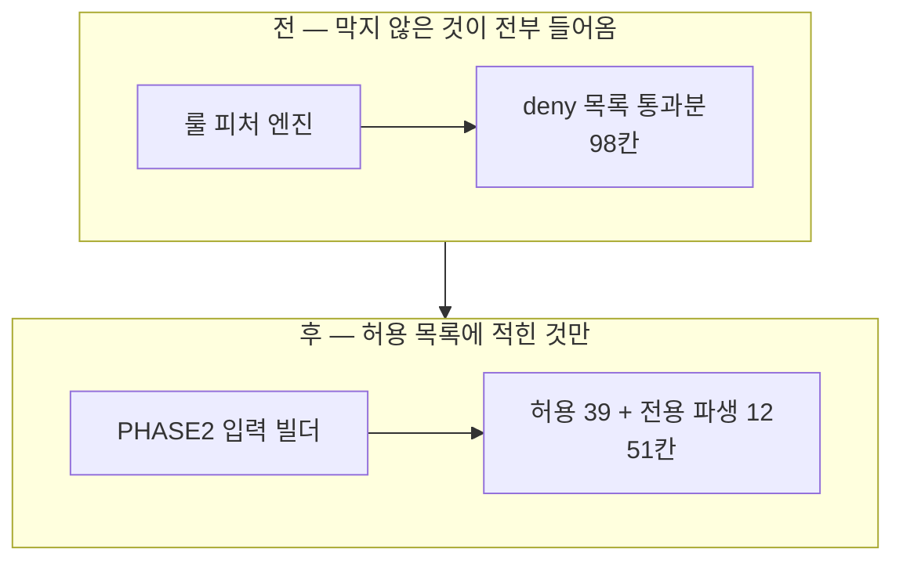

| 구분           | 전                  | 후                            |
| -------------- | ------------------- | ----------------------------- |
| 입력 칸        | 98칸                | **51칸**                      |
| 입력 결정 방식 | deny에 안 걸린 전부 | 허용 목록에 적힌 것만         |
| 차단 목록      | 58칸                | **22칸** (허용 목록 가드레일) |
| 룰 산출물 유입 | 6칸                 | **0칸** (회귀 테스트로 강제)  |

- **무엇이 잘못돼 있었나**
  - 룰용 파생 39칸이 아무 결정 없이 유입 — 룰을 위해 칸을 만들면 그 순간 VAE 입력이 하나 늘어남
  - 그중 6칸은 룰 탐지 결과 그 자체이고, 단변량 분리력 1위가 그중 하나

- **차단 목록 58 → 22칸은 근거 전수 재검 결과**
  - 근거가 전부 2026-05 감사에서 왔고, 그 감사는 결측 누출이 살아 있던 생성기에서 잰 값
  - 비구조적 29칸 중 26칸이 근거 소멸이었고 그중에 원장 핵심인 차대변 금액
  - 남은 규칙 : **차단은 근거와 함께 만료된다**

### 컬럼별 전처리

- 규칙은 컬럼이 무엇이냐로 정함 : 카디널리티 같은 숫자 임계는 역할이 안 정해진 칸의 폴백
- 측정된 균형 : 표준편차 최대 **1.033**, 40%를 넘는 그룹 없음 (시작점은 한 그룹 93.5%)

<details>
<summary><b>성격별 처리 규칙과 각 규칙이 겪은 실패 (펼치기)</b></summary>

| 성격             | 처리                              | 해당 칸                                                     |
| ---------------- | --------------------------------- | ----------------------------------------------------------- |
| 분류·코드        | 원-핫 (희소값·결측은 별도 값)     | 계정과목 · 전표유형 · 업무프로세스 · 세무구분 · 회계연도·월 |
| 이름·식별        | 빈도 (전체에서 차지하는 비율)     | 승인자 · 작성자 · 거래처 · 부서 · 적요                      |
| 금액             | 부호 유지 로그 → 크기만 나눔      | 차변 · 대변 · 원화 · 송장 · 공급가 · 세액 · 승인자 한도     |
| 그 밖의 수치     | 치우침을 보고 강건/표준 자동 선택 | 날짜 간격 3종 · 끝자리 0 개수                               |
| 불리언           | 0/1                               | 증빙 · 관계사 · 가계정 · 공휴일 · 승인자 명단 등재          |
| 결측이 정보인 칸 | 위 처리 + 결측 표식 1칸           | 세액 · 승인 간격 · 인도 간격 · 승인자 한도                  |

- 이름 칸을 카디널리티로 가르면 회사마다 처리가 뒤집힌다 : 승인자 45명 회사와 55명 회사가 다른 전처리를 받음
  - 감사에서 승인자·거래처는 *누가*보다 **얼마나 드문가**가 신호이므로 도메인이 답함
- 숫자로 저장됐다고 수량인 것은 아니다 : 회계연도·회계기간을 수치 표준화하면 "12월과 1월이 가장 멀다"를 학습
  - 회계에서 12월(결산)과 1월(기초)은 붙어 있고 감사에서 가장 중요한 구간
- 결측은 정보다 : 승인 간격을 0으로 채우면 "승인 없음"과 "당일 승인"이 같아짐
- "90% 넘게 비면 고장난 칸"이 항상 참은 아니다 : 가계정 정리 여부는 가계정 아닌 전표에서 물어볼 수 없는 질문이라 빔(전체 95% 결측)
  - 자동 제외에서 빼면 정리된 가계정 2,809건 · **미정리 가계정 135건** · 가계정 아님 57,056건으로 갈림

</details>

### 학습 구성과 1차 관문

| 항목               | 값                                          |
| ------------------ | ------------------------------------------- |
| 학습 표본          | 정상 50,000행 (라벨 미사용)                 |
| 입력 피처          | 71개                                        |
| 은닉 / 잠재 차원   | 64 / 32                                     |
| 에폭·배치·학습률   | 50 · 256 · 0.001                            |
| 손실 두 항의 비중  | 1 : 1 (가중 조정 없음)                      |
| 실측 손실          | 복원 오차 0.2300 · 잠재 규제 0.3718         |
| 미학습 정상 발화율 | **1.056%** (데이터 생성 시 정한 이상 1.00%) |

> 사전 선언 대역 [0.3배, 3배] 안이라 **통과** — 모델이 정상을 정상으로 보고 있다는 뜻이다.
>
> 위 표는 **학습 5만 행 회차(회차 A)** 값이다. 아래 2·3차 관문은 학습 20만 행에 입력을 재설계한 **회차 C**이고, 회차 C 조건의 1차 관문은 **재측정하지 못했다** — 두 표의 숫자를 한 모델의 것으로 읽으면 안 된다.

### 2·3차 관문 — 회차 C (2026-07-29)

| 데이터셋     | 문서 AUROC | recall@top1% |
| ------------ | ---------: | -----------: |
| r9           |     0.8775 |       0.3697 |
| r9_seed1     |     0.8831 |       0.3667 |
| r9_seed2     |     0.8844 |       0.3212 |
| r9_seed3     |     0.8929 |       0.3697 |
| **4벌 평균** | **0.8845** |   **0.3568** |

- 시드 고정으로 재현 : 이전 회차에는 학습 시드가 없어 같은 데이터로 다시 재도 다른 값이 나왔음
- **상보성은 분모를 바꿨다**
  - 전체 룰 기준 미표면은 0~2건이라 지표가 죽음
  - 무정보 룰로만 오른 문서는 감사인이 그 룰을 골라도 정상이 같은 비율로 딸려오므로 표면화된 것이 아님
  - 판별력 있는 룰만으로 표면화되지 않은 부정을 분모로 사용 → 4벌 합계 **124건 중 27건(21.8%)**

### 회수는 두 수법에만 몰린다 — 이 절의 핵심

| 수법               | 미표면 | 회수 | 회수율 |
| ------------------ | -----: | ---: | -----: |
| FS01 가공매출      |     21 |    9 |  42.9% |
| FS05 순환거래      |     57 |   18 |  31.6% |
| FS14 유령급여      |     27 |    0 |     0% |
| FS08 부적절 자본화 |     11 |    0 |     0% |
| FS12 충당금 누락   |      7 |    0 |     0% |
| FS13 손상 회피     |      1 |    0 |     0% |

- 27건 전부 가공매출 계열 : FS01과 FS05는 없는 매출을 만든다는 점에서 같은 계열이고 생성기도 한 묶음으로 다룸
- 나머지 네 수법 46건은 4벌 내내 0건
- 어느 수법이 잡히는가는 4벌 모두 동일 : 표본이 작아 흔들리는 값이 아니라 구조적 성질

> ~~"룰이 놓친 부정의 21.8%를 회수한다"~~<br>
> **"룰이 놓친 가공매출의 34%를 회수한다. 유령급여를 비롯한 다른 계열은 회수하지 못한다."**
>
> 앞 문장은 감사인에게 잘못된 기대를 준다. 그리고 비용을 함께 적어야 한다 — **9건을 얻기 위해 1,134건을 검토**한다.

### 무엇을 보고 올렸나 — 기여 분해

| 칸                    | 축        | 등장 | 배율 평균 |
| --------------------- | --------- | ---: | --------: |
| 인도일 − 증빙일 간격  | 시점      |  4벌 |  **39.0** |
| 대변 금액             | 금액      |  3벌 |      28.1 |
| 차변 금액             | 금액      |  3벌 |      14.6 |
| 전표유형 = KR         | 전표 속성 |  3벌 |      11.1 |
| 업무프로세스 = 구매   | 전표 속성 |  3벌 |       8.5 |
| 인도일 간격 결측 표식 | 시점      |  4벌 |       7.9 |

- 정확한 분해가 존재 : VAE 점수는 정의상 칸별 복원 제곱오차의 합이라 근사 기법은 정확한 값을 근사로 바꾸고 계산만 수십 배 비싸짐
- 1위와 2위의 격차 2.4~4.9배
- 상위 8칸 중 5칸이 이번 라운드 신규 : 인도일 간격 2칸은 신설 파생, 금액 3칸은 차단이 풀린 칸
  - 그전까지는 이 9건을 잡을 통로 자체가 없었음

- **부정의 실체인가, 생성기 흔적인가**
  - 회수 근거가 도메인적으로 성립 : 없는 매출을 만들면 인도가 없거나 증빙일과 어긋나고, 1위 칸이 정확히 그것
  - 배선 칸은 기여하지 않음 : 전기시각·요일·월중일자가 평평 — 부정 전표가 정상 전표를 복제해 만들어지므로 배울 것이 없음
  - 사람·승인 축 0.1% : 담당자 배정에 인공적 편향이 없다는 뜻이고, 직무분리 플래그를 부정에만 넣으면 정답지가 된다고 보고 제외했던 판단이 측정으로 뒷받침됨
  - 미확인 1건 : seed3에서만 차입금 인출 계열이 66~77배로 튐 — 그 벌은 미표면 34건(다른 벌 30건)으로 구성이 다르고 원인 미확인

<p align="center">
  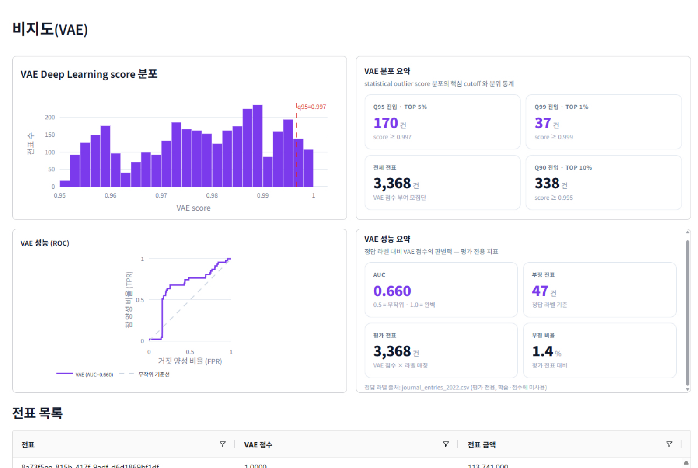
</p>
<p align="center"><sub>화면의 AUC는 그 배치의 점수 부여 전표만 대상인 <b>구 회차 값</b>이다. 좋은 숫자가 나오지 않는 지표도 감추지 않고 그린다 — 이 표면이 무엇을 하는지 감사인이 판단하려면 얼마나 못 맞히는지가 보여야 한다.</sub></p>

---

## 4. 검증

### 4-1. 정상 원장 베이스라인 정합성 검증

> 이상치 주입 전, 기반이 되는 정상 원장의 정합성 평가 · 핵심 장치는 **측정 전 대역 선언**

**통과 28 / 실패 0** (발화율 상위 항목 발췌 · 분모 355,786행)

| 룰              | 실측 발화율 | 선언 대역      | 판정        |
| --------------- | ----------: | -------------- | ----------- |
| L1-07 승인 생략 |      22.73% | [15%, 30%]     | 통과        |
| L3-04 기말 집중 |      14.14% | [10%, 20%]     | 통과        |
| L3-02 수기 전환 |       8.16% | [5%, 12%]      | 통과        |
| L3-06 심야 전기 |       3.25% | [1.2%, 8%]     | 통과        |
| L1-06 직무분리  |       3.05% | [0.5%, 8%]     | 통과        |
| L4-05 심야 배치 |       2.80% | [1%, 8%]       | 통과        |
| L3-05 주말 전기 |       2.49% | [1%, 9%]       | 통과        |
| L3-10 추정계정  |       0.42% | [0.07%, 0.7%]  | 통과 (해소) |
| L4-03 절대 고액 |       0.19% | [0.065%, 0.6%] | 통과 (해소) |

- **실패로 기록됐다가 해소된 두 룰**
  - L4-03 절대 고액 : 마감분개 식별 키가 현행 데이터와 안 맞아 순이익이 잘못 계산되고 임계가 붕괴해 3.61%까지 발화
    - 마감분개를 벤치마크 집계에서 제외하도록 수정하여 0.19%
  - L3-10 추정계정 : 부정 데이터의 갭을 메우려 상각 계정 3종을 목록에 넣자 정상 원장 4,392건이 함께 걸려 1.43%
    - 상각 전표에는 추정 판단이 실리지 않으므로 목록을 되돌려 0.42%
  - 규칙 : 고칠 수 있는 실패라도 **대역표에 실패로 남긴 뒤에 고침**

- **정상 발화 허용 대역의 출처와 한계**
  - 자체 실측 기반 : 실제 기업 원장 통계 확보가 불가해 LLM 휴리스틱으로 대역 설정 — 외부 채점이 아닌 내부 역방향 평가
  - 사전 고정과 이탈 통제 : 사후 조작을 막기 위해 측정 전 고정하고, 이탈 시 ①생성기 결함 ②룰 과탐 ③대역 오류로 분류 강제(③은 도메인 근거 필수)
  - 통과의 의미 : 룰의 회계적 정당성 보증이 아니라 룰·생성기 간 내적 정합성만 의미

### 4-2. 표적 위반 시나리오 주입 발화 검증

| 항목      | 내용                                                     |
| --------- | -------------------------------------------------------- |
| 배경 원장 | 정본 원장의 2024회계연도 구간 119,205행                  |
| 주입      | 룰별 최소 위반 사례 2~5건 — 총 74행 / 36문서             |
| 분모      | 탐지기 목록을 스크립트로 추출해 파일로 고정              |
| 판정 기준 | **표적 적중** — "발화했지만 다른 전표에서"는 실패로 계산 |
| 결과      | **29 / 29 발화 · 룰 결함 0건**                           |

- 1차 판정은 26/29였고 미발화 3건은 전부 시험 장치의 결함
- 가장 교훈적인 것은 업무범위 집중 룰 : 점수를 싣지 않고 검토 채널에만 신호를 보내는 설계라 점수만 보는 측정기에는 영원히 0으로 보임
  - **점수 0이 침묵을 의미하지 않는다**

**조합 빌더 — 독립 재구현과 대조**

| 판정 축       | 내용                                                      | 결과                     |
| ------------- | --------------------------------------------------------- | ------------------------ |
| 날조 검사     | 엔진이 제시한 증거가 오라클에 전부 실재하는가             | **위반 0 / 37,341 unit** |
| 결합 의미론   | 몸통×특징 + 단독을 어휘에서 계산(9×10+19 = 109셀), 2모드  | **전셀 일치**            |
| 정답지 하한   | 어휘 19룰 단독 선택 시 자기 표적 문서 일치                | **전룰 일치**            |
| 표면 커버리지 | 탐지기 발화가 표면에 실제로 오르는가 (합격선 없는 관찰축) | 유실 **741 → 2건**       |

- 마지막 축이 결함을 잡음 : 케이스 후보 선정이 등급 폐지(2026-07-17) 후에도 `risk_level != "Normal"` 필터를 들고 있어 룰 발화 **5,957행 / 2,006문서**를 표면 진입 전에 버림
- **통과/실패를 매기지 않는 지표가 결함을 잡은 사례**

### 4-3. 부정 시나리오 주입 탐지

> 정상 원장에 부정 시나리오를 오버레이 · 14 scheme × 부정 330문서, 시드만 바꿔 4벌

#### 룰 표면

- 부정 문서 330건 중 **328~330건(99.4~100%)** 검토 목록 등재
- 판별력 있는 룰(정상보다 자주 발화)만 세면 **296~300건(89.7~90.9%)**

| 룰                                  |  부정 |      정상 |     배수 |
| ----------------------------------- | ----: | --------: | -------: |
| L4-04 희소계정쌍                    | 17.0% |     0.02% |  **810** |
| L2-05 역분개                        | 30.9% |     0.29% |      108 |
| L1-05 자기승인                      | 19.7% |     0.33% |       59 |
| L2-04 비용자산화                    |  7.6% |     0.19% |       40 |
| L3-09 가수금 체류                   |  9.4% |     0.43% |       22 |
| L3-02 수기                          | 59.1% |     25.7% |      2.3 |
| L3-04 기말결산                      | 70.9% |     44.5% |      1.6 |
| L1-07 승인생략                      | 46.1% |     71.6% | **0.64** |
| L1-04·L2-01·L2-02·L3-07·L4-01·L4-03 |    0% | 0.01~0.6% |    **0** |

- 희소계정쌍 810배가 최상위 : 부정 시나리오 절반이 정상 원장에 없는 계정 조합을 쓰고(가지급금 경유 횡령·가수금 부채 은닉·유령급여) 그 조합을 보는 룰이 가장 잘 가름
- 기말결산은 반대편 : 배수 1.6이지만 정상 44.5%에 발화하므로 그 룰만으로 오른 문서는 5만 건짜리 목록 안 — 그래서 커버리지를 두 줄로 보고
- 승인 생략은 0.64로 역전 : 자기승인·수기 도너 조건이 *승인자가 있는* 정상 전표를 고르게 만든 반작용
  - 의도한 신호를 넣은 대가로 다른 축이 눌렸고 이것도 숨기지 않고 기록

- **표면에 오르지 않은 부정**
  - 전체 룰 기준 미표면은 4벌에서 **0~2건**
  - 판별력 있는 룰만 셀 때 빠지는 **30~34건**이 실질적인 갭이며 대부분 기말결산 단독으로만 걸린 문서
  - 시나리오 전체가 무정보 룰로만 표면화된 경우는 **4벌 모두 0**

**프리셋별 밀도 — 좁게 고르면 밀도, 넓게 고르면 건수**

| 프리셋           |    적중 |    표면 |      밀도 |
| ---------------- | ------: | ------: | --------: |
| 비용자산화       |      25 |     234 | **10.7%** |
| 역분개·은폐      | 108~111 |  ~1,558 |  6.9~7.1% |
| 수익인식         |   12~14 |    ~266 |  4.5~5.2% |
| 추정·관계사 조작 |   46~47 |  ~2,040 |      2.3% |
| 결산 손상·충당금 | 229~241 | ~50,200 |      0.5% |

- 이 판단을 도구가 대신하지 않고 감사인에게 건수로 보여주는 것이 설계 의도

#### 분석적 검토 — 성능 측정이 성립하지 않는다

| 모집단 축 | 검정 대상 그룹 | 부정이 든 그룹 | 기저율               |
| --------- | -------------: | -------------: | -------------------- |
| 계정      |        36 / 39 |             22 | **61.1%** (4벌 동일) |
| 작성자    |       67 / 192 |          41~48 | **61~72%**           |
| 월        |        36 / 36 |             34 | **94.4%** (4벌 동일) |

- 집계 단위가 측정 가능성을 결정 : 모집단 신호는 전표를 계정·작성자·월로 집계한 뒤 판정하므로 검정 대상이 전표가 아니라 그룹
- 계정 체계 39개에 부정 330문서가 14개 수법으로 흩어지면 어떤 신호든 그룹 하나를 지목하는 순간 최소 61%는 "부정이 든 그룹"에 걸림
- 신호의 판별력과 분모의 성질을 분리할 수 없어 어느 신호에서도 대조 수치가 만들어지지 않음
- 데이터를 다시 만들어도 안 풀림 : 부정을 소수 계정에 집중시킨 별도 데이터셋이 필요

#### 비지도 VAE — 폐기 조건 불성립, 표면 유지

| 폐기 조건                             | 실측                      | 판정   |
| ------------------------------------- | ------------------------- | ------ |
| 판별력이 무작위 근처인가              | AUROC 0.8845 (무작위 0.5) | 아니오 |
| 룰이 올린 것 위에 더 올리는 것이 없나 | 미표면 124건 중 27건 회수 | 아니오 |

- 폐기 조건은 착수 시점에 사전 선언 : 결과를 보고 기준을 만들면 어떤 값이든 정당화되므로 순서 준수
- 둘 다 불성립이라 폐기하지 않음 : 다만 "VAE가 쓸모 있다"는 일반 진술이 아님
  - 쓸모의 범위가 가공매출 계열로 좁혀졌고 비용은 9건당 1,134건 검토
  - 그 교환이 성립하는지는 감사인의 판단

---

## 5. 핵심 의사결정

### 1. 프로젝트 스코프 조정

| 제외 대상                        | 사유                                 |
| -------------------------------- | ------------------------------------ |
| 관계 분석 계열 · 순환거래 검사기 | 단일 법인 원장으로는 불가            |
| 6모델 앙상블 · 계층적 순위결합   | 합성 라벨 지도학습은 순환 학습       |
| LLM 서술 생성 · Text-to-SQL      | 외부 API에 원장 전송 금지(보안 문제) |

- 초기 기획에 다중 법인 관계 분석·복합 모델 앙상블·LLM 서술 생성이 포함됐으나 구현 과정에서 제외
- 관계 분석은 대상 데이터 부재, 앙상블은 합성 라벨을 학습해 주입 규칙을 되찾는 순환 구조

### 2. 위험 등급 자동 산출 폐지 → 사용자 주도 필터링

| 구분 | 전                                      | 후                                |
| ---- | --------------------------------------- | --------------------------------- |
| 산출 | 조합마다 HIGH/MEDIUM/LOW/맥락 자동 부여 | 등급 없음 · 일치 건수와 발화 룰만 |
| 근거 | 조합별 임의 점수 산정                   | 감리 확정 건수 · 기준서 문언 표기 |
| 판단 | 도구가 선언                             | 감사인이 조합을 고름              |

- 폐지 근거 : 감리 사례 731행을 엄격 기준으로 재태깅하니 구 HIGH 조합의 지지가 기말×추정 12~22건 외 전부 0~3건으로 붕괴
- 보정하지 않고 폐지 : 등급을 선언하지 않으면 방어할 휴리스틱이 0
- 감사기준서 240에서도 분개 테스트 항목 선정은 감사인 판단 사항

### 3. VAE 판정 — 네 차례 정정 끝에 표면 유지

| 정정 | 시점       | 판정 이름                           | 무엇이 바뀌었나                                    |
| ---- | ---------- | ----------------------------------- | -------------------------------------------------- |
| 최초 | 2026-07-18 | 검증 실패                           | AUROC 0.5187을 모델의 실패 수치로 기록             |
| 1차  | 2026-07-25 | 성능 검증 불성립 — 측정 데이터 무효 | 정보는 있었고 그것이 **생성 아티팩트**였음         |
| 2차  | 2026-07-26 | 불변                                | 낮은 수치는 방어 성과가 아니라 **학습 부족**이었음 |
| 3차  | 2026-07-27 | 불변                                | "생성기를 고치지 않는다"는 **결정 자체**를 뒤집음  |
| 4차  | 2026-07-29 | **폐기 조건 불성립 — 표면 유지**    | 입력 배관을 고치고 재측정 → **0.8845**, 재현됨     |

```
  세 라운드의 진단 경로
    모델이 못 잡았다 ──▶ 데이터에 지름길이 있다 ──▶ 게이트 분모가 좁다
                                                          │
                                          "합성데이터로는 원리적으로 불가능"
                                                          ▼
  네 번째 라운드가 실제로 찾은 것
    입력 71칸 중 6칸이 룰 탐지 결과 그 자체 (단변량 분리력 1위)
    룰용 파생 39칸이 아무 결정 없이 유입
    원장 핵심인 차대변 금액이 두 달 전 근거로 차단
                          ▼
    "무엇을 막을지" 세는 대신 "무엇을 넣을지" 선언 → 입력 98칸 → 51칸
    학습 시드 고정 → 재현되는 0.8845
```

- **원인 후보를 잘못 세웠다**
  - EDA·전처리·라벨·튜닝·학습 표본 다섯 후보가 전부 "모델·데이터·라벨·튜닝" 축
  - 실제 원인은 목록에 없던 여섯 번째 — **파이프라인의 입구**
  - 모델은 한 줄도 바꾸지 않았음

- **결론을 뒤집지도 않았다**
  - 회수가 가공매출 계열에만 몰리므로 성능 주장을 수법 단위로 좁혀 기재

- **남은 규칙 2개**
  - 아키텍처 계약은 문서에 쓰는 것으로 지켜지지 않는다 : "룰 결과는 VAE 입력이 아니다"는 문장은 보고서에 있었고 강제하는 코드는 없었음 — 지금은 회귀 테스트가 6칸 차단을 검사
  - 차단은 근거와 함께 만료된다 : 근거가 데이터에 매여 있으면 데이터가 바뀔 때 다시 재야 함

- **인용하지 않는 수치**
  - 0.5187(학습 5만 행) · 0.660(단일 배치) · 1.0000(학습 20만 행)
  - 구 overlay·구 입력 시절 값이고 시드도 고정되지 않아 회차 C와 비교 불가
  - 1.0000이 나왔을 때도 성능 주장으로 바꾸지 않았음 — 낮은 수치를 방어의 성과로 읽는 것도, 높은 수치를 성능으로 읽는 것도 같은 종류의 세탁

---

## 6. 한계점

### 원리적 한계 — 데이터를 고쳐도 남는다

| #   | 한계                         | 성격                                                                              |
| --- | ---------------------------- | --------------------------------------------------------------------------------- |
| 1   | **단일 법인 원장 단일 소스** | 은행 계좌망·타사 장부·거래처 마스터 부재 — 순환거래·가공거래처·유령급여 확인 불가 |
| 2   | **위장된 부정은 룰 범위 밖** | 승인·증빙·차대변이 다 갖춰진 조작은 전표 한 장 기준 위반이 아님                   |
| 3   | **VAE의 쓸모 범위가 좁다**   | 회수가 가공매출 계열 한정 · 나머지 네 수법 0건 · 9건당 1,134건 검토               |
| 4   | **분석적 검토는 미검증**     | 모집단 기저율 61~94% — 이 데이터로는 대조가 성립 불가                             |

- 1번의 크기는 실측 가능 : 판별력 있는 룰 기준 미표면 124건 중 **순환거래 57 · 유령급여 27**
- 3번은 VAE를 보조 표면으로만 두는 근거
- 4번을 재려면 부정을 소수 계정에 집중시킨 별도 데이터셋 필요

### 합성데이터·프로파일 한계 — 재생성이나 재설정으로 풀린다

| #   | 한계                        | 성격                                                           |
| --- | --------------------------- | -------------------------------------------------------------- |
| 5   | **손익 구조 비정합**        | 감가·매입·급여를 매출과 무관하게 독립 생성 — 영업적자 구조     |
| 6   | **판정 기준이 내부 산출**   | 발화율 대역을 자체 실측·휴리스틱으로 설정 — 내적 정합성만 의미 |
| 7   | **단일 업종 프로파일 전용** | 승인 한도 6단계·발화 수치가 한국 중견 제조업 1개사 기준        |
| 8   | **이 합성데이터 전용**      | 읽기 단계가 이 원장 컬럼에 고정 — 타사 원장은 코드 수정 필요   |

- 5번은 탐지 결과와 무관 : 룰이 손익 총액을 읽지 않음 — 다만 재무제표 현실성은 미달
- 6번의 대역 통과는 회계적 정당성이 아니라 룰·생성기 간 내적 정합성만 의미

### 미조치로 남긴 것

| 결함                           | 상태                                                      |
| ------------------------------ | --------------------------------------------------------- |
| 지름길 게이트의 결측률 축 분모 | **미조치** — 메타 컬럼 8개뿐이라 같은 결함을 다시 놓침    |
| 차단 목록이 컬럼 조합을 못 봄  | **우회만** — 허용 목록으로 막았고 조합 판정 장치는 없음   |
| VAE 회차 C 조건의 1차 관문     | **미측정** — 5만 행 회차 값으로 대체하지 않고 공란으로 둠 |

- 고칠 계획이 없다는 것까지가 기록

---

## 7. 기술 스택

| 레이어          | 기술                                            | 비고                                                         |
| --------------- | ----------------------------------------------- | ------------------------------------------------------------ |
| 합성데이터 생성 | Rust (워크스페이스 15 크레이트)                 | EY 스위스 Assurance R&D 공개 오픈소스 개편(원 저장소 비공개) |
| 언어·패키지     | Python 3.11+ / uv + pyproject dependency-groups | core·ml·dashboard·dev 그룹 분리                              |
| 수집·전처리     | pandas 2.x · openpyxl · rapidfuzz               | 헤더 자동 탐지 · 유사도 매핑(이 원장은 미개입)               |
| 데이터 검증     | Pandera                                         | 스키마 기반 구조 게이트                                      |
| 통계            | scipy.stats · numpy                             | 벤포드 · 이항검정                                            |
| 비지도 학습     | PyTorch (VAE) · scikit-learn                    | 보조 표면 · 시드 고정으로 재현                               |
| 저장            | DuckDB                                          | 분석 질의용 · 회사·감사연도별 파일 격리                      |
| 설정            | pydantic-settings + YAML                        | 글로벌 → 회사 → 연도 3계층 병합                              |
| 화면            | Streamlit + Plotly + AgGrid                     | 6화면 배선                                                   |

---

> 이 README의 모든 수치는 [FINAL-REPORT](FINAL-REPORT/0_README.md) 17장의 실측과 대조했다. 장별 상세와 정정 이력은 그쪽에 있다.
