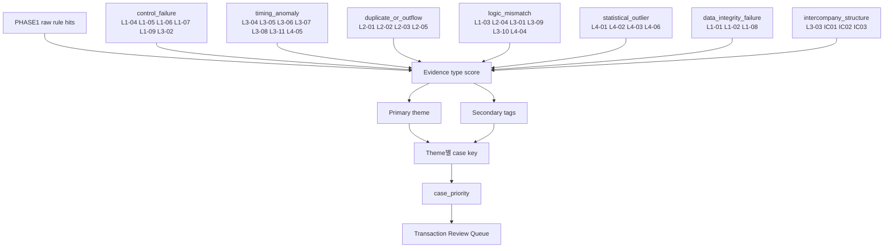
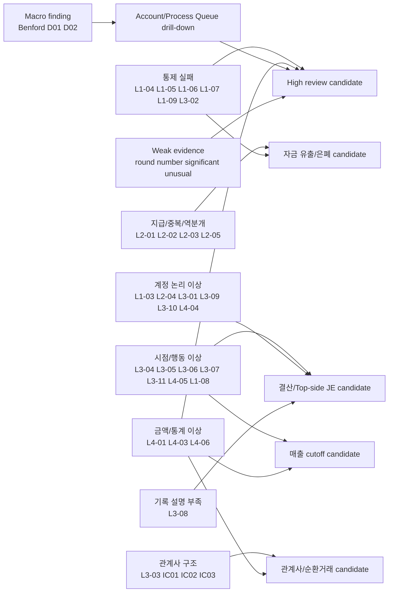

# PHASE1 룰 관계도 및 증폭 관계 분석

분석일: 2026-04-25

범위:

- 로컬 문서: `docs/DETECTION_RULES.md`, `docs/DETECTION_PARAMETERS.md`, `docs/DETECTION_REFERENCE.md`
- 로컬 구현 대조 대상: `src/detection/phase1_case_builder.py`, `src/detection/score_aggregator.py`, `src/detection/constants.py`, `src/detection/variance_layer.py`, `config/phase1_case.yaml`
- 외부 기준: PCAOB AS 2401, AS 2110, AS 2305, AS 2410, PCAOB Journal Entries audit focus

이 문서는 코드 수정 결과가 아니라, PHASE1 룰 개편 이후 **어떤 룰들이 서로 증폭 관계를 가지는지**와 **향후 문서/구현이 따라야 할 정합성 기준**을 정리한 설계 문서다.

## 1. 결론 요약

PHASE1 개편 방향인 `Rule -> Evidence Type -> Theme -> Case Priority` 구조는 감사 기준의 요구와 대체로 맞다. PCAOB AS 2401은 부적절한 전표의 특성으로 기말/마감후 전표, 설명 부족, 희소 계정, 비정상 사용자, 승인 통제 밖 처리, 유의적 비경상 거래, round number 또는 일관된 끝자리 숫자 등을 제시한다.

따라서 PHASE1의 핵심은 개별 룰 hit 개수가 아니라 **서로 다른 성격의 증거가 같은 전표, 같은 case key, 같은 계정/월/사용자에 결합되는지**다.

가장 강한 증폭 축은 아래 5개다.

| 증폭 축 | 핵심 룰 | 강해지는 조합 |
|---|---|---|
| 통제 우회 + 고액 | L1-04, L1-05, L1-06, L1-07, L1-09, L4-03 | 자기승인/승인생략/승인일 누락/SoD가 고액 전표에 붙으면 High 우선순위 |
| 결산 조정 + 설명 부족 + 비정상 계정 | L3-04, L3-08, L4-04, L1-03, L3-10 | Top-side JE 성격. 마감 조정성 전표의 핵심 조합 |
| 매출 이상 + cutoff + 기말 | L4-01, L3-11, L3-04 | 고액 매출과 기간귀속 불일치가 결합하면 High~Critical 후보 |
| 지급/중복 + 통제 실패 | L2-02, L2-03, L2-05, L1-05, L1-06, L1-07 | 실제 자금 유출 또는 은폐 가능성 증폭 |
| 분석적 변동 + 행 단위 이상 | D01, D02 + L3-04, L4-03, L4-04, L2-05 | 계정/월 수준 변화가 전표 수준 이상과 만날 때 우선순위 상승 |

즉시 정합화할 설계 결정은 다음과 같다.

1. `L1-09`는 `control_failure`로 편입한다.
2. `L3-01`은 `logic_mismatch`로 편입한다.
3. `L4-05`는 `timing_anomaly`로 통일한다. 산출 방식은 통계적이어도 감사 스토리텔링상 비정상 시간대/행동 집중 신호이기 때문이다.
4. `topside_score`, `batch_combo_score` 성격의 조합 신호는 row-level 보조 컬럼에 머물지 않고 case priority에 영향을 주는 case-level 보정 신호로 반영한다.
5. Benford, D01, D02는 Transaction Queue가 아니라 Account / Process Queue 같은 macro-finding 큐에서 다룬다.
6. Round number, significant unusual transaction 성격의 약한 신호는 단독 큐가 아니라 weak evidence tag로 case priority를 소폭 보정한다.

## 2. Evidence Type 관계도



해석:

- 같은 evidence type 안에서 룰이 여러 개 걸려도 case당 기여도는 cap을 둔다.
- 다른 evidence type이 같이 걸리면 secondary tag가 붙고, 문서 기준 임계값은 `0.40`이다.
- case priority 공식은 기본적으로 `control 0.35 + amount 0.30 + logic 0.20 + behavior 0.15`다.
- `L4-05`는 통계 기반으로 산출되지만 감사 해석상 `timing_anomaly`로 본다. 특정 사용자의 심야/주말/overtime 집중은 “분포 이상”보다 “비정상 시간대 행동 집중”으로 설명하는 편이 조서와 UI에서 자연스럽다.

## 3. 핵심 증폭 관계도



## 4. 즉시 정합화 대상

### 4.1 `_RULE_THEME_MAP` 사각지대 제거

가장 먼저 없애야 할 문제는 룰이 탐지되어도 case builder 또는 화면 큐로 올라가지 못하는 사각지대다.

| 룰 | 확정 Evidence Type | 이유 |
|---|---|---|
| `L1-09` 승인일 누락 | `control_failure` | 승인자가 있는데 승인일이 없으면 승인 추적성이 훼손된다. `L1-05`, `L1-07`, `L1-06`과 결합될 때 통제 우회 설명력이 커진다. |
| `L3-01` 계정 분류 불일치 | `logic_mismatch` | 계정 자체는 유효하지만 업무 프로세스와 맞지 않는 신호다. `L1-03`, `L2-04`, `L3-10`, `L4-04`와 같은 계정 논리 축에 둔다. |
| `L4-05` 비정상 시간대 집중 | `timing_anomaly` | 사용자별 시간대 집중은 산출 방식이 통계적이어도 감사 해석은 비정상 시간/행동 집중이다. `L3-05`, `L3-06`의 상위 패턴으로 설명한다. |

`D01`, `D02`, Benford는 `_RULE_THEME_MAP`에 단순히 끼워 넣는 방식보다 macro-finding 큐로 분리한다. 단, 해당 macro-finding에 연결된 계정/월/프로세스 아래에 L1~L4 transaction hit가 있으면 drill-down 연결고리로 사용한다.

### 4.2 문서와 구현의 기준

공식 문서 기준은 다음과 같이 둔다.

| Evidence Type | 포함 룰 |
|---|---|
| `control_failure` | L1-04, L1-05, L1-06, L1-07, L1-09, L3-02 |
| `timing_anomaly` | L3-04, L3-05, L3-06, L3-07, L3-08, L3-11, L4-05 |
| `duplicate_or_outflow` | L2-01, L2-02, L2-03, L2-05 |
| `logic_mismatch` | L1-03, L2-04, L3-01, L3-09, L3-10, L4-04 |
| `statistical_outlier` | L4-01, L4-02, L4-03, L4-06 |
| `data_integrity_failure` | L1-01, L1-02, L1-08 |
| `intercompany_structure` | L3-03, IC01, IC02, IC03 |

주의:

- 구현에서는 `L2-03`을 `L2-03a` 정확 중복, `L2-03b` 유사 중복, `L2-03c` 분할 후보, `L2-03d` 시차 중복으로 세분화할 수 있다. 사용자 문서와 evidence type 기준에서는 모두 `L2-03 중복 전표`의 하위 구현으로 보며 `duplicate_or_outflow`에 포함한다.
- `L3-08`은 `timing_anomaly`의 구성 룰로 유지한다. 의미는 “설명 부실”이지만, 결산/기말 조정 이상 시나리오에서 시점 이상과 결합해 중요해지는 보조 증거이기 때문이다.
- `L4-02` Benford는 `statistical_outlier`에 이름은 남기되, 실제 사용자 큐에서는 row-level transaction hit보다 population/account-level finding으로 다루는 것이 맞다.

## 5. Case Priority 보정 원칙

현재 기본 공식은 다음과 같다.

```text
case_priority =
  0.35 * control_score
+ 0.30 * amount_score
+ 0.20 * logic_score
+ 0.15 * behavior_score
```

이 기본식은 유지하되, 아래 보정 신호는 case priority에 직접 개입한다. 구현에서는 보정 전 점수를 `base_priority_score`로 보존하고, 최종 점수는 `priority_score`에 저장한다.

### 5.1 Top-side JE 보정

Top-side JE는 별도 공식 룰로 노출하지 않고, 다음 조합 신호를 묶은 derived score로 본다.

| 조건 그룹 | 룰 |
|---|---|
| period end | L3-04 |
| approval bypass | L1-05, L1-07 |
| invalid accounting pattern | L1-03, L4-04 |
| high amount | L4-03 |
| weak description | L3-08 |

권장 보정:

```text
if case_topside_score >= 0.60:
    case_priority += 0.20
elif case_topside_score >= 0.40:
    case_priority += 0.10
```

`case_priority * 1.5` 같은 multiplier는 낮은 기본 점수를 과도하게 끌어올릴 수 있으므로 기본안으로 쓰지 않는다. 감사 조서 설명 가능성을 위해 “Top-side 조건 2개 이상/3개 이상”처럼 additive bonus로 남기는 편이 낫다.

### 5.2 Batch Combo 보정

L4-06 배치성 전표는 단독으로는 정상 대량 처리일 수 있다. 다만 독립 증거 축이 같이 붙으면 우선순위를 올린다.

| corroboration group | 룰 |
|---|---|
| `closing_or_cutoff` | L3-04, L3-07, L1-08 |
| `control_failure` | L1-05, L1-06, L1-07 |
| `amount_or_account` | L4-03, L4-04, L3-10 |
| `weak_description` | L3-08 |
| `reversal_or_duplicate` | L2-05, L2-02 |

권장 보정:

```text
if L4-06 and corroboration_group_count >= 3:
    behavior_score = max(behavior_score, 1.0)
    case_priority += 0.15
elif L4-06 and corroboration_group_count >= 2:
    behavior_score = max(behavior_score, 0.7)
    case_priority += 0.08
```

이 보정은 “배치 전표라서 위험하다”가 아니라 “배치성 처리에 결산/통제/금액/설명/역분개 축이 같이 붙었다”는 설명을 전제로 한다.

### 5.3 Weak Evidence 보정

AS 2401의 round number, consistent ending number, significant unusual transaction 성격은 단독 룰로 강하게 쓰면 과탐이 크다. 따라서 weak evidence tag로 관리한다.

권장 weak tags:

| Weak Tag | 예시 feature 또는 조건 | 사용 방식 |
|---|---|---|
| `round_number_bias` | `is_round_number == True` | 다른 강한 신호가 있을 때 +0.03~0.05 |
| `significant_unusual_transaction` | 고액 + 희소 계정쌍 + 비경상 문서유형 | Top-side/logic 보조 |
| `manual_period_end` | 수기 전표 + 기말/월말 윈도우 | behavior 보조 |
| `weak_description` | L3-08 또는 설명 품질 저하 | 다른 축과 결합 시 보조 |
| `sensitive_account_touch` | L3-10 또는 민감 계정 prefix | control/logic 보조 |

권장 보정:

```text
weak_bonus = min(weak_tag_count * 0.03, 0.09)
case_priority += weak_bonus
```

weak evidence는 단독으로 high를 만들면 안 된다. `control_failure`, `timing_anomaly`, `logic_mismatch`, `duplicate_or_outflow` 중 하나 이상의 본 신호가 있을 때만 보정한다.

## 6. Queue 분리 원칙

PHASE1 사용자 큐는 한 줄로 합치지 말고 두 계층으로 나눈다.

### 6.1 Transaction Queue

대상:

- L1~L4 row-level 또는 document-level 룰
- 승인/권한, 기말, 고액, 중복, 역분개, 계정 논리 이상

정렬 기준:

- `case_priority`
- `primary_theme`
- `secondary_tags`
- `topside_score`, `batch_combo_score`, weak evidence bonus

사용자에게 보여주는 기본 큐는 Transaction Queue다.

### 6.2 Account / Process Queue

대상:

- L4-02 Benford finding
- D01 계정과목 거래 활동량 급변
- D02 월별 분포 패턴 변화
- 필요 시 계정/프로세스/월 단위 trend 또는 population finding

기본 case key:

| Macro Finding | 기본 Key |
|---|---|
| Benford | `scope / gl_account / flagged_digit` |
| D01 | `gl_account / current_period / variance_type` |
| D02 | `gl_account / changed_month / pattern_shift_type` |

드릴다운 연결:

1. Account / Process Queue에서 이상 계정 또는 월을 선택한다.
2. 같은 `gl_account`, `fiscal_period`, `posting_month`, `business_process` 조건에 속한 전표를 찾는다.
3. 그중 L1~L4 transaction hit가 있는 전표를 먼저 보여준다.
4. L1~L4 hit가 없더라도 macro finding의 후보 전표는 별도 “population sample”로 보여준다.

이 구조가 필요한 이유:

- Benford, D01, D02는 “이 전표 1건이 틀렸다”가 아니라 “이 모집단/계정/월이 이상하다”는 finding이다.
- 이를 Transaction Queue에 억지로 끼워 넣으면 row-level 룰과 의미 단위가 섞인다.
- AS 2305 관점에서도 분석적 절차는 단독 부정 결론보다 다른 증거와 결합될 때 강해진다.

## 7. 시나리오별 증폭 관계

### 7.1 승인·권한 통제 우회

Primary evidence: `control_failure`

핵심 룰:

- L1-04 승인한도 초과
- L1-05 자기승인
- L1-06 직무분리 위반
- L1-07 승인 생략
- L1-09 승인일 누락
- L3-02 수기 전표

| 조합 | 해석 | 우선순위 |
|---|---|---|
| L1-05 + L1-07 | 입력자/승인자 통제와 승인 흔적이 동시에 약함 | High |
| L1-06 + L1-05/L1-07 | SoD review 후보가 즉시 위반으로 승격될 수 있음 | High |
| L1-09 + L1-05/L1-07 | 승인 기록 추적성과 승인 우회가 함께 약함 | High |
| L1-04 + L2-01 | 한도 초과와 한도 직하 패턴이 같은 사용자/부서에 반복될 때 승인 체계 우회 가능성 | Medium~High |
| L1-05/L1-07 + L4-03 | 고액 전표의 자기승인 또는 승인 생략 | High |
| L1-05/L1-07 + L3-04/L3-06 | 기말 또는 심야에 승인 통제 우회 | High |
| L3-02 + L1-05/L1-07 + L3-08 | 사람이 직접 입력했고 승인/설명도 약함 | High |

외부 기준 대조:

- AS 2401은 management override 대응으로 journal entry와 other adjustment 테스트를 요구하고, 승인 요구사항과 누가 전표를 만들 수 있는지 이해해야 한다고 본다.
- AS 2110은 management override를 fraud risk 식별에 포함하고, 유의적 비경상 거래의 승인/식별/회계처리 통제를 이해하도록 요구한다.

### 7.2 결산·Top-side JE

Primary evidence: `timing_anomaly`, 보조로 `control_failure`, `logic_mismatch`, `statistical_outlier`

핵심 룰:

- L3-04 기말/기초 대규모
- L3-07 전기일-문서일 장기 괴리
- L1-08 기간 불일치
- L3-08 적요 결손/파손
- L1-03 무효 계정
- L4-04 희소 차대 계정쌍
- L4-03 이상 고액
- L4-05 비정상 시간대 집중
- L1-05/L1-07 승인 우회

| 조합 | 해석 | 우선순위 |
|---|---|---|
| L3-04 단독 | 결산 검토 모집단 | Low |
| L3-04 + L4-03 | 기말 고액 조정 | High |
| L3-04 + L3-08 | 기말 조정인데 설명 부실 | Medium~High |
| L3-04 + L4-04/L1-03 | 기말에 드문 계정 조합 또는 무효 계정 사용 | High |
| L3-04 + L1-05/L1-07 | 기말 조정과 승인 통제 우회 | High |
| L3-04 + L2-05 | 결산 전후 역분개/상계/재분류 후보 | High |
| L3-04 + L4-05 | 기말 전표가 특정 사용자/비정상 시간대에 집중 | High |

### 7.3 매출·금액·cutoff 이상

Primary evidence: `statistical_outlier` 또는 `timing_anomaly`

핵심 룰:

- L4-01 매출 이상 변동
- L4-03 이상 고액
- L3-11 매출 cutoff 불일치
- L3-04 기말/기초 대규모
- L3-02 수기 전표
- L1-05/L1-07 승인 통제 우회
- L2-05 후속 역분개
- L3-03 관계사 거래

| 조합 | 해석 | 우선순위 |
|---|---|---|
| L4-01 + L4-03 | 매출 계정 특화 이상치이면서 전체 금액 기준 고액 | High |
| L4-01 + L3-11 | 고액 매출과 cutoff 불일치 | High |
| L4-01 + L3-11 + L3-04 | 기말 고액 매출 cutoff 후보 | High~Critical |
| L4-01 + L1-05/L1-07/L3-02 | 수기 또는 승인 우회가 붙은 매출 이상 | Critical 후보 |
| L4-01 + L2-05 | 매출 인식 후 취소/역분개 가능성 | High |
| L4-01 + L3-03 | 관계사 매출, 순환거래, 밀어넣기 가능성 후속 확인 | Medium~High |

외부 기준 대조:

- AS 2110은 부적절한 수익 인식 fraud risk를 추정하도록 요구한다.
- AS 2401은 유의적 비경상 거래가 timing, size, nature 때문에 unusual하면 fraud 또는 misappropriation 은폐에 쓰일 수 있다고 본다.
- AS 2410 Appendix A는 period end 직전 거래 후 unwind, bill-and-hold, unusual return terms, round-trip 성격 거래 등을 관련자 거래 위험 신호로 든다.

### 7.4 지급·중복·자금 유출 위험

Primary evidence: `duplicate_or_outflow`

핵심 룰:

- L2-01 승인한도 직하
- L2-02 중복 지급
- L2-03 중복 전표
- L2-05 역분개 패턴
- L1-05/L1-06/L1-07 통제 실패
- L3-10 민감 계정군
- L4-03 고액
- L3-05/L3-06 비근무 시간
- L3-08 설명 부실

| 조합 | 해석 | 우선순위 |
|---|---|---|
| L2-02 + L2-03 | 지급성 중복과 전표 중복이 같은 거래처/금액대에 결합 | High |
| L2-02/L2-03 + L1-07 | 중복 지급 후보인데 승인 흔적도 약함 | High |
| L2-01 + L2-03 | 한도 직하 금액으로 반복 또는 분할 입력 가능성 | Medium~High |
| L2-05 + L2-02/L2-03 | 지급 후 상계/취소/재분류 은폐 가능성 | High |
| L2-02/L2-03 + L3-10 | 민감 계정 또는 현금성 계정과 연결된 반복 지급 | High |
| L2-02/L2-03 + L3-05/L3-06 + L3-08 | 비근무 시간의 반복 지급 및 설명 부실 | High |

주의:

- duplicate confidence와 reversal interpretation은 case priority에 직접 반영할 가치가 있다.
- 다만 confidence 하나만으로 High를 만들기보다 통제/금액/시점/설명 신호와 결합될 때 가중해야 한다.

### 7.5 계정 사용 논리 이상

Primary evidence: `logic_mismatch`

핵심 룰:

- L1-03 무효 계정
- L2-04 비용 자산화
- L3-01 계정 분류 불일치
- L3-09 가수금 장기체류
- L3-10 고위험 계정 사용
- L4-04 희소 차대 계정쌍

| 조합 | 해석 | 우선순위 |
|---|---|---|
| L2-04 + L4-03 | 고액 비용 자산화 후보 | High |
| L2-04 + L3-04 | 결산 시점의 비용 자산화 후보 | High |
| L3-01 + L4-04 | 프로세스와 계정 조합이 모두 부자연스러움 | Medium~High |
| L3-10 + L1-05/L1-07 | 민감 계정을 승인 우회로 처리 | High |
| L3-10 + L3-08 | 민감 계정인데 설명 부실 | Medium~High |
| L4-04 + L3-04 + L4-03 | 기말 고액 희소 계정쌍 | High |
| L3-09 + L3-07/L3-08 | 장기 미정리 가계정과 날짜 괴리/설명 부실 | Medium~High |

외부 기준 대조:

- AS 2401은 unrelated, unusual, seldom-used account와 significant estimates, unreconciled differences, intercompany transactions를 전표 테스트의 주요 특성으로 본다.
- AS 2305는 예상 관계에서 벗어난 분석적 차이가 미표시 또는 오류 가능성을 시사할 수 있지만 단독으로 fraud 탐지에 충분하지 않다고 본다.

### 7.6 관계사·연결 구조 이상

Primary evidence: `intercompany_structure`

핵심 룰:

- L3-03 관계사 거래 검토 신호
- IC01/IC02/IC03 관계사 대사/금액/시차 이상
- GR01/GR03 순환 구조/이전가격 그래프 신호
- L4-01/L4-03 고액 또는 매출 이상
- L3-11 cutoff
- L2-05 역분개

| 조합 | 해석 | 우선순위 |
|---|---|---|
| L3-03 단독 | 관계사 거래 모집단 | Low |
| L3-03 + IC01/IC02/IC03 | 대사, 금액, 시차 검증 필요 | Medium~High |
| L3-03 + L4-01/L4-03 | 관계사 고액 매출/거래 | High |
| L3-03 + L3-11/L3-04 | 관계사 cutoff 또는 기말 집중 | High |
| L3-03 + L2-05 | 관계사 거래 후 되돌림/상계 | High |
| L3-03 + GR01/GR03 | 순환 구조 또는 가격 비대칭 | Critical 후보 |

외부 기준 대조:

- AS 2410은 관련자 거래의 성격, 조건, 사업 목적을 이해하고, 승인 정책 준수 여부와 예외 승인 여부를 확인하도록 요구한다.
- AS 2410은 intercompany account balance에 대한 절차도 요구한다.
- AS 2410 Appendix A는 period end 직전 거래 후 unwind, round-trip transaction, below-market intermediary 등을 관련자 미식별 신호로 든다.

### 7.7 배치성 자동 전표

Primary evidence: `statistical_outlier`, 운영상 보조 신호

핵심 룰:

- L4-06 배치성 자동 전표 검토 신호
- L3-04/L3-07/L1-08 결산·cutoff·기간
- L1-05/L1-06/L1-07 통제 실패
- L4-03/L4-04/L3-10 금액·계정
- L3-08 설명 부실
- L2-05/L2-02 역분개·중복

| 조합 | 해석 | 우선순위 |
|---|---|---|
| L4-06 단독 | 정상 배치 가능성이 커서 단독 승격 없음 | Normal~Low |
| L4-06 + 2개 corroboration group | 배치 이상에 결산/통제/금액 등 2개 축 결합 | Medium |
| L4-06 + 3개 corroboration group | 배치 이상에 복수 독립 축 결합 | High |

보정 원칙:

- L4-06 단독은 High를 만들지 않는다.
- L4-06에 2개 이상 독립 증거 축이 붙으면 behavior_score를 올린다.
- L4-06에 3개 이상 독립 증거 축이 붙으면 High 후보로 본다.

### 7.8 Variance 독립 트랙

Primary evidence: macro-finding. 기존회사에서만 사용.

핵심 룰:

- D01 계정과목 거래 활동량 급변
- D02 월별 분포 패턴 변화

| 조합 | 해석 | 우선순위 |
|---|---|---|
| D01 + L4-03/L4-04 | 계정 활동량 급변과 고액/희소 계정쌍 | Medium 이상 |
| D01 + L3-04/L3-10 | 급변 계정이 결산 또는 민감 계정과 결합 | High 후보 |
| D01 + L1-05/L1-06/L1-07 | 계정 급변과 통제 실패 결합 | High 후보 |
| D02 + L3-04/L3-07/L1-08 | 월별 패턴 변화와 기말/날짜/기간 이상 | High 후보 |
| D02 + L2-05 | 특정 월 집중 후 역분개/정리 패턴 | High 후보 |
| D01 + D02 | 활동량과 월별 배치가 함께 변화 | Medium 이상 |

외부 기준 대조:

- AS 2305는 분석적 절차가 재무·비재무 데이터의 그럴듯한 관계를 평가하는 절차라고 설명하고, prior period, budget, industry, internal relationships 등을 expectation source로 든다.
- AS 2305는 significant risk에서 분석적 절차 단독 증거가 충분하지 않을 가능성을 명시하므로 D01/D02는 단독 finding보다 다른 전표 룰과 결합될 때 강해진다.

## 8. 구현 반영 체크리스트

이 문서 기준으로 향후 구현을 맞춘다면 우선순위는 다음이다.

1. `_RULE_THEME_MAP`에 `L1-09 -> control_failure`, `L3-01 -> logic_mismatch`를 추가한다.
2. `L4-05`는 문서와 구현 모두 `timing_anomaly`로 통일한다.
3. case-level Top-side 조합 점수를 case priority의 additive bonus로 반영한다.
4. `L4-06`의 corroboration group count를 case priority의 additive bonus 및 behavior 보정으로 반영한다.
5. Benford, D01, D02는 Transaction Queue가 아니라 Account / Process Queue로 분리한다.
6. Account / Process Queue에서 관련 계정/월/프로세스의 L1~L4 transaction hit로 drill-down한다.
7. `is_round_number`, `significant_unusual_transaction`, `manual_period_end`, `sensitive_account_touch` 같은 weak evidence tag를 별도 파생 변수로 관리한다.
8. weak evidence tag는 단독 High가 아니라 다른 강한 신호가 있을 때만 `+0.03~0.05`, 총합 cap `0.09` 수준으로 보정한다.

## 9. 참고한 외부 기준

- PCAOB AS 2401, Consideration of Fraud in a Financial Statement Audit: https://pcaobus.org/oversight/standards/auditing-standards/details/AS2401
- PCAOB Audit Focus, Journal Entries: https://pcaobus.org/resources/staff-publications/audit-focus/audit-focus-journal-entries
- PCAOB AS 2110, Identifying and Assessing Risks of Material Misstatement: https://pcaobus.org/Standards/Auditing/Pages/AS2110.aspx
- PCAOB AS 2305, Substantive Analytical Procedures: https://pcaobus.org/oversight/standards/auditing-standards/details/AS2305
- PCAOB AS 2410, Related Parties: https://pcaobus.org/oversight/standards/auditing-standards/details/AS2410
