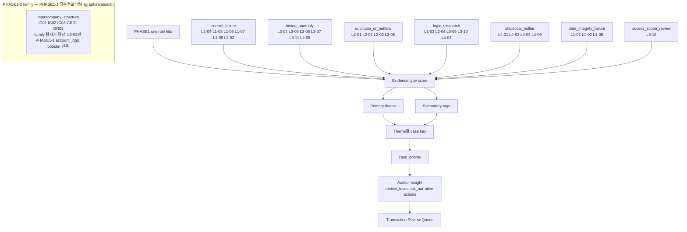
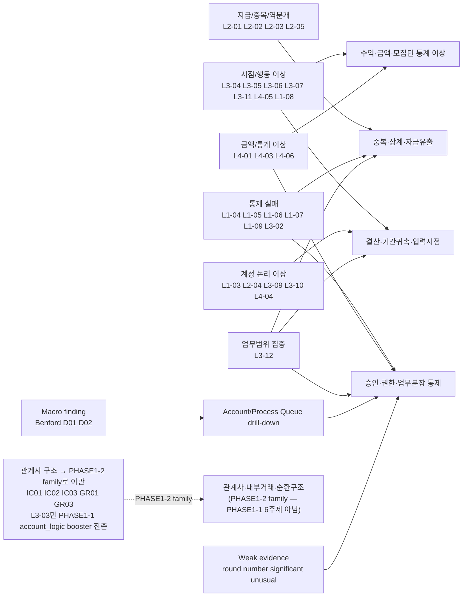

# PHASE1 룰 관계도 및 증폭 관계 분석

> **SoT 우선 (2026-06-14)**: tier 체계·6주제·C안 3-surface는 [`PHASE1_TIER_EVIDENCE_BASIS.md`](PHASE1_TIER_EVIDENCE_BASIS.md)가 단일 출처(SoT)다. 본 문서의 floor 숫자(`0.75`/`0.60` 등)·band 컷은 근거 없는 임의 숫자로 폐기되어, 명명된 순서형 tier(HIGH/MEDIUM/LOW/CONTEXT)로 대체된다. 연속 점수는 tier 내부 정렬 tiebreak 전용이다. 7주제→6주제 전환으로 `관계사·내부거래·순환구조`(intercompany_structure) topic은 PHASE1-2 family(graph/relational)로 이관됐다. **macro 이관(2026-06-15)**: `D01`/`D02`/`Benford(L4-02)`도 PHASE1-2 macro family로 이관됐고 PHASE1-1 transaction case 점수 기여 0(macro_only 중화)이다 — 본 문서 아래의 macro_context booster(`+0.06`/`+0.10` 등) 결합 mechanics는 구 PHASE1-1 설계 기록이며 PHASE1-2 재정립 시 갱신된다. 충돌 시 SoT 우선.

> **PHASE1 역할 원칙**: PHASE1은 `fraud`를 확정하거나 정답 라벨을 맞히는 단계가 아니다. PHASE1의 목적은 전수 모집단에서 규칙 위반, 정책 위반, 이상 징후, 분석적 검토 신호를 넓게 올려 **감사인이 봐야 할 항목과 우선순위**를 만드는 것이다. DataSynth의 `is_fraud`/`is_anomaly`와 precision/recall은 개발 검증 보조 지표이며, 운영 해석은 예외 처리 대상, 감사인 리뷰 대상, 고위험 후보를 구분하는 review queue 기준으로 한다.


> **포트폴리오 주장 범위 (2026-05-19)**: 이 프로젝트는 `fraud`를 판정하거나 실제 운영 부정 탐지 성능을 보장하는 모델이 아니다. 전수 모집단에서 감사인이 먼저 볼 review queue를 만들고, 무작위 검토 대비 상위 구간에 review-worthy synthetic anomaly를 강하게 농축하는 로컬 감사 분석 보조 도구다. DataSynth 기반 precision/recall은 개발 검증 보조 지표이며, 실데이터 운영 성능으로 주장하지 않는다.
> **금지 표현**: "부정을 정확히 탐지", "실무 운영 성능 검증 완료", "TOP100 precision 충분", "fraud 확정/자동 적발"처럼 확정적이거나 운영 성능을 보장하는 표현은 사용하지 않는다.

분석일: 2026-04-25
보강일: 2026-04-27

범위:

- 로컬 문서: `docs/spec/DETECTION_RULES.md`, `docs/spec/DETECTION_PARAMETERS.md`, `docs/spec/DETECTION_REFERENCE.md`
- 로컬 구현 대조 대상: `src/detection/phase1_case_builder.py`, `src/detection/score_aggregator.py`, `src/detection/constants.py`, `src/detection/variance_layer.py`, `config/phase1_case.yaml`
- 외부 기준: PCAOB AS 2401, AS 2110, AS 2305, AS 2410, PCAOB Journal Entries audit focus

2026-04-27 scoring update:

2026-04-28 L3-12 work-scope update:

- `L3-12 WorkScopeExcessReview`는 L1-06의 명시적 SoD 위반이 아니라 `access_scope_review` evidence type의 review signal이다.
- 단독 L3-12는 L3 family max에 약하게 들어가며, 단독으로 policy high floor를 만들지 않는다.
- Phase1 row-level 보강은 `work_scope_combo_score`로 별도 기록한다. L3-12에 독립 보강 evidence group이 2개 붙으면 Medium floor, 3개 이상 붙으면 High floor를 적용한다.
- L1-06이 같이 뜨면 L1-06이 주 위반 신호이고 L3-12는 동일 사용자의 업무범위 집중 맥락으로만 해석한다.

- Row-level `anomaly_score`는 legacy `layer_a/layer_b/layer_c/benford` 가중합이 아니라 L1/L2/L3/L4 rule-family 가중합이다: `L1 0.40`, `L2 0.25`, `L3 0.20`, `L4 0.15`.
- 심각한 통제 위반은 row `risk_level`과 case `priority_score` 양쪽에 policy floor를 적용한다.
- Case `amount_score`는 engagement materiality가 있으면 상대 금액 점수와 materiality 대비 점수 중 큰 값을 사용한다.

이 문서는 PHASE1 룰 개편 이후 **어떤 룰들이 서로 증폭 관계를 가지는지**, 그리고 `docs/spec/DETECTION_RULES.md`의 최신 PHASE1 통합 출력 구조와 맞춰 **감사인에게 어떤 insight로 번역해야 하는지**를 정리한 관계도 문서다.

## 1. 결론 요약

PHASE1 개편 방향인 `Rule -> Evidence Type -> Theme -> Case Priority` 구조는 감사 기준의 요구와 대체로 맞다. PCAOB AS 2401은 부적절한 전표의 특성으로 기말/마감후 전표, 설명 부족, 희소 계정, 비정상 사용자, 승인 통제 밖 처리, 유의적 비경상 거래, round number 또는 일관된 끝자리 숫자 등을 제시한다.

따라서 PHASE1의 핵심은 개별 룰 hit 개수가 아니라 **서로 다른 성격의 증거가 같은 전표, 같은 case key, 같은 계정/월/사용자에 결합되는지**다. 최종 출력도 룰 결과표가 아니라 `priority_band`, `review_focus`, `risk_narrative`, `recommended_audit_actions`를 가진 감사 검토 큐여야 한다.

가장 강한 증폭 축은 아래 5개다.

| 증폭 축                    | 핵심 룰                                                 | 강해지는 조합                                                                                          |
| -------------------------- | ------------------------------------------------------- | ------------------------------------------------------------------------------------------------------ |
| 통제 우회 + 고액           | L1-04, L1-05, L1-06, L1-07, L1-09, L4-03                | 자기승인/승인생략/승인일 누락/SoD가 고액 전표에 붙으면 High 우선순위                                   |
| 결산 조정 + 비정상 계정    | L3-04, L4-04, L1-03, L3-10                              | Top-side JE 성격. 마감 조정성 전표의 핵심 조합                                                         |
| 매출 이상 + cutoff + 기말  | L4-01, L3-11, L3-04                                     | 고액 매출과 기간귀속 불일치가 결합하면 High~Critical 후보                                              |
| 지급/중복 + 통제 실패      | L2-02, L2-03, L2-05, L1-05, L1-06, L1-07                | 실제 자금 유출 또는 은폐 가능성 증폭                                                                   |
| 분석적 변동 + 행 단위 이상 | D01, D02 + L3-04, L4-03, L4-04, L2-05                   | 계정/월 수준 변화가 전표 수준 이상과 만날 때 우선순위 상승                                             |
| 업무범위 집중 + 보강 신호  | L3-12 + L3-02/L3-10/L3-04/L4-03/L1-05/L1-07/L2-02/L2-03 | 한 사용자가 여러 업무 영역에 집중되어 있고 수기·민감계정·결산·고액·중복·통제실패가 붙을 때 Medium~High |

현재 정합성 기준은 다음과 같다.

1. `L1-09`는 `control_failure`로 편입한다.
2. `L3-01`은 폐기되었다(2026-06-20, MisclassifiedAccount 정답표 의존·통합점수 미참조 → L4-04 희소쌍이 역할 대체).
3. `L4-05`는 `timing_anomaly`로 통일한다. 산출 방식은 통계적이어도 감사 스토리텔링상 비정상 시간대/행동 집중 신호이기 때문이다.
4. `topside_score`, `batch_combo_score` 성격의 조합 신호는 row-level 보조 컬럼에 머물지 않고 case priority에 영향을 주는 case-level 보정 신호로 반영한다.
5. Benford, D01, D02는 Transaction Queue가 아니라 Account / Process Queue 같은 macro-finding 큐에서 다룬다.
6. Round number, significant unusual transaction 성격의 약한 신호는 단독 큐가 아니라 weak evidence tag로 case priority를 소폭 보정한다.
7. 룰별 `High/Medium/Low`, `검토 필요`, `위험 높음` 같은 표현은 최종 합산 단위가 아니다. 룰 출력은 먼저 evidence type, evidence strength, review focus, action metadata로 표준화한 뒤 case-level insight로 번역한다.

## 2. Evidence Type 관계도



해석:

- 같은 evidence type 안에서 룰이 여러 개 걸려도 case당 기여도는 cap을 둔다.
- 다른 evidence type이 같이 걸리면 secondary tag가 붙고, 문서 기준 임계값은 `0.40`이다.
- case priority 공식은 기본적으로 `control 0.25 + amount 0.25 + outflow 0.15 + logic 0.15 + timing 0.10 + behavior 0.10`이다.
- `L4-05`는 통계 기반으로 산출되지만 감사 해석상 `timing_anomaly`로 본다. 특정 사용자의 심야/주말/overtime 집중은 “분포 이상”보다 “비정상 시간대 행동 집중”으로 설명하는 편이 조서와 UI에서 자연스럽다.

Auditor insight 계층:

| 필드                        | 의미                                    | 생성 기준                                                                 |
| --------------------------- | --------------------------------------- | ------------------------------------------------------------------------- |
| `review_focus`              | 감사인이 집중할 검토 축                 | hit된 룰의 focus metadata를 중복 제거해 구성                              |
| `risk_narrative`            | 왜 먼저 봐야 하는지에 대한 한 문단 설명 | primary theme, secondary tags, priority adjustment reason을 결합          |
| `recommended_audit_actions` | 다음 감사 절차                          | 룰별 action metadata를 theme 우선순위에 따라 정렬                         |
| `rule_evidence_summary`     | drill-down용 근거 요약                  | raw rule hit, severity, evidence type, detail을 사람이 읽는 문장으로 변환 |

즉 `L1-05 = High`, `L3-10 = 검토 필요`처럼 룰별 표현을 그대로 합산하거나 화면의 메인 언어로 쓰지 않는다. 룰별 표현은 `display_label`로 보존하되, 합산 전 `signal_strength`, `severity`, `evidence_strength`, `scoring_role`, `normalized_score`로 분리한다. 최종 합산에는 `normalized_score`만 사용하고, 화면 설명에는 `review_focus`와 case-level narrative를 사용한다.

현재 구현 기준:

| 항목                | 저장/계산 위치                  | 역할                                                               |
| ------------------- | ------------------------------- | ------------------------------------------------------------------ |
| `display_label`     | `RawRuleHitRef`                 | 룰별 원문 표현 또는 bucket 표시                                    |
| `signal_strength`   | `src/detection/rule_scoring.py` | `High/상/위험 높음`, `검토 필요`, numeric row score를 0~1로 표준화 |
| `evidence_strength` | rule scoring registry           | strong/medium/weak 증거 설명력                                     |
| `scoring_role`      | rule scoring registry           | primary/booster/combo_only/macro_only 기여 방식                    |
| `normalized_score`  | `normalize_rule_evidence()`     | evidence type 합산에 들어가는 실제 점수                            |

Rule-specific 예외는 detector row score가 이미 감사 우선순위 bucket을 담는 경우에만 둔다(예: `L3-06`/`L3-10`/`L3-12`의 raw band 단조 보존). `L3-09` suspense aging은 binary 전환(2026-06)으로 이 예외에서 제외됐다 — 발화 시 `1.0`이며, 체류기간·금액 강도는 룰 점수가 아니라 통합점수체계가 정황으로 받는다.

추가 구현 기준:

| 항목                     | 저장/계산 위치               | 역할                                             |
| ------------------------ | ---------------------------- | ------------------------------------------------ |
| `RULE_LEVEL_WEIGHTS`     | `src/detection/constants.py` | row-level `anomaly_score`의 L1/L2/L3/L4 가중치   |
| `priority_floor_reasons` | `phase1_case_builder`        | 심각한 통제 위반으로 최소 priority가 적용된 근거 |
| `risk_floor_reasons`     | `score_aggregator`           | row-level 위험등급 정책 승격 근거                |

## 3. 핵심 증폭 관계도



## 4. 즉시 정합화 대상

### 4.1 `_RULE_THEME_MAP` 사각지대 제거

가장 먼저 없애야 할 문제는 룰이 탐지되어도 case builder 또는 화면 큐로 올라가지 못하는 사각지대다.

| 룰                         | 확정 Evidence Type | 이유                                                                                                                              |
| -------------------------- | ------------------ | --------------------------------------------------------------------------------------------------------------------------------- |
| `L1-09` 승인일 누락        | `control_failure`  | 승인자가 있는데 승인일이 없으면 승인 추적성이 훼손된다. `L1-05`, `L1-07`, `L1-06`과 결합될 때 통제 우회 설명력이 커진다.          |
| `L4-05` 비정상 시간대 집중 | `timing_anomaly`   | 사용자별 시간대 집중은 산출 방식이 통계적이어도 감사 해석은 비정상 시간/행동 집중이다. `L3-05`, `L3-06`의 상위 패턴으로 설명한다. |

`D01`, `D02`, Benford는 `_RULE_THEME_MAP`에 단순히 끼워 넣는 방식보다 macro-finding 큐로 분리한다. 단, 해당 macro-finding에 연결된 계정/월/프로세스 아래에 L1~L4 transaction hit가 있으면 drill-down 연결고리로 사용한다.

### 4.2 문서와 구현의 기준

공식 문서 기준은 다음과 같이 둔다.

| Evidence Type                                   | 포함 룰                                                                                   |
| ----------------------------------------------- | ----------------------------------------------------------------------------------------- |
| `control_failure`                               | L1-04, L1-05, L1-06, L1-07, L1-09, L3-02                                                  |
| `timing_anomaly`                                | L3-04, L3-05, L3-06, L3-07, L3-11, L4-05                                                  |
| `duplicate_or_outflow`                          | L2-01, L2-02, L2-03, L2-05                                                                |
| `logic_mismatch`                                | L1-03, L2-04, L3-09, L3-10, L4-04                                                         |
| `statistical_outlier`                           | L4-01, L4-02, L4-03, L4-06                                                                |
| `data_integrity_failure`                        | L1-01, L1-02, L1-08                                                                       |
| `access_scope_review`                           | L3-12                                                                                     |
| `intercompany_structure` (PHASE1-2 family 이관) | IC01, IC02, IC03, GR01, GR03 — PHASE1-1 점수경로 아님. L3-03만 account_logic booster 잔존 |

> 2026-06-14 6주제 전환: `intercompany_structure`는 PHASE1-1 evidence type/점수경로에서 제거되어 PHASE1-2 family(graph/relational)로 이관됐다. IC01~03·GR01/03은 family 탐지기가 담당하고, L3-03만 PHASE1-1에서 `logic_mismatch` account_logic booster로 잔존한다. 근거·귀속은 SoT [`PHASE1_TIER_EVIDENCE_BASIS.md`](PHASE1_TIER_EVIDENCE_BASIS.md) §7.3.

사용자에게 노출하는 공식 review queue는 evidence type을 그대로 보여주지 않고 아래 6개 감사 주제로 번역한다(`관계사·내부거래·순환구조`는 7번째 주제였으나 PHASE1-2 family로 이관, SoT §7.3).

| 공식 review queue          | 포함 evidence/rule                                | 사용 목적                                                            |
| -------------------------- | ------------------------------------------------- | -------------------------------------------------------------------- |
| 원장기록·데이터정합성      | `data_integrity_failure`                          | 원장 기록 자체의 유효성, 필수값, 기간 정합성, 설명 추적성 확인       |
| 승인·권한·업무분장 통제    | `control_failure`, `access_scope_review`          | 승인권한 초과, 자기승인, 승인생략, SoD, 수기우회, 업무범위 집중 확인 |
| 결산·기간귀속·입력시점     | `timing_anomaly`                                  | 결산 말, 휴일·야간, 사후입력, cutoff, 설명 부족 전표 확인            |
| 계정분류·거래실질 불일치   | `logic_mismatch` (L3-03 관계사 맥락 booster 포함) | 계정 조합, 프로세스, 가계정, 민감계정 사용이 거래 실질과 맞는지 확인 |
| 중복·상계·자금유출         | `duplicate_or_outflow`                            | 중복 지급, 반복 전표, 상계·반제, 자금 유출 은폐 가능성 확인          |
| 수익·금액·모집단 통계 이상 | `statistical_outlier`, Benford, D01, D02          | 매출, 고액, 숫자 분포, 배치, 계정·월 단위 모집단 이상 확인           |

`조작 후보`, `맥락 검토대상`, `추가검토사항`은 공식 review queue가 아니다. 이들은 필요하면 보조 tag 또는 상태값으로만 남기고, primary queue는 반드시 위 6개 중 하나로 지정한다. 목적과 배경은 [TROUBLESHOOT.md TS-9](TROUBLESHOOT.md#ts-9-phase1-review-queue를-확실한-감사-주제로-재정렬)에 정리했다.

주의:

- 구현에서는 `L2-03`을 `L2-03a` 정확 중복, `L2-03b` 유사 중복, `L2-03c` 분할 후보, `L2-03d` 시차 중복으로 세분화할 수 있다. 사용자 문서와 evidence type 기준에서는 모두 `L2-03 중복 전표`의 하위 구현으로 보며 `duplicate_or_outflow`에 포함한다.
- `L1-08`은 primary evidence type 기준으로는 `data_integrity_failure`다. 다만 기간 불일치는 결산/cutoff 시나리오에서 중요한 secondary 증거가 되므로, `timing_anomaly` 자체로 재분류하지 않고 `secondary_tags`와 scenario narrative에서 시점 증거로 사용한다.
- `L4-02` Benford는 `statistical_outlier`에 이름은 남기되, 실제 사용자 큐에서는 row-level transaction hit보다 population/account-level finding으로 다루는 것이 맞다.
- `intercompany_structure`는 2026-06-14 6주제 전환으로 PHASE1-1 점수경로에서 제거되어 PHASE1-2 family(graph/relational)로 이관됐다(SoT §7.3). IC01~03·GR01/03은 family 탐지기가 담당하고 PHASE1-1 transaction case 점수를 만들지 않는다. L3-03만 PHASE1-1에서 `logic_mismatch` account_logic booster(관계사 모집단 맥락)로 잔존한다. (구 D065 IC01 sidecar 정책은 PHASE1-1 IC 경로 제거로 PHASE1-2 family 산출물로 이관 — `docs/spec/RULE_DETAIL_METADATA_V1_LOCK.md` §IC01 참조.)

Primary/secondary 구분 원칙:

- **Primary evidence**는 case가 어느 Theme Queue에 한 번만 노출될지를 정한다.
- **Secondary evidence**는 같은 case 안의 다른 위험 축을 설명하고 priority를 보정한다.
- 하나의 룰을 여러 primary theme에 중복 배치하지 않는다. 예를 들어 `L1-08`은 데이터 정합성 오류가 primary이고, 결산/cutoff 설명에서는 secondary timing signal로만 사용한다.

## 5. Case Priority 보정 원칙

현재 기본 공식은 다음과 같다.

```text
case_priority =
  0.25 * control_score
+ 0.25 * amount_score
+ 0.15 * duplicate_or_outflow_score
+ 0.15 * logic_score
+ 0.10 * timing_score
+ 0.10 * behavior_score
```

`timing_score` is the normalized `timing_anomaly` evidence score. It keeps closing/cutoff signals such as `L3-04`, `L3-07`, and `L3-11` visible in case priority even when row-level L3 family weighting is intentionally conservative.

이 기본식은 유지하되, 아래 보정 신호는 case priority에 직접 개입한다. 구현에서는 보정 전 점수를 `base_priority_score`로 보존하고, 최종 점수는 `priority_score`에 저장한다.

`priority_floors`는 보정과 별개로 최소선을 보장한다. 예를 들어 `L1-05` immediate/escalated 자기승인, `L1-04` 승인한도 초과, `L1-06` direct SoD, `L1-07` immediate 승인 생략, `L1-09` material approval-date gap, `L3-11` cutoff gap, `L2-02` reference match, `L1-02` 핵심 필드 누락은 단일 룰 또는 지정된 조합만으로도 최소 priority를 만든다. `amount_score`는 engagement materiality가 있으면 case 내 상대 금액과 materiality 대비 금액 중 더 큰 신호를 사용한다.

`L1-01`은 row-level risk floor에서 별도로 다룬다. severe imbalance는 Medium floor, material imbalance는 Low floor를 만든다. `L1-02`는 case priority에서 `document_id`, `gl_account`, `posting_date`, `debit_amount`, `credit_amount` 같은 핵심 필드 누락 수와 종류에 따라 blocker 성격의 floor를 만든다.

`L1-08`은 primary evidence type은 `data_integrity_failure`로 유지하지만, row annotation의 `context_reasons`가 있으면 case priority에 `l108_context_priority` 보정을 준다. 이 보정은 기간 불일치 자체를 timing primary로 바꾸지 않고, cutoff/결산 맥락을 보조 설명으로 남기는 방식이다.

L3-07은 PHASE1에서 `timing_anomaly`의 보조 신호로 유지한다. 탐지기 raw score `0.45/0.60/0.75`는 리포트 설명용으로 보존하고, 통합 점수에서는 bucket label을 기준으로 `moderate_gap=0.55`, `large_gap=0.75`, `extreme_gap=1.0` signal strength를 적용한다. 이렇게 해야 90일 초과 괴리가 61~90일 괴리보다 낮게 평가되는 정규화 역전을 막을 수 있다. L3 family weight가 0.20이므로 L3-07 단독으로는 row-level Medium/High를 만들지 않고, 결산·통제·금액·적요 신호와 결합할 때 우선순위가 올라간다.

L3-10은 PHASE1에서 민감 계정 접촉을 단독 High로 올리지 않는다. 다만 `priority_case`로 분류된 건은 `config/phase1_case.yaml`의 `priority_floors`로 최소 `0.45`를 적용해 Medium 검토 큐에 남긴다. row-level `anomaly_score`에서는 weak booster로 약하게 반영하고, case priority에서 수기/조정, 고액, 미정리, 승인일 누락, 기말/비정상시점 같은 보강 맥락을 보존한다.

L3-01은 폐기되었다(2026-06-20). 계정-프로세스 불일치는 사람이 유지하는 정답 조합표에 의존해 기준이 애매했고 통합점수체계 조합에서도 참조되지 않았다. 도메인상 이상한 계정 조합 중 실제로 드문 것은 `L4-04`(희소 차대 계정쌍)가 데이터 기반으로 포착한다.

L3-04는 결산 검토 모집단이므로 단독 반복성 패턴은 낮춘다. `L3-04` 단독이면 `l304_only_penalty`를 적용하고, 민감 계정·고액·다른 timing/control/outflow 조합이 붙으면 보정한다. 정상 반복 결산 패턴으로 보이는 경우에는 repeat score도 cap을 둔다.

### 5.1 Top-side JE 보정

Top-side JE는 별도 공식 룰로 노출하지 않고, 다음 조합 신호를 묶은 derived score로 본다.

| 조건 그룹                  | 룰           |
| -------------------------- | ------------ |
| period end                 | L3-04        |
| approval bypass            | L1-05, L1-07 |
| invalid accounting pattern | L1-03, L4-04 |
| high amount                | L4-03        |
권장 보정:

```text
if case_topside_score >= 0.60:
    case_priority += 0.20
elif case_topside_score >= 0.40:
    case_priority += 0.10
```

`case_priority * 1.5` 같은 multiplier는 낮은 기본 점수를 과도하게 끌어올릴 수 있으므로 기본안으로 쓰지 않는다. 감사 조서 설명 가능성을 위해 “Top-side 조건 2개 이상/3개 이상”처럼 additive bonus로 남기는 편이 낫다.

### 5.2 Batch Combo 보정

L4-06 배치성 전표는 단독으로는 정상 대량 처리일 수 있다. 다만 독립 증거 축이 같이 붙으면 우선순위를 올린다.

| corroboration group | 룰                  |     |                         |              |
| ------------------- | ------------------- | --- | ----------------------- | ------------ |
| `closing_or_cutoff` | L3-04, L3-07, L1-08 |     |                         |              |
| `control_failure`   | L1-05, L1-06, L1-07 |     |                         |              |
| `amount_or_account` | L4-03, L4-04, L3-10 |     | `reversal_or_duplicate` | L2-05, L2-02 |

권장 보정:

```text
if L4-06 and corroboration_group_count >= 3:
    behavior_score = max(behavior_score, 1.0)
    case_priority += 0.15
elif L4-06 and corroboration_group_count >= 2:
    behavior_score = max(behavior_score, 0.7)
    case_priority += 0.08
```

이 보정은 “배치 전표라서 위험하다”가 아니라 “배치성 처리에 결산/통제/금액/설명/역분개 축이 같이 붙었다”는 설명을 전제로 한다.

row-level `score_aggregator`도 같은 corroboration group을 계산해 `batch_combo_score`, `batch_combo_reasons`를 남긴다. 다만 row-level에서는 L4-06 2개 group이면 `risk_level=Medium`, 3개 group이면 `risk_level=High`로 승격하고, `anomaly_score` 자체의 floor를 별도로 올리지는 않는다. case-level에서는 위 additive bonus와 behavior floor가 `priority_score`에 반영된다.

### 5.3 Work-scope Combo 보정

L3-12는 한 사용자가 여러 업무 영역에 과도하게 관여한 review signal이다. 단독으로는 업무분장 위반이나 부정을 확정하지 않으며, L1-06의 명시적 SoD 위반과 분리한다. 사용자-year 점수는 `review_score_series`와 `row_annotations.review_score`로만 PHASE1 점수체계에 유입하고, `details`/`flagged_rules`에는 확정 위반처럼 넣지 않는다. 다만 같은 사용자·같은 기간의 L3-12 hit에 독립 증거 축이 붙으면 Phase1 종합점수에서 우선순위를 올린다.

| corroboration group       | 룰                                       |
| ------------------------- | ---------------------------------------- |
| `manual_or_control`       | L3-02, L1-04, L1-05, L1-06, L1-07, L1-09 |
| `sensitive_or_amount`     | L3-10, L4-03, L4-04                      |
| `closing_or_timing`       | L3-04, L3-06, L3-07, L3-11, L1-08        |
| `duplicate_or_outflow`    | L2-01, L2-02, L2-03, L2-05               |
| `revenue_or_intercompany` | L4-01, L3-03, IC01                       |

권장 보정:

```text
if L3-12 and corroboration_group_count >= 3:
    anomaly_score = max(anomaly_score, 0.70)
    risk_level = High
elif L3-12 and corroboration_group_count >= 2:
    anomaly_score = max(anomaly_score, 0.40)
    risk_level = Medium
```

이 보정은 L3-12가 확정 위반이라는 뜻이 아니다. Phase1의 L3 family row score가 family max 방식이어서 L3-12와 다른 L3 신호가 함께 떠도 과소 반영될 수 있으므로, 독립 evidence group 수를 `work_scope_combo_score`와 `work_scope_combo_reasons`로 별도 기록해 감사 검토 큐 정렬에 반영한다. L3-12 단독은 High floor를 만들지 않는다.

현재 `work_scope_combo_score`와 `work_scope_combo_reasons`는 row-level `score_aggregator` 출력 컬럼이다. case builder는 L3-12를 `access_scope_review` theme으로 묶고 `review_rules`/row annotation 기반 신호를 case queue에 반영하지만, 별도 case field로 `work_scope_combo_score`를 저장하지 않는다. 따라서 화면이나 export에서 work-scope 조합 사유를 보여주려면 row-level aggregate 컬럼과 case 결과를 함께 참조해야 한다.

### 5.4 Weak Evidence 보정

AS 2401의 round number, consistent ending number, significant unusual transaction 성격은 단독 룰로 강하게 쓰면 과탐이 크다. 따라서 weak evidence tag로 관리한다.

권장 weak tags:

| Weak Tag                          | 예시 feature 또는 조건               | 사용 방식                           |     |                           |                             |                    |
| --------------------------------- | ------------------------------------ | ----------------------------------- | --- | ------------------------- | --------------------------- | ------------------ |
| `round_number_bias`               | `is_round_number == True`            | 다른 강한 신호가 있을 때 +0.03~0.05 |     |                           |                             |                    |
| `significant_unusual_transaction` | 고액 + 희소 계정쌍 + 비경상 문서유형 | Top-side/logic 보조                 |     |                           |                             |                    |
| `manual_period_end`               | 수기 전표 + 기말/월말 윈도우         | behavior 보조                       |     | `sensitive_account_touch` | L3-10 또는 민감 계정 prefix | control/logic 보조 |

권장 보정:

```text
weak_bonus = min(weak_tag_count * 0.03, 0.09)
case_priority += weak_bonus
```

weak evidence는 단독으로 high를 만들면 안 된다. `control_failure`, `timing_anomaly`, `logic_mismatch`, `duplicate_or_outflow` 중 하나 이상의 본 신호가 있을 때만 보정한다.

추가 제약:

- weak evidence는 **자기 자신만으로 보정 사유가 되면 안 된다**. round number 같은 약한 증거는 독립 보강 룰과 함께 나타날 때만 보정한다.
- `round_number_bias`도 단독 High를 만들지 않는다. AS 2401의 round number는 journal entry 선별 특성이지만, 승인 우회·기말 조정·희소 계정·고액 같은 본 신호와 결합될 때 감사상 설명력이 커진다.
- weak evidence 보정은 `priority_adjustment_reasons`에 남겨야 하며, auditor insight에서는 “보조 신호”로 표현한다.

### 5.5 Duplicate, Rare Pair, Macro Context 보정

`L2-03` 계열은 `L2-03a~L2-03d`를 모두 `duplicate_or_outflow`에 넣지만, 고신뢰 중복이라고 해서 항상 High로 올리지는 않는다. `confidence_band=high`, annotation confidence, 또는 raw score가 `0.85` 이상이고 독립 evidence type이나 materiality/금액 보강이 있을 때만 `l203_high_confidence_corroborated` 또는 `l203_high_confidence_material` 사유로 bonus와 최소 `0.45` floor를 적용한다.

`L4-04` 희소 차대 계정쌍은 단독이면 정상 희소 거래일 수 있다. 따라서 단독 `L4-04` case에는 penalty를 적용하고, source가 recurring/automated/batch/interface/system 성격으로 일정 비율 이상이면 추가 penalty를 적용한다. 다른 logic, timing, control, amount 신호와 결합될 때만 priority 설명력이 커진다.

D01/D02는 Account / Process Queue의 macro finding이지만, 같은 `fiscal_year`, `company_code`, `gl_account`에 속한 transaction case에 context로 연결될 수 있다. `confirmed_*` bucket은 `+0.06`, `corroborated_*` bucket은 `+0.04` priority booster를 주며, macro context bonus 전체는 최대 `+0.10`으로 제한한다. Benford(`L4-02`)는 macro finding으로 생성되지만 현재 transaction case context booster 대상은 D01/D02다.

## 6. Queue 분리 원칙

PHASE1 사용자 큐는 한 줄로 합치지 말고 두 계층으로 나눈다.

### 6.1 Transaction Queue

대상:

- L1~L4 row-level 또는 document-level 룰
- 승인/권한, 기말, 고액, 중복, 역분개, 계정 논리 이상

정렬 기준:

- `case_priority`
- `primary_theme`
- `secondary_tags`
- case-level Top-side 조합 점수, `batch_combo_bonus`, `weak_evidence_bonus`, 그리고 row-level `work_scope_combo_score`

사용자에게 보여주는 기본 큐는 Transaction Queue다. 화면의 메인 문구는 원천 룰 라벨이 아니라 Auditor Insight 계층을 사용한다.

권장 표시 순서:

1. `priority_band`와 primary theme
2. `review_focus`
3. `risk_narrative`
4. `recommended_audit_actions`
5. drill-down에서 `rule_evidence_summary`와 raw rule hit

### 6.2 Account / Process Queue

대상:

- L4-02 Benford finding
- D01 계정과목 거래 활동량 급변
- D02 월별 분포 패턴 변화
- 필요 시 계정/프로세스/월 단위 trend 또는 population finding

기본 case key:

| Macro Finding | 기본 Key                                          |
| ------------- | ------------------------------------------------- |
| Benford       | `scope / gl_account / flagged_digit`              |
| D01           | `gl_account / current_period / variance_type`     |
| D02           | `gl_account / changed_month / pattern_shift_type` |

드릴다운 연결:

1. Account / Process Queue에서 이상 계정 또는 월을 선택한다.
2. 같은 `gl_account`, `fiscal_period`, `posting_month`, `business_process` 조건에 속한 전표를 찾는다.
3. 그중 L1~L4 transaction hit가 있는 전표를 먼저 보여준다.
4. L1~L4 hit가 없더라도 macro finding의 후보 전표는 별도 “population sample”로 보여준다.

이 구조가 필요한 이유:

- Benford, D01, D02는 “이 전표 1건이 틀렸다”가 아니라 “이 모집단/계정/월이 이상하다”는 finding이다.
- 이를 Transaction Queue에 억지로 끼워 넣으면 row-level 룰과 의미 단위가 섞인다.
- AS 2305 관점에서도 분석적 절차는 단독 부정 결론보다 다른 증거와 결합될 때 강해진다.

## 7. 시나리오별 증폭 관계

> tier 체계 정합 (2026-06-14, SoT §1-3): 아래 ~40개 추가 조합은 band를 새로 승격시키는 가중합 입력이 아니라, **명명된 tier 내부 정렬(tiebreak)**용이다. tier 자체는 SoT §4~§6의 근거 있는 조건이 결정하고, 본 절의 조합은 같은 tier 안에서 case 줄세우기에만 쓰인다(연속 점수는 크기 의미 없는 순서형 tiebreak).

### 7.1 승인·권한 통제 우회

Primary evidence: `control_failure`

핵심 룰:

- L1-04 승인한도 초과
- L1-05 자기승인
- L1-06 직무분리 위반
- L1-07 승인 생략
- L1-09 승인일 누락
- L3-02 수기 전표

| 조합                      | 해석                                                                            | 우선순위    |
| ------------------------- | ------------------------------------------------------------------------------- | ----------- |
| L1-05 + L1-07             | 입력자/승인자 통제와 승인 흔적이 동시에 약함                                    | High        |
| L1-06 + L1-05/L1-07       | direct SoD conflict와 자기승인/승인생략이 함께 나타난 통제 실패                 | High        |
| L1-09 + L1-05/L1-07       | 승인 기록 추적성과 승인 우회가 함께 약함                                        | High        |
| L1-04 + L2-01             | 한도 초과와 한도 직하 패턴이 같은 사용자/부서에 반복될 때 승인 체계 우회 가능성 | Medium~High |
| L1-05/L1-07 + L4-03       | 고액 전표의 자기승인 또는 승인 생략                                             | High        |
| L1-05/L1-07 + L3-04/L3-06 | 기말 또는 심야에 승인 통제 우회                                                 | High        |
| L3-02 + L1-05/L1-07       | 사람이 직접 입력했고 승인도 약함                                                | High        |

외부 기준 대조:

- AS 2401은 management override 대응으로 journal entry와 other adjustment 테스트를 요구하고, 승인 요구사항과 누가 전표를 만들 수 있는지 이해해야 한다고 본다.
- AS 2110은 management override를 fraud risk 식별에 포함하고, 유의적 비경상 거래의 승인/식별/회계처리 통제를 이해하도록 요구한다.

### 7.2 업무범위 집중 검토

Primary evidence: `access_scope_review`

핵심 룰:

- L3-12 업무범위 집중 검토
- L3-02 수기 전표
- L3-10 민감 계정 사용
- L3-04/L3-11 결산·cutoff 신호
- L1-05/L1-06/L1-07/L1-09 통제 실패
- L2-02/L2-03/L2-05 중복·역분개·유출 신호

| 조합                      | 해석                                                                                  | 우선순위    |
| ------------------------- | ------------------------------------------------------------------------------------- | ----------- |
| L3-12 단독                | 한 사용자의 업무범위가 넓은 review population. 정상 조직 구조나 권한 위임 가능성 있음 | Normal~Low  |
| L3-12 + L3-02             | 넓은 업무범위 사용자가 수기 입력까지 수행                                             | Medium      |
| L3-12 + L3-10/L4-03/L4-04 | 넓은 업무범위와 민감·고액·희소 계정 사용 결합                                         | Medium~High |
| L3-12 + L3-04/L3-11/L1-08 | 넓은 업무범위가 결산·cutoff 기간에 집중                                               | Medium~High |
| L3-12 + L1-05/L1-07/L1-09 | 넓은 업무범위와 승인 우회·추적성 약화 결합                                            | High        |
| L3-12 + L1-06             | L1-06 direct SoD가 주 신호, L3-12는 같은 사용자의 범위 집중 맥락                      | High        |
| L3-12 + L2-02/L2-03/L2-05 | 넓은 업무범위와 중복·역분개·자금 유출 후보 결합                                       | High        |
| L3-12 + L4-01/L3-03       | 넓은 업무범위와 매출·관계사 거래 신호 결합                                            | Medium~High |

Phase1 종합점수 반영:

- 기본 row-level 점수에는 `RULE_SCORING_REGISTRY["L3-12"] = weak/booster`와 `RULE_LEVEL_WEIGHTS["L3"] = 0.20`을 통해 약하게 반영한다.
- L3-12 자체는 `review_score_series`/annotation score를 통해 반영하며, `flagged_rules`가 아니라 `review_rules`로 노출한다.
- 독립 보강 evidence group이 2개면 `anomaly_score >= 0.40`, 3개 이상이면 `anomaly_score >= 0.70` floor를 적용한다.
- 보강 결과는 `work_scope_combo_score`, `work_scope_combo_reasons`에 남긴다.
- L3-12는 `_POLICY_HIGH_RULES`에 넣지 않는다. 확정 통제 위반 floor는 L1-06 등 direct control failure가 담당한다.

### 7.3 결산·Top-side JE

Primary evidence: `timing_anomaly`, 보조로 `control_failure`, `logic_mismatch`, `statistical_outlier`

핵심 룰:

- L3-04 기말/기초 결산 검토 후보군
- L3-07 전기일-문서일 장기 괴리
- L1-08 기간 불일치- L1-03 무효 계정
- L4-04 희소 차대 계정쌍
- L4-03 이상 고액
- L4-05 비정상 시간대 집중
- L1-05/L1-07 승인 우회

| 조합                | 해석                                         | 우선순위 |     |                     |                                           |      |
| ------------------- | -------------------------------------------- | -------- | --- | ------------------- | ----------------------------------------- | ---- |
| L3-04 단독          | 결산 검토 모집단                             | Low      |     |                     |                                           |      |
| L3-04 + L4-03       | 기말 고액 조정                               | High     |     | L3-04 + L4-04/L1-03 | 기말에 드문 계정 조합 또는 무효 계정 사용 | High |
| L3-04 + L1-05/L1-07 | 기말 조정과 승인 통제 우회                   | High     |     |                     |                                           |      |
| L3-04 + L2-05       | 결산 전후 역분개/상계/재분류 후보            | High     |     |                     |                                           |      |
| L3-04 + L4-05       | 기말 전표가 특정 사용자/비정상 시간대에 집중 | High     |     |                     |                                           |      |

### 7.4 매출·금액·cutoff 이상

Primary evidence: `statistical_outlier` 또는 `timing_anomaly`

핵심 룰:

- L4-01 매출 이상 변동
- L4-03 이상 고액
- L3-11 매출 cutoff 불일치
- L3-04 기말/기초 결산 검토 후보군
- L3-02 수기 전표
- L1-05/L1-07 승인 통제 우회
- L2-05 후속 역분개
- L3-03 관계사 거래

| 조합                      | 해석                                             | 우선순위      |
| ------------------------- | ------------------------------------------------ | ------------- |
| L4-01 + L4-03             | 매출 계정 특화 이상치이면서 전체 금액 기준 고액  | High          |
| L4-01 + L3-11             | 고액 매출과 cutoff 불일치                        | High          |
| L4-01 + L3-11 + L3-04     | 기말 고액 매출 cutoff 후보                       | High~Critical |
| L4-01 + L1-05/L1-07/L3-02 | 수기 또는 승인 우회가 붙은 매출 이상             | Critical 후보 |
| L4-01 + L2-05             | 매출 인식 후 취소/역분개 가능성                  | High          |
| L4-01 + L3-03             | 관계사 매출, 순환거래, 밀어넣기 가능성 후속 확인 | Medium~High   |

외부 기준 대조:

- AS 2110은 부적절한 수익 인식 fraud risk를 추정하도록 요구한다.
- AS 2401은 유의적 비경상 거래가 timing, size, nature 때문에 unusual하면 fraud 또는 misappropriation 은폐에 쓰일 수 있다고 본다.
- AS 2410 Appendix A는 period end 직전 거래 후 unwind, bill-and-hold, unusual return terms, round-trip 성격 거래 등을 관련자 거래 위험 신호로 든다.

### 7.5 지급·중복·자금 유출 위험

Primary evidence: `duplicate_or_outflow`

핵심 룰:

- L2-01 승인한도 직하
- L2-02 중복 지급
- L2-03 중복 전표
- L2-05 역분개 패턴
- L1-05/L1-06/L1-07 통제 실패
- L3-10 민감 계정군
- L4-03 고액
- L3-05/L3-06 비근무 시간
| 조합                      | 해석                                                | 우선순위    |
| ------------------------- | --------------------------------------------------- | ----------- |
| L2-02 + L2-03             | 지급성 중복과 전표 중복이 같은 거래처/금액대에 결합 | High        |
| L2-02/L2-03 + L1-07       | 중복 지급 후보인데 승인 흔적도 약함                 | High        |
| L2-01 + L2-03             | 한도 직하 금액으로 반복 또는 분할 입력 가능성       | Medium~High |
| L2-05 + L2-02/L2-03       | 지급 후 상계/취소/재분류 은폐 가능성                | High        |
| L2-02/L2-03 + L3-10       | 민감 계정 또는 현금성 계정과 연결된 반복 지급       | High        |
| L2-02/L2-03 + L3-05/L3-06 | 비근무 시간의 반복 지급                             | High        |

주의:

- duplicate confidence와 reversal interpretation은 case priority에 직접 반영할 가치가 있다.
- 다만 confidence 하나만으로 High를 만들기보다 통제/금액/시점/설명 신호와 결합될 때 가중해야 한다.

### 7.6 계정 사용 논리 이상

Primary evidence: `logic_mismatch`

핵심 룰:

- L1-03 무효 계정
- L2-04 비용 자산화
- L3-09 가수금 장기체류
- L3-10 고위험 계정 사용
- L4-04 희소 차대 계정쌍

| 조합                | 해석                           | 우선순위    |     |                       |                       |      |
| ------------------- | ------------------------------ | ----------- | --- | --------------------- | --------------------- | ---- |
| L2-04 + L4-03       | 고액 비용 자산화 후보          | High        |     |                       |                       |      |
| L2-04 + L3-04       | 결산 시점의 비용 자산화 후보   | High        |     |                       |                       |      |
| L3-10 + L1-05/L1-07 | 민감 계정을 승인 우회로 처리   | High        |     | L4-04 + L3-04 + L4-03 | 기말 고액 희소 계정쌍 | High |
| L3-09 + L3-07       | 장기 미정리 가계정과 날짜 괴리 | Medium~High |     |                       |                       |      |

PHASE1 통합점수에서는 L3-09를 확정 부정 점수로 취급하지 않는다. `logic_mismatch` medium evidence(발화 시 binary `1.0`)로 정규화해 기본식의 `0.15 * logic_score` 안에서만 기여시키고, 단독 High floor는 두지 않는다. 체류기간·금액 강도는 룰 점수가 아니라 통합점수체계가 정황으로 받는다.

외부 기준 대조:

- AS 2401은 unrelated, unusual, seldom-used account와 significant estimates, unreconciled differences, intercompany transactions를 전표 테스트의 주요 특성으로 본다.
- AS 2305는 예상 관계에서 벗어난 분석적 차이가 미표시 또는 오류 가능성을 시사할 수 있지만 단독으로 fraud 탐지에 충분하지 않다고 본다.

### 7.7 관계사·연결 구조 이상 → PHASE1-2 family로 재배치

> 2026-06-14 6주제 전환: 이 절이 다루던 `관계사·내부거래·순환구조`는 PHASE1-1 6주제에서 제거되어 **PHASE1-2 family(graph/relational)의 정식 대상**으로 재배치됐다. 한 전표만 봐선 안 보이고 여러 전표·관계를 엮어야 보이는 구조이므로 룰(PHASE1-1 전표 단위)로 표현 불가 → graph/relational 탐지기(family)가 맡는다. IC01~03·GR01/03은 PHASE1-1 점수경로에서 제거됐고, family 탐지기가 담당한다. L3-03만 PHASE1-1에서 `logic_mismatch` account_logic booster(관계사 모집단 맥락)로 잔존한다. 근거·귀속: SoT [`PHASE1_TIER_EVIDENCE_BASIS.md`](PHASE1_TIER_EVIDENCE_BASIS.md) §7.3 (IFRS 10 §B86, K-IFRS 1110/1024, ISA 600/550은 PHASE1-2 귀속).

PHASE1-2 family 탐지 대상 (graph/relational):

- IC01/IC02/IC03 관계사 대사/금액/시차 이상
- GR01/GR03 순환 구조/이전가격 그래프 신호
- 순환거래(A→B→C→A) cycle, 직원-거래처 master-join 등 관계 구조 패턴

PHASE1-1 잔존:

- L3-03 관계사 거래 검토 신호 — `logic_mismatch` account_logic booster로만 잔존(단독 seed 불가, 다른 조작 combo의 관계사 모집단 맥락 보강).

아래 조합은 PHASE1-1 transaction case 승격이 아니라 family 탐지기의 입력·연계 맥락으로 해석한다.

| 조합                                  | 해석                                         | 귀속                                      |
| ------------------------------------- | -------------------------------------------- | ----------------------------------------- |
| L3-03 단독                            | 관계사 거래 모집단                           | PHASE1-1 account_logic booster (LOW 맥락) |
| IC01/IC02/IC03                        | 대사, 금액, 시차 검증                        | PHASE1-2 family                           |
| GR01/GR03                             | 순환 구조 또는 가격 비대칭 cycle             | PHASE1-2 family                           |
| L4-01/L4-03/L3-11/L2-05 + 관계사 구조 | family 신호가 고액·cutoff·역분개 전표와 결합 | family 출력 + PHASE1-1 전표 교차참조      |

외부 기준 대조 (PHASE1-2 family 귀속):

- AS 2410은 관련자 거래의 성격, 조건, 사업 목적을 이해하고, 승인 정책 준수 여부와 예외 승인 여부를 확인하도록 요구한다.
- AS 2410은 intercompany account balance에 대한 절차도 요구한다.
- AS 2410 Appendix A는 period end 직전 거래 후 unwind, round-trip transaction, below-market intermediary 등을 관련자 미식별 신호로 든다.

### 7.8 배치성 자동 전표

Primary evidence: `statistical_outlier`, 운영상 보조 신호

핵심 룰:

- L4-06 배치성 자동 전표 검토 신호
- L3-04/L3-07/L1-08 결산·cutoff·기간
- L1-05/L1-06/L1-07 통제 실패
- L4-03/L4-04/L3-10 금액·계정- L2-05/L2-02 역분개·중복

| 조합                            | 해석                                      | 우선순위   |
| ------------------------------- | ----------------------------------------- | ---------- |
| L4-06 단독                      | 정상 배치 가능성이 커서 단독 승격 없음    | Normal~Low |
| L4-06 + 2개 corroboration group | 배치 이상에 결산/통제/금액 등 2개 축 결합 | Medium     |
| L4-06 + 3개 corroboration group | 배치 이상에 복수 독립 축 결합             | High       |

보정 원칙:

- L4-06 단독은 High를 만들지 않는다.
- L4-06에 2개 이상 독립 증거 축이 붙으면 behavior_score를 올린다.
- L4-06에 3개 이상 독립 증거 축이 붙으면 High 후보로 본다.

### 7.9 Variance 독립 트랙

Primary evidence: macro-finding. 기존회사에서만 사용.

핵심 룰:

- D01 계정과목 거래 활동량 급변
- D02 월별 분포 패턴 변화

| 조합                    | 해석                                   | 우선순위    |
| ----------------------- | -------------------------------------- | ----------- |
| D01 + L4-03/L4-04       | 계정 활동량 급변과 고액/희소 계정쌍    | Medium 이상 |
| D01 + L3-04/L3-10       | 급변 계정이 결산 또는 민감 계정과 결합 | High 후보   |
| D01 + L1-05/L1-06/L1-07 | 계정 급변과 통제 실패 결합             | High 후보   |
| D02 + L3-04/L3-07/L1-08 | 월별 패턴 변화와 기말/날짜/기간 이상   | High 후보   |
| D02 + L2-05             | 특정 월 집중 후 역분개/정리 패턴       | High 후보   |
| D01 + D02               | 활동량과 월별 배치가 함께 변화         | Medium 이상 |

구현 반영:

- D01은 `account_activity_variance` metadata에서 Account / Process Queue finding으로 생성한다.
- D02는 `d02_account_diagnostics` metadata에서 flagged group만 Account / Process Queue finding으로 생성한다.
- `confirmed_account_shift`, `confirmed_monthly_shift`는 macro priority `0.75` 이상으로 보정한다.
- `corroborated_account_shift`, `corroborated_monthly_shift`는 macro priority `0.55~0.80` 범위로 보정한다.
- 정상 사업 이벤트나 정상 패턴으로 보이는 bucket은 낮은 macro priority로 남기고 transaction case를 직접 승격하지 않는다.
- 같은 회사·연도·계정의 transaction case와 연결되면 `macro_context` tag와 제한된 priority booster를 준다.

외부 기준 대조:

- AS 2305는 분석적 절차가 재무·비재무 데이터의 그럴듯한 관계를 평가하는 절차라고 설명하고, prior period, budget, industry, internal relationships 등을 expectation source로 든다.
- AS 2305는 significant risk에서 분석적 절차 단독 증거가 충분하지 않을 가능성을 명시하므로 D01/D02는 단독 finding보다 다른 전표 룰과 결합될 때 강해진다.

## 8. 구현 반영 상태와 남은 정합성

현재 코드 기준으로 반영된 항목과 아직 문서/화면에서 주의할 항목을 분리한다.

| 항목                                                | 상태                     | 비고                                                                                                            |
| --------------------------------------------------- | ------------------------ | --------------------------------------------------------------------------------------------------------------- |
| case priority 기본식                                | 반영                     | `control 0.25`, `amount 0.25`, `outflow 0.15`, `logic 0.15`, `timing 0.10`, `behavior 0.10`                     |
| `_RULE_THEME_MAP`의 `L1-09 -> control_failure`      | 반영                     | 승인일 누락은 승인 추적성 훼손 신호                                                                             |
| `L4-05 -> timing_anomaly`                           | 반영                     | 산출은 통계 기반이어도 감사 해석은 비정상 시간대/행동 집중                                                      |
| `L2-03a~L2-03d`를 `L2-03` 하위 reason code로 정리   | 반영                     | 모두 `duplicate_or_outflow`                                                                                     |
| `L1-01` row-level imbalance floor                   | 반영                     | severe imbalance는 Medium, material imbalance는 Low floor                                                       |
| `L1-02` 핵심 필드 누락 floor                        | 반영                     | document/core required field 누락을 blocker 성격의 priority floor로 반영                                        |
| `L1-08` context priority                            | 반영                     | primary는 `data_integrity_failure`, annotation context가 있을 때 보조 priority bonus                            |
| `L2-03` 고신뢰 중복 보정                            | 반영                     | 고신뢰 + 독립 evidence 또는 금액 보강일 때 bonus/floor 적용                                                     |
| `L3-04` timing priority tuning                      | 반영                     | 단독 결산 모집단 penalty, 민감계정/고액/조합 bonus, 정상 반복 패턴 cap                                          |
| `L4-04` 희소 계정쌍 penalty                         | 반영                     | 단독 또는 recurring source 성격이면 priority penalty                                                            |
| case-level Top-side additive bonus                  | 반영                     | 보정 전 점수는 `base_priority_score`, 최종 점수는 `priority_score`                                              |
| `L4-06` corroboration group 기반 batch combo 보정   | 반영                     | case priority에는 bonus/behavior floor, row-level에는 risk_level 승격과 combo reason 기록                       |
| `L3-12` access scope review + work-scope combo 보정 | 반영                     | 단독 L3-12는 weak/booster, row-level 2개 보강 group은 Medium, 3개 이상은 High floor                             |
| weak evidence bonus                                 | 반영                     | 강한 독립 evidence 축이 있을 때만 보조 가산                                                                     |
| 룰별 라벨/버킷 정규화                               | 반영                     | `src/detection/rule_scoring.py`에서 `signal_strength`, `normalized_score`, `scoring_role` 계산                  |
| Auditor Insight 출력 계층                           | 반영                     | `review_focus`, `risk_narrative`, `recommended_audit_actions` 사용                                              |
| Benford, D01, D02 Account / Process Queue           | 반영                     | macro finding과 transaction case를 분리하고, D01/D02는 제한된 macro context booster를 제공                      |
| `rule_evidence_summary` 표준화                      | 1차 반영, 지속 보강 대상 | raw rule hit에 `display_label`, `signal_strength`, `normalized_score`, `evidence_strength`, `scoring_role` 포함 |
| GR01/GR03 graph 신호                                | 부분 반영                | scoring registry에는 `macro_only`로 있으나 PHASE1 transaction case builder에는 직접 연결되지 않음               |

남은 정합성 체크:

1. weak evidence가 자기 자신만으로 보정되지 않는지 테스트한다.
2. `L1-08`이 primary로는 `data_integrity_failure`, scenario narrative에서는 secondary timing signal로만 쓰이는지 확인한다.
3. Account / Process Queue에서 Benford/D01/D02와 L1~L4 transaction hit drill-down이 분리되어 표시되는지 확인한다.
4. D01/D02 `macro_context` booster가 최대 `0.10`을 넘지 않고, 정상 사업 이벤트 bucket은 context only로 남는지 테스트한다.
5. 화면/export가 `representative_explanation`보다 `risk_narrative`와 `recommended_audit_actions`를 우선 사용하는지 확인한다.
6. 케이스 목록은 룰 hit 개수 하나로 표시하지 않고 `Direct`, `Review`, `Blocker`, `Macro` 신호 수를 함께 표시한다.
7. Drill-down은 raw rule hit 전체 표를 기본으로 노출하지 않고 `직접 위험 신호`, `리뷰/맥락 신호`, `정합성/탐지제약`, `계정/모집단 Finding` 섹션으로 나누어 표시한다.
8. 룰별 상/중/하 또는 위험 높음/낮음 표현이 직접 합산되지 않고, `signal_strength`와 `normalized_score`로 정규화되는지 회귀 테스트한다.
9. GR01/GR03을 PHASE1 사용자 큐에 노출하려면 graph/macro queue 설계와 transaction case 연결 방식을 별도 정의한다.

## 8.1 Fraud Combo Floor 관계도 보강

`docs/archive/completed/PHASE1_TOPIC_SCORING_V1_LOCK.md`(2026-06-16 archive 이관)의 Fraud Combo Scoring Policy는 이 문서의 증폭 관계를 구현 가능한 floor 정책으로 고정한 것이다. 핵심 원칙은 다음과 같다.

- 개별 룰 topic 분류는 유지한다.
- `조작 후보`를 7번째 topic, tab, queue로 만들지 않는다(6주제 전환 후 기준).
- 강한 조작 의심은 기존 6개 topic 내부의 `fraud_scenario_tags`로 표시하고, 우선순위는 명명된 순서형 tier(SoT §4~§6)로 매핑한다. 아래 표의 `0.75` 같은 floor 숫자는 근거 없는 임의 숫자로 폐기됐고(SoT §3), tier(HIGH/MEDIUM) 컬럼으로 대체된다.

> floor 숫자(`0.75`) → tier 매핑 (2026-06-14, SoT §3·§4): 아래 표의 High floor 숫자는 폐기됐다. 각 subtype의 seed+booster 조합 충족은 HIGH tier로 직접 매핑되며, 숫자 컷을 거치지 않는다. tier 내부 정렬만 단순 키(독립 primary 수·materiality)로 한다.

| 조작 subtype                         | 증폭 축                                                  | Seed 규칙                                                   | Booster/보강 규칙                                                                                                  | 승격 topic                            |                               tier (구 floor 폐기) |
| ------------------------------------ | -------------------------------------------------------- | ----------------------------------------------------------- | ------------------------------------------------------------------------------------------------------------------ | ------------------------------------- | -------------------------------------------------: |
| 가공전표 의심                        | 수익/금액 이상 + 수기/조정 + 희소·중복·반복              | `L4-01` 또는 `L4-03`                                        | `L3-02` + (`L4-04` 또는 `L2-03`), 보조 `L4-06`, `L3-04`                                                            | 수익·금액·모집단 통계 이상            |                              HIGH (구 `0.75` 폐기) |
| 결산수정 조작 의심                   | 결산말/사후입력 + 고액 + 설명부족·민감·희소계정          | `L3-04`, `L3-07`, `L3-11`, `L1-08`                          | `L4-03` + (`L3-10` 또는 `L4-04`)                                                                                   | 결산·기간귀속·입력시점                |                              HIGH (구 `0.75` 폐기) |
| 횡령은폐 의심                        | 자금유출/상계/중복 + 승인·SoD·권한 우회                  | `L2-02`, `L2-03`, `L2-05`                                   | `L1-05`, `L1-06`, `L1-07`, `L1-04`, 보조 `L3-12`, `L3-02`                                                          | 중복·상계·자금유출                    |                              HIGH (구 `0.75` 폐기) |
| 순환거래 의심 → PHASE1-2 family 이관 | 관계사/내부거래 + 반복·순환 + 금액·시점 이상             | IC01/IC02/IC03·GR01/GR03·counterparty cycle (family 탐지기) | family 출력과 L4-03/L3-04/L3-11 전표 교차참조                                                                      | PHASE1-2 family (PHASE1-1 6주제 아님) | family 산출 (PHASE1-1 floor/tier 미적용, SoT §7.3) |
| 승인우회 조작 의심                   | 자기승인/승인생략/권한초과 + 고액·cutoff·강한 비정상시점 | `L1-04`, `L1-05`, `L1-06`, `L1-07`                          | High: `L4-03`, `L3-11`, `L3-04 + L3-02`, `L3-06 + L3-02`; Medium: `L3-02`, `L3-05`, `L3-06`, 보조 `L1-09`, `L3-12` | 승인·권한·업무분장 통제               |                              HIGH (구 `0.75` 폐기) |

2026-05-08 이후 `datasynth_manipulation` 보정에서 확인된 약한 truth 조합은 combo floor reason으로 허용하지 않는다. `L3-12` 업무범위 집중은 booster/context이며, `L3-02 + L3-04 + L3-12`처럼 수기·결산·업무범위만 결합된 조합은 가공전표 또는 결산수정 floor를 만들 수 없다.

| 약한 조합                                                                       |                         floor 적용 | 처리 원칙                                                                                                        |
| ------------------------------------------------------------------------------- | ---------------------------------: | ---------------------------------------------------------------------------------------------------------------- |
| `L3-02 + L3-04 + L3-12`                                                         |                               금지 | 수기·결산·업무범위 context만 표시한다. 수익/금액/설명부족/희소계정/중복/cutoff 근거가 붙을 때만 fraud floor 검토 |
| `(L1-04 or L1-05 or L1-06 or L1-07) + L3-02 + L3-12`                            | duplicate/outflow fraud floor 금지 | 승인통제 context로 유지한다. 횡령은폐 floor는 `L2-02`, `L2-03`, `L2-05` 같은 자금유출·중복·상계 근거 필요        |
| `L3-03 + L3-05 + (L3-02 or L3-12)`                                              |                          High 금지 | 관계사 + 휴일/수기/업무범위 context다. 순환거래 High는 repeat/cycle/IC exception과 금액·시점·불일치 근거 필요    |
| `approval_bypass + L3-02`, `approval_bypass + L3-05`, `approval_bypass + L3-06` |                          High 금지 | 승인통제 Medium으로만 처리한다. High는 고액, cutoff, 결산수기, 강한 비정상시간+수기 근거가 필요                  |

관계사 구조는 2026-06-14 6주제 전환으로 PHASE1-1 topic이 아니라 PHASE1-2 family로 이관됐다(SoT §7.3). IC01~03·GR01/03·순환 cycle은 family 탐지기가 담당하므로, PHASE1-1 transaction case에서 관계사 topic score를 계산하지 않는다. `L3-03`만 PHASE1-1에서 `logic_mismatch` account_logic booster(관계사 모집단 맥락)로 잔존하며, 단독으로 큐를 만들지 않고 다른 조작 combo의 맥락 보강으로만 참여한다. (구 v1에서 관계사 truth가 0건이던 문제는 family 탐지기 책임으로 이관됐다.)

계정분류·거래실질 불일치 topic은 다른 조작 subtype의 보조 승격축으로 보는 것이 원칙이다. `L3-10`은 결산수정 조작 의심을, `L4-04`는 가공전표 의심을, `L3-09`는 횡령은폐 의심을 강화할 수 있지만, 계정실질 topic 단독 High floor를 넓게 만들지는 않는다.

원장기록·데이터정합성 topic은 fraud scoring의 직접 High 승격 대상이 아니다. `L1-02` 핵심 필드 누락은 결산수정 또는 횡령은폐의 은폐 맥락을 강화할 수 있지만, 원장기록 topic 자체는 품질 게이트와 원장 신뢰성 검토를 우선한다.

## 9. 참고한 외부 기준

- PCAOB AS 2401, Consideration of Fraud in a Financial Statement Audit: https://pcaobus.org/oversight/standards/auditing-standards/details/AS2401
- PCAOB Audit Focus, Journal Entries: https://pcaobus.org/resources/staff-publications/audit-focus/audit-focus-journal-entries
- PCAOB AS 2110, Identifying and Assessing Risks of Material Misstatement: https://pcaobus.org/Standards/Auditing/Pages/AS2110.aspx
- PCAOB AS 2305, Substantive Analytical Procedures: https://pcaobus.org/oversight/standards/auditing-standards/details/AS2305
- PCAOB AS 2410, Related Parties: https://pcaobus.org/oversight/standards/auditing-standards/details/AS2410
